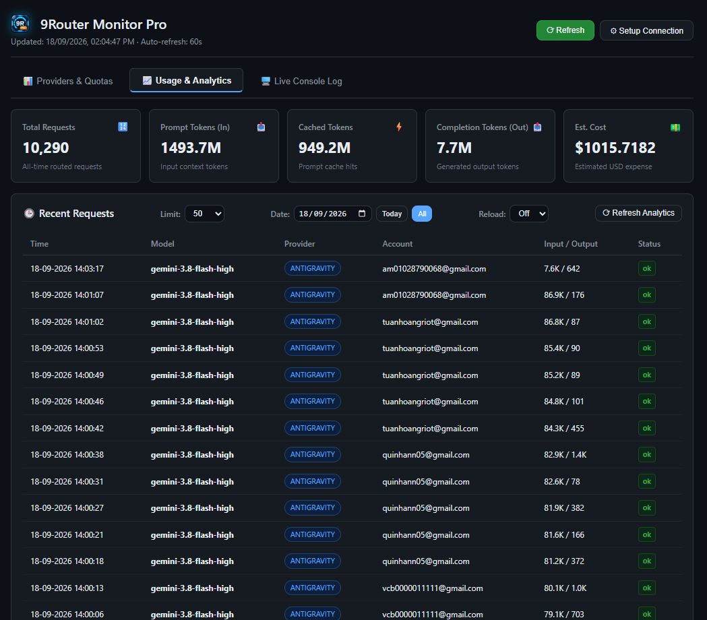
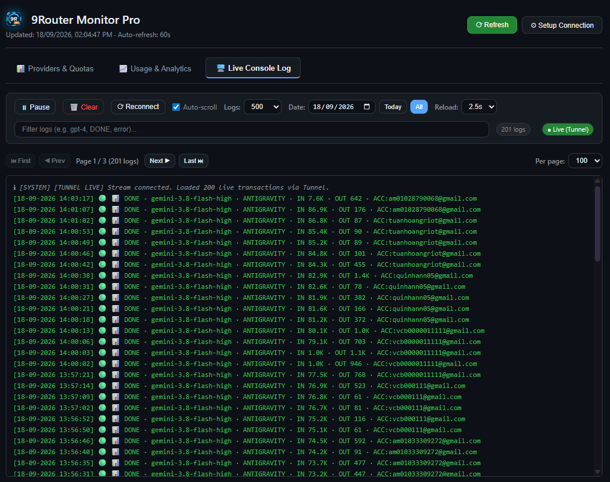
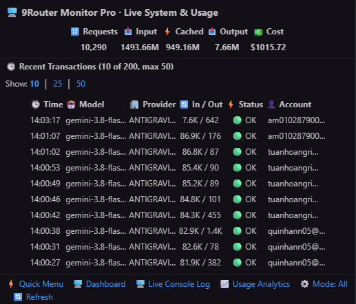
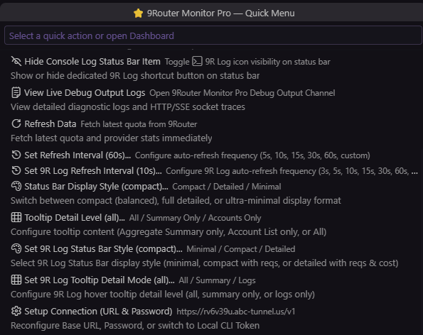

# 9Router Monitor Pro

<p align="center">
  
</p>

<p align="center">
  <a href="https://marketplace.visualstudio.com/items?itemName=minhtalent-dev.9router-monitor-pro"></a>
  <a href="https://marketplace.visualstudio.com/items?itemName=minhtalent-dev.9router-monitor-pro"></a>
  <a href="https://open-vsx.org/extension/minhtalent-dev/9router-monitor-pro"></a>
  <a href="https://open-vsx.org/extension/minhtalent-dev/9router-monitor-pro"></a>
</p>

<p align="center">
  <a href="LICENSE"></a>
  <a href="https://code.visualstudio.com/"></a>
  <a href="https://github.com/minhtalent-dev/9router-monitor-pro"></a>
</p>

<p align="center">
  <strong>The definitive real-time token & quota monitor for 9Router AI Gateway directly in your status bar.</strong>
</p>

<p align="center">
  Supports <strong>multi-account quota aggregation</strong>, <strong>multi-model pinning</strong>, <strong>remote Cloudflare Tunnels</strong>, <strong>interactive dashboard</strong>, and <strong>zero-config local discovery</strong>.
</p>

---

## 📸 Visual Showcase & Feature Tour

### 1. Interactive Webview Dashboard Pro Max (3-Tab Command Center)
A comprehensive, zero-latency control center with seamless tabbed navigation:

#### Tab 1 · 📊 Providers & Quotas
High-performance Fluent Dark Theme grid matrix that gives you an immediate overview of all AI providers connected to 9Router. Features realtime keyword search, dynamic category filter chips (`Antigravity`, `Gemini`, `Claude`, `Codex`, etc.), multi-criteria sorting (Highest Usage, Lowest, Name, Priority), and one-click pin/hide/active controls.


#### Tab 2 · 📈 Usage & Analytics
Real-time aggregated monitoring with 5 KPI cards (**Total Requests**, **Prompt Tokens**, **Cached Tokens**, **Completion Tokens**, **Est. Cost**) and a live historical table of recent requests with HTTP status badges, token in/out ratios, model, and active accounts. Features Date Picker filtering with midnight rollover and configurable auto-reload intervals.



#### Tab 3 · 🖥️ Live Console Log
Stream server logs in real time over Server-Sent Events (SSE) directly into an embedded Fluent dark terminal. Features Pause/Resume, Server Clear sync, Auto-scroll, text search/filter, date range navigation, flexible pagination (100, 200, 500, All), and syntax highlighting (`DONE`, `POST`, `TOKEN_REFRESH`, `WARN`, `ERROR`). Automatically activates an **Adaptive Tunnel Engine** when connecting remotely via Cloudflare Tunnel to bypass proxy response buffering.



---

### 2. Dual Status Bar Widgets & Live Telemetry Pulse
Never crowd your status bar. 9Router Monitor Pro provides two complementary status bar indicators:
- **📊 Main Quota Widget**: Sums up remaining balances and total quotas across all pinned accounts into a single condensed metric (`10 ⭐ · G3.8 9.4K · GW 7.6K`). Hovering reveals a high-density Markdown inspection table with aggregate totals and per-account breakdowns.
- **⚡ Dedicated 9R Log Widget (`$(terminal) 9R Log · 10.2K req · G3.8 🟢`)**: An independent status bar widget placed right next to the main quota bar. Shows real-time request density, current active model, and a live health pulse dot (`🟢`). Click to open directly into the Live Console Log.


---

### 3. Minimalist Hover Intelligence HUD
Hover over the **9R Log** status bar item to trigger the instant Hover Intelligence HUD:
- **KPI Snapshot Matrix**: Immediate glance at total requests, input tokens, cache hits, output tokens, and estimated cost.
- **Recent Transactions Stream**: Interactive table showing the last 10, 25, or 50 API transactions with timestamps, target models, providers, token volumes, and execution statuses.
- **Synchronized Action Bar**: 1-click links to Quick Menu, Dashboard, Live Console Log, Usage Analytics, Tooltip Mode toggle, and Instant Refresh.



---

### 4. Persistent Quick Menu & Advanced Controls
No more frustrating hover dismissals! Click the status bar metric to open an interactive, keyboard-navigable Quick Menu:
- **Account & Model Pinning**: Multi-select accounts and AI models to track and aggregate.
- **Account Activation**: Toggle provider account active/inactive status in 9Router on the fly.
- **Dedicated Timers**: Configure independent auto-refresh intervals for Quota checks (5s–5m) and Fast 9R Log telemetry (3s–60s).
- **Display Styles**: Customize both Status Bar and Tooltip detail levels with instant preview.

| Account & Model Controls | Display Styles & Timers |
|:---:|:---:|
|  |  |

---

### 5. Full Command Palette Integration
Every single feature is natively exposed to the VS Code Command Palette (`Ctrl+Shift+P` -> `9router`). Manage your AI quotas entirely from the keyboard with zero context switching.


---

## ✨ Core Highlights & Architecture

- ⚡ **Multi-Account Quota Aggregation**: Automatically computes cumulative remaining and total quota limits across all pinned accounts.
- 📌 **Multi-Pin Flexibility**: Pin multiple accounts and multiple AI models (e.g. Gemini 3.8 Flash, Claude Sonnet, Codex) simultaneously.
- 🌐 **Flexible Multi-Machine Connectivity**:
  - **Local Zero-Config**: Automatically discovers local CLI credentials from `%APPDATA%\9router` when running on the same machine.
  - **Remote Tunnel Support**: Connect securely across machines via Cloudflare Tunnel (`https://*.trycloudflare.com`) or custom domains using Dashboard Password authentication with auto-refreshing session tokens.
- 🎨 **3 Configurable Display Modes**:
  - **Compact (Default)**: Balanced, hides denominator `/total` and reset timestamps (`10⭐ · G3.8 9.9K · GW 8.6K`).
  - **Detailed**: Full transparency with remaining/total ratio and reset schedule (`⭐ 10 acc · G3.8 9.9K/10K (17/09 06:16 PM)`).
  - **Minimal**: Ultra-compact numbers and model names only (`G3.8 9.9K · GW 8.6K`), ideal for busy status bars.
- 🛡️ **Enterprise-Grade Secret Management**: Credentials and session tokens are encrypted at rest using VS Code `SecretStorage`.
- 🚀 **Concurrency Pooling & Stale Fallback**: Built-in HTTP connection pool (concurrency: 3) with exponential backoff and stale-cache serving prevents timeouts and eliminates upstream API flooding.
- 🔔 **Native Feedback & Non-Intrusive Notifications**: Manual refreshes show native progress notifications (`withProgress`), while periodic background syncs remain completely silent.

---

## 🚀 Getting Started

### Scenario A: Local Machine (Zero-Config)
If 9Router is running locally on the same computer:
1. Install **9Router Monitor Pro**.
2. The extension automatically detects your local CLI token from AppData.
3. Your provider quotas appear in the status bar immediately!

### Scenario B: Remote Host (Cloudflare Tunnel or Remote IP)
If 9Router is running on a remote server, home lab, or separate machine:
1. Open Command Palette (`Ctrl+Shift+P`).
2. Run: **`9Router Monitor Pro: Set Connection (URL & Password)`**.
3. **Step 1 - Base URL**: Enter your Cloudflare Tunnel URL (e.g. `https://rv6v39u.abc-tunnel.us`) or remote IP (`http://192.168.1.100:20128`).
4. **Step 2 - Dashboard Password**: Enter your 9Router Dashboard password (default: `123456`).
5. The extension authenticates, encrypts the session token in `SecretStorage`, and maintains persistent real-time monitoring!

---

## 🎨 Status Bar Display Styles

Customize the visual density of both the **Main Quota Bar** and the **9R Log Bar** directly via Quick Menu or Settings:

### 1. Main Quota Monitor Bar (`aiTokenUsage.statusDisplayMode`)

| Style | Preview (Multi-Account) | Preview (Single Account) | Best For |
|:---|:---|:---|:---|
| **Compact** *(Default)* | `10⭐ · G3.8 9.4K · GW 7.6K` | `⭐ Pro-Acc · G3.8 980` | Clean, high-density daily workflow |
| **Detailed** | `⭐ 10 acc · G3.8 9.4K/10K (06:16 PM)` | `⭐ Pro-Acc · G3.8 980/1K (06:16 PM)` | Full audit & tracking reset schedules |
| **Minimal** | `G3.8 9.4K · GW 7.6K` | `G3.8 980` | Ultra-condensed, minimal screen usage |

### 2. Dedicated 9R Log Telemetry Bar (`aiTokenUsage.logStatusDisplayMode`)

| Style | Status Bar Preview | Telemetry Metrics | Best For |
|:---|:---|:---|:---|
| **Minimal** | `$(terminal) 9R Log` | Clean icon and label only | Low distraction, simple shortcut |
| **Compact** *(Recommended)* | `$(terminal) 9R Log · 10.2K req · G3.8 🟢` | Total requests + last active model + live pulse | Balanced glanceable activity |
| **Detailed** | `$(terminal) 9R Log · 10.2K req · $1015 · G3.8 7.6K/642 🟢` | Requests + estimated cost + model token IO ratio + pulse | Comprehensive real-time telemetry |

---

## 📦 Installation Guide

### Option 1 · Official Marketplaces (Recommended)

#### Visual Studio Code
- **Web**: Install with one click from the [Visual Studio Marketplace](https://marketplace.visualstudio.com/items?itemName=minhtalent-dev.9router-monitor-pro).
- **In-App**: Press `Ctrl+Shift+X`, search for `9Router Monitor Pro`, and click **Install**.
- **Quick Open**: Press `Ctrl+P` and paste:
  ```text
  ext install minhtalent-dev.9router-monitor-pro
  ```

#### Cursor, Windsurf, VSCodium, & Antigravity
- **Web**: Available directly on the [Open VSX Registry](https://open-vsx.org/extension/minhtalent-dev/9router-monitor-pro).
- **In-App**: Open the Extensions panel (`Ctrl+Shift+X`), search for `9Router Monitor Pro`, and click **Install**.

---

### Option 2 · Command Line Interface (CLI)

Run the command for your preferred editor:

```bash
# Visual Studio Code
code --install-extension minhtalent-dev.9router-monitor-pro

# Cursor
cursor --install-extension minhtalent-dev.9router-monitor-pro

# Windsurf
windsurf --install-extension minhtalent-dev.9router-monitor-pro

# VSCodium
codium --install-extension minhtalent-dev.9router-monitor-pro

# Antigravity
antigravity --install-extension minhtalent-dev.9router-monitor-pro
```

---

### Option 3 · Offline VSIX Package

For air-gapped environments or manual installations:
1. Download the latest `9router-monitor-pro-1.1.0.vsix` from [GitHub Releases](https://github.com/minhtalent-dev/9router-monitor-pro/releases).
2. Open Extensions view (`Ctrl+Shift+X`) -> click the `...` menu (Views and More Actions) -> select **Install from VSIX...**
3. Or install via terminal:
   ```bash
   code --install-extension 9router-monitor-pro-1.1.0.vsix --force
   ```

---

## ⌨️ Commands Reference

All commands are prefixed with `9Router Monitor Pro` in the Command Palette (`Ctrl+Shift+P`):

| Command | Title | Description |
|:---|:---|:---|
| `aiTokenUsage.openQuickMenu` | `Open Interactive Menu` | Open interactive popup menu to pin accounts, pin models, toggle status, and configure styles |
| `aiTokenUsage.showDetails` | `Show Dashboard` | Open the full Webview Dashboard with search, filters, and cards |
| `aiTokenUsage.openConsoleLog` | `Open Live Console Log` | Open Webview Dashboard directly at the Live Console Log tab |
| `aiTokenUsage.openUsageAnalytics` | `Open Usage & Analytics` | Open Webview Dashboard directly at the Usage & Analytics tab |
| `aiTokenUsage.toggleLogStatusBar` | `Toggle Console Log Status Bar Item` | Toggle visibility of the `$(terminal) 9R Log` status bar button |
| `aiTokenUsage.setLogStatusDisplayMode` | `Set 9R Log Status Bar Style` | Switch 9R Log Bar between Minimal, Compact, and Detailed modes |
| `aiTokenUsage.setLogTooltipMode` | `Set 9R Log Tooltip Detail Mode` | Configure 9R Log hover tooltip detail: All Details, KPI Summary Only, or Logs Only |
| `aiTokenUsage.toggleLogTooltipMode` | `Toggle 9R Log Tooltip Mode` | 1-click cycle between All, Summary, and Logs tooltip detail levels |
| `aiTokenUsage.setLogRefreshInterval` | `Set 9R Log Refresh Interval` | Set fast telemetry auto-refresh frequency (3s, 5s, 10s, 15s, 30s, 60s, or custom) |
| `aiTokenUsage.setDisplayMode` | `Set Status Bar Display Style` | Switch Quota Bar between Compact, Detailed, and Minimal styles |
| `aiTokenUsage.setTooltipMode` | `Set Tooltip Detail Level` | Choose between All Details, Aggregate Summary Only, or Account List Only |
| `aiTokenUsage.toggleTooltipMode` | `Toggle Tooltip Mode` | 1-click toggle between Summary Only and All Details |
| `aiTokenUsage.setInterval` | `Set Refresh Interval` | Set quota auto-refresh frequency (5s, 10s, 15s, 30s, 60s, 2m, 5m, or custom) |
| `aiTokenUsage.showDebugLogs` | `View Live Debug Output Logs` | Open the diagnostic Output Channel for real-time socket and HTTP traces |
| `aiTokenUsage.refresh` | `Refresh` | Manually trigger immediate quota check with native progress notification |
| `aiTokenUsage.setConnection` | `Set Connection (URL & Password)` | Configure Base URL (Cloudflare Tunnel or Local) and Dashboard Password |

---

## ⚙️ Configuration Reference

Customize extension behavior in your `settings.json`:

| Setting | Type | Default | Description |
|:---|:---:|:---:|:---|
| `aiTokenUsage.showLogStatusBar` | `boolean` | `true` | Show dedicated `$(terminal) 9R Log` status bar item to quickly open Console Log |
| `aiTokenUsage.logStatusDisplayMode` | `string` | `"minimal"` | 9R Log status bar style: `"minimal"`, `"compact"` (with reqs & live pulse), or `"detailed"` (with reqs & cost) |
| `aiTokenUsage.logTooltipDisplayMode` | `string` | `"all"` | 9R Log tooltip detail: `"all"` (KPI + recent logs), `"summary"` (KPI only), or `"logs"` (recent logs only) |
| `aiTokenUsage.logStatusBarRefreshIntervalSeconds` | `number` | `10` | Fast telemetry refresh rate in seconds (minimum: 3s) |
| `aiTokenUsage.statusDisplayMode` | `string` | `"compact"` | Main Quota status bar style: `"compact"`, `"detailed"`, or `"minimal"` |
| `aiTokenUsage.tooltipDisplayMode` | `string` | `"all"` | Main Quota tooltip detail: `"all"`, `"summary"` (summary only), or `"accounts"` (accounts only) |
| `aiTokenUsage.refreshIntervalSeconds` | `number` | `60` | Quota auto-refresh frequency in seconds (minimum: 5s) |
| `aiTokenUsage.apiBaseUrl` | `string` | `"http://localhost:20128"` | 9Router Base URL (e.g. `http://localhost:20128` or `https://*.trycloudflare.com`) |
| `aiTokenUsage.authMode` | `string` | `"auto"` | Authentication method: `"auto"`, `"password"`, or `"token"` |
| `aiTokenUsage.statusBarQuota` | `string` | `"session"` | Fallback quota for status bar when no model is explicitly pinned |
| `aiTokenUsage.providersPath` | `string` | `"/api/providers?..."` | Endpoint to fetch provider account connections |
| `aiTokenUsage.usagePathTemplate` | `string` | `"/api/usage/{id}"` | Endpoint template to fetch quota by provider ID |

---

## 🛡️ Security & Privacy

- **Encrypted Local Storage**: Your 9Router password, session token, and API keys are stored exclusively in VS Code's encrypted `SecretStorage`.
- **Zero Telemetry**: 9Router Monitor Pro does not collect, track, or transmit any analytics, usage stats, or private tokens to any third-party server.
- **Direct Communication**: Network traffic is strictly peer-to-peer between your IDE and your designated 9Router host.

---

## 📄 License & Author

- **Author**: [Minhtalent-dev](https://github.com/minhtalent-dev)
- **Repository**: [github.com/minhtalent-dev/9router-monitor-pro](https://github.com/minhtalent-dev/9router-monitor-pro)
- **VS Code Marketplace**: [minhtalent-dev.9router-monitor-pro](https://marketplace.visualstudio.com/items?itemName=minhtalent-dev.9router-monitor-pro)
- **Open VSX Registry**: [minhtalent-dev/9router-monitor-pro](https://open-vsx.org/extension/minhtalent-dev/9router-monitor-pro)
- **License**: Released under the [MIT License](LICENSE). © 2026 Minhtalent-dev. All rights reserved.

```
