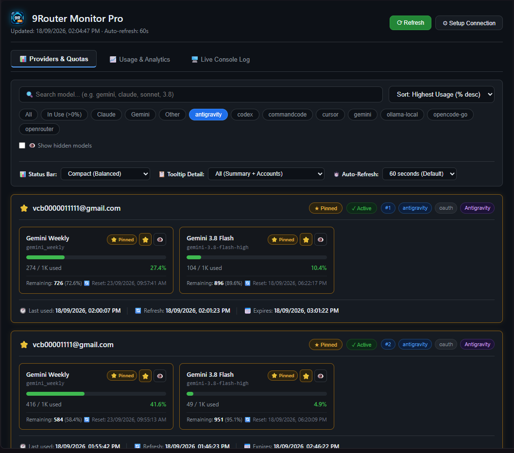
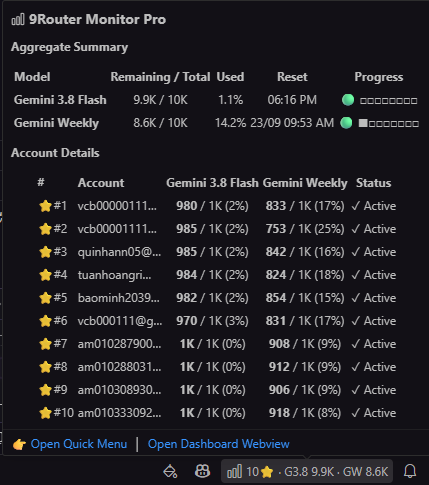
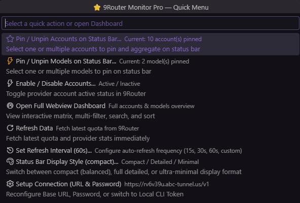
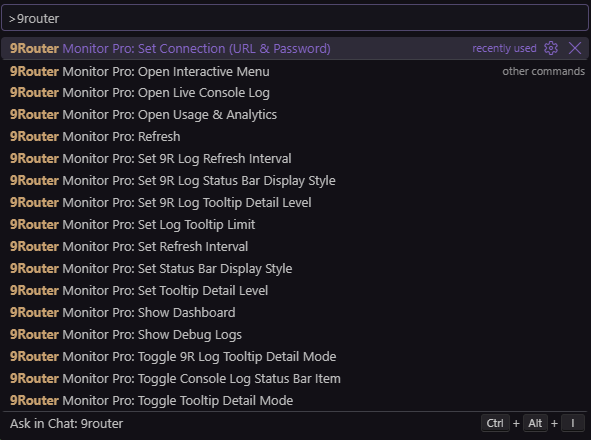

# 9Router Monitor Pro

<p align="center">
  
</p>

<p align="center">
  <a href="https://github.com/minhtalent-dev/9router-monitor-pro/releases"></a>
  <a href="LICENSE"></a>
  <a href="https://code.visualstudio.com/"></a>
  <a href="https://github.com/minhtalent-dev/9router-monitor-pro"></a>
</p>

<p align="center">
  <strong>The definitive real-time token & quota monitor for 9Router AI Gateway directly in your status bar.</strong>
</p>

<p align="center">
  Supports <strong>multi-account quota aggregation</strong>, <strong>multi-model pinning</strong>, <strong>remote Cloudflare Tunnels</strong>, <strong>interactive dashboard</strong>, and <strong>zero-config local discovery</strong>.
</p>

---

## 📸 Visual Showcase & Feature Tour

### 1. Interactive Webview Dashboard Pro Max
A clean, high-performance Fluent Dark Theme grid matrix that gives you an immediate overview of all AI providers connected to 9Router. Features realtime keyword search, dynamic category filter chips (`Antigravity`, `Gemini`, `Claude`, `Codex`, etc.), multi-criteria sorting, and one-click pin/hide/active controls.



### 2. Multi-Account Status Bar Aggregation & Detailed Tooltip
Never crowd your status bar. When pinning multiple accounts, 9Router Monitor Pro automatically sums up the remaining balances and total quotas into a single condensed metric (`10 ⭐ · G3.8 9.9K · GW 8.6K`). Hovering over the metric reveals a high-density Markdown inspection table with per-account breakdowns, usage percentages, and reset countdowns.



### 3. Persistent Quick Menu
No more frustrating hover dismissals! Click the status bar metric to open an interactive, keyboard-navigable Quick Menu. Easily multi-select accounts or models to pin, enable/disable provider accounts, adjust auto-refresh intervals, switch status bar display styles, or reconfigure connections.



### 4. Full Command Palette Integration
Every single feature is natively exposed to the VS Code Command Palette (`Ctrl+Shift+P` -> `9router`). Manage your AI quotas entirely from the keyboard with zero context switching.



---

## ✨ Core Highlights & Architecture

- ⚡ **Multi-Account Quota Aggregation**: Automatically computes cumulative remaining and total quota limits across all pinned accounts.
- 📌 **Multi-Pin Flexibility**: Pin multiple accounts and multiple AI models (e.g. Gemini 3.8 Flash, Claude Sonnet, Codex) simultaneously.
- 🌐 **Flexible Multi-Machine Connectivity**:
  - **Local Zero-Config**: Automatically discovers local CLI credentials from `%APPDATA%\9router` when running on the same machine.
  - **Remote Tunnel Support**: Connect securely across machines via Cloudflare Tunnel (`https://*.trycloudflare.com`) or custom domains using Dashboard Password authentication with auto-refreshing session tokens.
- 🎨 **3 Configurable Display Modes**:
  - **Compact (Default)**: Balanced, hides denominator `/total` and reset timestamps (`10⭐ · G3.8 9.9K · GW 8.6K`).
  - **Detailed**: Full transparency with remaining/total ratio and reset schedule (`⭐ 10 acc · G3.8 9.9K/10K (17/09 06:16 PM)`).
  - **Minimal**: Ultra-compact numbers and model names only (`G3.8 9.9K · GW 8.6K`), ideal for busy status bars.
- 🛡️ **Enterprise-Grade Secret Management**: Credentials and session tokens are encrypted at rest using VS Code `SecretStorage`.
- 🚀 **Concurrency Pooling & Stale Fallback**: Built-in HTTP connection pool (concurrency: 3) with exponential backoff and stale-cache serving prevents timeouts and eliminates upstream API flooding.
- 🔔 **Native Feedback & Non-Intrusive Notifications**: Manual refreshes show native progress notifications (`withProgress`), while periodic background syncs remain completely silent.

---

## 🚀 Getting Started

### Scenario A: Local Machine (Zero-Config)
If 9Router is running locally on the same computer:
1. Install **9Router Monitor Pro**.
2. The extension automatically detects your local CLI token from AppData.
3. Your provider quotas appear in the status bar immediately!

### Scenario B: Remote Host (Cloudflare Tunnel or Remote IP)
If 9Router is running on a remote server, home lab, or separate machine:
1. Open Command Palette (`Ctrl+Shift+P`).
2. Run: **`9Router Monitor Pro: Set Connection (URL & Password)`**.
3. **Step 1 - Base URL**: Enter your Cloudflare Tunnel URL (e.g. `https://rv6v39u.abc-tunnel.us`) or remote IP (`http://192.168.1.100:20128`).
4. **Step 2 - Dashboard Password**: Enter your 9Router Dashboard password (default: `123456`).
5. The extension authenticates, encrypts the session token in `SecretStorage`, and maintains persistent real-time monitoring!

---

## 🎨 Status Bar Display Styles

You can switch display styles at any time via **Quick Menu -> Status Bar Display Style** or via Settings (`aiTokenUsage.statusDisplayMode`):

| Style | Preview (Multi-Account) | Preview (Single Account) | Best For |
|:---|:---|:---|:---|
| **Compact** *(Default)* | `10⭐ · G3.8 9.9K · GW 8.6K` | `⭐ Pro-Acc · G3.8 980` | Clean, high-density daily workflow |
| **Detailed** | `⭐ 10 acc · G3.8 9.9K/10K (06:16 PM)` | `⭐ Pro-Acc · G3.8 980/1K (06:16 PM)` | Full audit & tracking reset cycles |
| **Minimal** | `G3.8 9.9K · GW 8.6K` | `G3.8 980` | Ultra-condensed, minimal screen usage |

---

## 📦 Installation Guide

### For Antigravity, Cursor, Windsurf, & VSCodium

#### Method 1: Install via CLI (Recommended)
```powershell
# For Antigravity
antigravity --install-extension 9router-monitor-pro-1.0.1.vsix --force

# For Cursor
cursor --install-extension 9router-monitor-pro-1.0.1.vsix --force

# For VS Code
code --install-extension 9router-monitor-pro-1.0.1.vsix --force
```

#### Method 2: Install from VSIX in GUI
1. Download `9router-monitor-pro-1.0.1.vsix` from [GitHub Releases](https://github.com/minhtalent-dev/9router-monitor-pro/releases).
2. In your IDE, open the Extensions view (`Ctrl+Shift+X`).
3. Click the `...` menu (Views and More Actions) at the top right of the Extensions panel.
4. Select **Install from VSIX...** and choose the downloaded file.

---

## ⌨️ Commands Reference

All commands are prefixed with `9Router Monitor Pro` in the Command Palette (`Ctrl+Shift+P`):

| Command | Title | Description |
|:---|:---|:---|
| `aiTokenUsage.openQuickMenu` | `Open Interactive Menu` | Open interactive popup menu to pin accounts, pin models, toggle status, and change settings |
| `aiTokenUsage.showDetails` | `Show Dashboard` | Open the full Webview Dashboard with search, filters, and cards |
| `aiTokenUsage.refresh` | `Refresh` | Manually trigger immediate quota check with progress indicator |
| `aiTokenUsage.setConnection` | `Set Connection (URL & Password)` | Configure Base URL (Cloudflare Tunnel or Local) and Dashboard Password |
| `aiTokenUsage.setDisplayMode` | `Set Status Bar Display Style` | Switch between Compact, Detailed, and Minimal status bar styles |
| `aiTokenUsage.setTooltipMode` | `Set Tooltip Detail Level` | Choose between All Details, Aggregate Summary Only, or Account List Only |
| `aiTokenUsage.setInterval` | `Set Refresh Interval` | Set auto-refresh frequency (15s, 30s, 60s, 2m, 5m, or custom) |

---

## ⚙️ Configuration Reference

Customize extension behavior in your `settings.json`:

| Setting | Type | Default | Description |
|:---|:---:|:---:|:---|
| `aiTokenUsage.statusDisplayMode` | `string` | `"compact"` | Status bar style: `"compact"`, `"detailed"`, or `"minimal"` |
| `aiTokenUsage.tooltipDisplayMode` | `string` | `"all"` | Tooltip content detail: `"all"` (both summary & accounts), `"summary"` (summary table only), or `"accounts"` (account list only) |
| `aiTokenUsage.apiBaseUrl` | `string` | `"http://localhost:20128"` | 9Router Base URL (e.g. `http://localhost:20128` or `https://*.trycloudflare.com`) |
| `aiTokenUsage.authMode` | `string` | `"auto"` | Authentication method: `"auto"`, `"password"`, or `"token"` |
| `aiTokenUsage.refreshIntervalSeconds` | `number` | `60` | Auto-refresh frequency in seconds (minimum: 10) |
| `aiTokenUsage.statusBarQuota` | `string` | `"session"` | Fallback quota for status bar when no model is explicitly pinned |
| `aiTokenUsage.providersPath` | `string` | `"/api/providers?..."` | Endpoint to fetch provider account connections |
| `aiTokenUsage.usagePathTemplate` | `string` | `"/api/usage/{id}"` | Endpoint template to fetch quota by provider ID |

---

## 🛡️ Security & Privacy

- **Encrypted Local Storage**: Your 9Router password, session token, and API keys are stored exclusively in VS Code's encrypted `SecretStorage`.
- **Zero Telemetry**: 9Router Monitor Pro does not collect, track, or transmit any analytics, usage stats, or private tokens to any third-party server.
- **Direct Communication**: Network traffic is strictly peer-to-peer between your IDE and your designated 9Router host.

---

## 📄 License & Author

- **Author**: [Minhtalent-dev](https://github.com/minhtalent-dev)
- **Repository**: [github.com/minhtalent-dev/9router-monitor-pro](https://github.com/minhtalent-dev/9router-monitor-pro)
- **License**: Released under the [MIT License](LICENSE). © 2026 Minhtalent-dev. All rights reserved.

```
