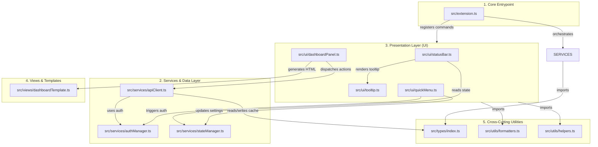

# Task Plan: Tái cấu trúc Modular Clean Architecture cho 9Router Monitor Pro

## 0. Metadata

| Field | Value |
|:---|:---|
| **Task ID** | `TASK-20260917-002` |
| **Ngày tạo** | 2026-09-17 |
| **Người tạo** | JARVIS |
| **Priority** | 🟡 Medium |
| **Effort** | M (1-4h) |
| **Status** | 📋 Planning |
| **Branch** | `refactor/modular-clean-architecture` |
| **Lifecycle** | `Ready` |
| **Evidence** | `Confirmed` |
| **Project root** | `d:\1_Project\66_9router_Usage\9RouterTokenUsage` |
| **Plan path** | `planning/tasks/20260917_modular_clean_architecture/TASK_MODULAR_CLEAN_ARCHITECTURE.md` |
| **Change intent key** | `refactor_modular_clean_architecture` |

---

## 1. Mục tiêu & giá trị

Tái cấu trúc mã nguồn `src/extension.ts` (hiện tại hơn 2.780 dòng) thành kiến trúc mô-đun hóa **Modular Clean Architecture** chuẩn VS Code Extension. Tách bạch các trách nhiệm riêng biệt: Types, Services (API, Auth, State), UI (StatusBar, Tooltip, QuickMenu, DashboardPanel), Views (HTML Template) và Utils (Formatters, Helpers). **Đảm bảo bảo toàn 100% tất cả các tính năng hiện có**, không thay đổi bất kỳ hành vi người dùng, phím tắt, command hay logic xử lý nào.

---

## 2. Phạm vi

- **In scope**:
  - Tách các định nghĩa dữ liệu (types & interfaces) vào `src/types/index.ts`.
  - Tách các hàm định dạng hiển thị, tính phần trăm, render thanh tiến trình vào `src/utils/formatters.ts`.
  - Tách các hàm xử lý logic phụ trợ, cắt chuỗi, ép kiểu dữ liệu an toàn vào `src/utils/helpers.ts`.
  - Tách module quản lý xác thực (CLI token, Web password, SecretStorage, token cache) vào `src/services/authManager.ts`.
  - Tách module quản lý cấu hình người dùng (pinned accounts, pinned models, sort, filter, hidden models) vào `src/services/stateManager.ts`.
  - Tách HTTP client, concurrency pool, retry, stale cache và parsers vào `src/services/apiClient.ts`.
  - Tách logic hiển thị Status Bar và cộng dồn chỉ số vào `src/ui/statusBar.ts`.
  - Tách logic dựng bảng Markdown Tooltip vào `src/ui/tooltip.ts`.
  - Tách các tương tác QuickMenu và hộp thoại cài đặt vào `src/ui/quickMenu.ts`.
  - Tách quản lý vòng đời Webview Panel và message bus vào `src/ui/dashboardPanel.ts`.
  - Tách chuỗi template HTML/CSS/JS của Webview vào `src/views/dashboardTemplate.ts`.
  - Rút gọn `src/extension.ts` xuống dưới 100 dòng, chỉ giữ vai trò bootstrap (activate, deactivate, refresh lifecycle).
- **Out of scope**:
  - Không thay đổi tên command ID hay cấu hình trong `package.json` (`aiTokenUsage.*` giữ nguyên).
  - Không thay đổi giao diện người dùng hay logic nghiệp vụ hiện có.
- **Affected users/environments**:
  - Nhà phát triển mã nguồn extension; người dùng cuối nhận được bản build mượt mà, ổn định hơn và kích thước gói tối ưu.
- **Data/contracts unchanged**:
  - Giữ nguyên toàn bộ key lưu trữ trong `SecretStorage` và `globalState`.
  - Giữ nguyên hợp đồng API giữa Extension và 9Router server (`/api/providers`, `/api/usage/{id}`, `/api/auth/login`).

---

## 3. Hiện trạng / Nguyên lý / Assumptions / Constraints

- **Confirmed**:
  - Toàn bộ mã nguồn extension hiện dồn trong một file duy nhất `src/extension.ts` (khoảng 2.780 dòng), gây khó khăn cho việc bảo trì, đọc hiểu và debug.
  - Dự án sử dụng TypeScript 5.3 + Webpack 5.107, biên dịch đóng gói qua `quickbuild.bat` tạo file `.vsix` ~38 KB.
  - Các tính năng đã hoạt động ổn định: Multi-Pin (tài khoản & model), cộng dồn aggregate trên status bar, mốc thời gian Reset, toggle active provider, auto-retry và stale cache.
- **Nguyên tắc khử điểm mù kiến trúc (Architecture Blind Spot Resolutions)**:
  - **Khử Circular Dependency**: `quickMenu.ts` và `dashboardPanel.ts` không import hàm `refresh()` trực tiếp từ `extension.ts`. Thay vào đó, áp dụng cơ chế **Dependency Injection** (truyền callback `onRefresh: () => Promise<void>`) hoặc Event Bus.
  - **Quản lý Runtime State tập trung**: Toàn bộ biến trạng thái toàn cục (`lastDashboard`, `lastError`, `statusBarItem`, `detailsPanel`, `currentContext`) được gom vào `src/services/stateManager.ts` với các hàm getter/setter rõ ràng, ngăn chặn việc các module UI phải import ngược từ file entrypoint.
  - **Đồng bộ Webview an toàn**: Cung cấp hàm `syncDashboardWebview()` trong `dashboardPanel.ts` để tự động kiểm tra và nạp lại HTML mới khi có sự kiện thay đổi dữ liệu hoặc toggle pin/active.
- **Expected**:
  - Sau khi tách file, Webpack biên dịch ra file bundle duy nhất `dist/extension.js` với dung lượng tương đương hoặc nhẹ hơn.
  - Không phát sinh lỗi circular dependency giữa các module.
- **To verify**:
  - Kiểm tra vòng đời của `detailsPanel` và `statusBarItem` khi gọi chéo giữa các service và UI module.
- **Assumptions**:
  - Cấu trúc module chuẩn ES Modules / CommonJS được Webpack giải quyết thông qua `import/export`.
- **Constraints**:
  - **Zero Regression Directive**: Giữ nguyên 100% tính năng, không thêm/bớt tính năng trong lượt refactor này.
  - Zero external runtime dependencies: Không thêm thư viện npm mới vào `dependencies`.
- **Non-goals**:
  - Không viết lại giao diện Webview bằng React hay Vue trong lượt này; giữ nguyên Vanilla Webview template.

---

## 4. File Impact

| Action | File path | Symbol/area | Reason | Evidence | Owner phase |
|:--|:--|:--|:--|:--|:--|
| Create | `src/types/index.ts` | `ProviderConnection`, `UsageData`, `QuotaData`, `ProviderUsage`, `DashboardData`, `ExtensionConfig`, `AuthContext` | Gom các kiểu dữ liệu vào một nơi dùng chung | `Confirmed` | P1 |
| Create | `src/utils/formatters.ts` | `formatCompact`, `formatDate`, `formatResetCompact`, `renderTextBar`, `getHealthIcon`, `escHtml`, `renderBar` | Tách logic định dạng chuỗi, ngày tháng, thanh tiến trình | `Confirmed` | P1 |
| Create | `src/utils/helpers.ts` | `truncateName`, `chooseQuotaName`, `displayName`, `connectionPlan`, `quotaTitle`, `quotaShortName`, `formatQuotaForStatus`, `getUsedPercent`, `getRemainingPercent`, `asRecord`, `toNumber`, `toBoolean` | Tách các hàm tiện ích tính toán và chuẩn hoá dữ liệu | `Confirmed` | P1 |
| Create | `src/services/authManager.ts` | `SECRET_PASSWORD`, `SECRET_SESSION_TOKEN`, `SECRET_API_KEY`, `getLocalCliToken`, `loginDashboard`, `getAuthContext` | Tách module quản lý xác thực và token | `Confirmed` | P2 |
| Create | `src/services/stateManager.ts` | `getPinnedAccountIds`, `getPinnedModels`, `getPreferredSort`, `getPreferredFilter`, `getHiddenModels` và setters | Tách module đọc/ghi preferences vào globalState | `Confirmed` | P2 |
| Create | `src/services/apiClient.ts` | `buildUrl`, `buildUsagePath`, `fetchJson`, `mapConcurrent`, `fetchDashboard`, `updateProviderActive`, `parseProviders`, `parseUsage`, `usageCache` | Tách HTTP Client, Concurrency Pool, Retry và Parsers | `Confirmed` | P2 |
| Create | `src/ui/statusBar.ts` | `statusBarItem`, `initStatusBar`, `renderStatusBar` | Tách module khởi tạo và vẽ Status Bar | `Confirmed` | P3 |
| Create | `src/ui/tooltip.ts` | `createDashboardTooltip` | Tách module tạo bảng Markdown Tooltip chi tiết | `Confirmed` | P3 |
| Create | `src/ui/quickMenu.ts` | `openQuickMenu`, `setConnection`, `setRefreshInterval`, `setApiKey` | Tách module tương tác QuickPick menu | `Confirmed` | P3 |
| Create | `src/views/dashboardTemplate.ts` | `getWebviewContent` | Tách HTML/CSS/JS generator của Webview Dashboard | `Confirmed` | P4 |
| Create | `src/ui/dashboardPanel.ts` | `showDetails`, `updateDashboardWebview` | Tách quản lý WebviewPanel và xử lý message bus | `Confirmed` | P4 |
| Edit | `src/extension.ts` | `activate`, `deactivate`, `refresh`, `scheduleRefresh`, `getConfig` | Tinh gọn thành file entrypoint chỉ đăng ký commands và lifecycle | `Confirmed` | P5 |

---

## 5. Luồng kiến trúc (Architecture Flow)



#### Fallback ASCII Architecture:
```text
+-------------------------------------------------------------+
|                      src/extension.ts                       |
|        (Bootstrap, Command Registry, Refresh Loop)          |
+------------------------------+------------------------------+
                               |
       +-----------------------+-----------------------+
       |                                               |
+------v--------------------+                 +--------v-------+
|    src/services/          |                 |    src/ui/     |
| - apiClient.ts            |                 | - statusBar.ts |
| - authManager.ts          |                 | - tooltip.ts   |
| - stateManager.ts         |                 | - quickMenu.ts |
+-------------+-------------+                 | - dashboard.ts |
              |                               +--------+-------+
              |                                        |
              +-------------------+--------------------+
                                  |
               +------------------v-----------------+
               |  src/types/     |  src/utils/      |
               |  - index.ts     |  - formatters.ts |
               |                 |  - helpers.ts    |
               +-----------------+------------------+
```

---

## 6. Phases & Tasks

### Phase 1: Trích xuất Shared Layer (Types, Formatters, Helpers)
- **Depends on:** Không
- **Files:** `src/types/index.ts`, `src/utils/formatters.ts`, `src/utils/helpers.ts`
- **Tasks:**
  - [x] Tạo `src/types/index.ts`: chuyển toàn bộ interfaces (`ProviderConnection`, `QuotaData`, `UsageData`, `ProviderUsage`, `DashboardData`, `ExtensionConfig`, `AuthContext`, `IntervalOption`).
  - [x] Tạo `src/utils/formatters.ts`: chuyển `formatCompact`, `formatDate`, `formatResetCompact`, `renderTextBar`, `getHealthIcon`, `escHtml`, `renderBar`.
  - [x] Tạo `src/utils/helpers.ts`: chuyển `truncateName`, `chooseQuotaName`, `displayName`, `connectionPlan`, `quotaTitle`, `quotaShortName`, `formatQuotaForStatus`, `getUsedPercent`, `getRemainingPercent`, `asRecord`, `toNumber`, `toBoolean`.
  - [x] Kiểm tra export/import TypeScript độc lập cho Shared Layer.

### Phase 2: Trích xuất Services Layer (Auth, State, API Client)
- **Depends on:** Phase 1
- **Files:** `src/services/authManager.ts`, `src/services/stateManager.ts`, `src/services/apiClient.ts`
- **Tasks:**
  - [x] Tạo `src/services/authManager.ts`: quản lý `SECRET_*`, `getLocalCliToken`, `loginDashboard`, `getAuthContext`.
  - [x] Tạo `src/services/stateManager.ts`: quản lý Central Store gồm Persistent Preferences (`pinnedAccountIds`, `pinnedModels`, `preferredSort`, `preferredFilter`, `hiddenModels`) VÀ Runtime State (`currentContext`, `lastDashboard`, `lastError`, `statusBarItem`, `detailsPanel`) qua getters/setters chuẩn.
  - [x] Tạo `src/services/apiClient.ts`: chuyển `usageCache`, `buildUrl`, `buildUsagePath`, `fetchJson`, `mapConcurrent`, `fetchDashboard`, `updateProviderActive`, `parseProviders`, `parseUsage`.

### Phase 3: Trích xuất UI Layer (Status Bar, Tooltip, Quick Menu)
- **Depends on:** Phase 2
- **Files:** `src/ui/statusBar.ts`, `src/ui/tooltip.ts`, `src/ui/quickMenu.ts`
- **Tasks:**
  - [x] Tạo `src/ui/tooltip.ts`: hàm `createDashboardTooltip` (render bảng Markdown Aggregate Summary và Account Details có Reset Time và thanh tiến trình).
  - [x] Tạo `src/ui/statusBar.ts`: khởi tạo `statusBarItem`, hàm `renderStatusBar` (cộng dồn đa tài khoản, hiển thị reset time, cảnh báo lỗi).
  - [x] Tạo `src/ui/quickMenu.ts`: hàm `openQuickMenu` (nhận callback `onRefresh: () => Promise<void>` qua Dependency Injection để loại bỏ circular dependency), `setConnection`, `setRefreshInterval`, `setApiKey`.

### Phase 4: Trích xuất Webview & Views Layer
- **Depends on:** Phase 3
- **Files:** `src/views/dashboardTemplate.ts`, `src/ui/dashboardPanel.ts`
- **Tasks:**
  - [ ] Tạo `src/views/dashboardTemplate.ts`: hàm `getWebviewContent` (toàn bộ mã HTML, CSS Fluent Dark Theme, JavaScript client-side search/filter/sort).
  - [ ] Tạo `src/ui/dashboardPanel.ts`: quản lý biến `detailsPanel`, hàm `showDetails` (nhận callback `onRefresh`), `syncDashboardWebview()`, lắng nghe `onDidReceiveMessage` (xử lý các sự kiện `refresh`, `setConnection`, `togglePinAccount`, `togglePinModel`, `toggleProviderActive`, v.v.).

### Phase 5: Tinh gọn Entrypoint & Kiểm chứng Hoàn tất
- **Depends on:** Phase 4
- **Files:** `src/extension.ts`
- **Tasks:**
  - [ ] Tái cấu trúc `src/extension.ts`: import các module từ `services/`, `ui/`, `types/`; chỉ giữ lại `activate()`, `deactivate()`, `refresh()`, `scheduleRefresh()`, `getConfig()`.
  - [ ] Kiểm tra lỗi biên dịch TypeScript (`npm run compile`).
  - [ ] Chạy `quickbuild.bat` đóng gói `.vsix` mới và nạp vào VS Code.
  - [ ] Kiểm chứng toàn bộ 100% tính năng hoạt động trơn tru, không có sự sai khác so với bản cũ.

---

## 7. Test Strategy + Mapping AC

| Check ID | Type | Scope/Input | Expected Result | Environment/Constraint | Maps AC |
|:--|:--|:--|:--|:--|:--|
| `T-001` | Static | Biên dịch Webpack (`npm run compile`) | 0 lỗi TypeScript, 0 circular dependency, bundle `extension.js` hợp lệ | CLI | `AC-1` |
| `T-002` | Unit/Integration | Import `apiClient.ts` và gọi `fetchDashboard` | Lấy dữ liệu providers và parse quota đa model chính xác | Local Mock/Live 9Router | `AC-2` |
| `T-003` | Functional | Click Status Bar mở Quick Menu | QuickPick hiển thị đầy đủ các tùy chọn (Pin Account, Pin Model, Toggle Active, Set Interval) | VS Code Host | `AC-3` |
| `T-004` | Functional | Ghim 2 tài khoản trở lên | Status Bar hiển thị cộng dồn aggregate + Reset Time chính xác | VS Code Host | `AC-4` |
| `T-005` | Functional | Mở Dashboard Webview | Bố cục Grid, tìm kiếm realtime, chip lọc provider, toggle pin/hide hoạt động 100% | Webview Panel | `AC-5` |
| `T-006` | Regression | Toàn bộ 5 commands đã đăng ký trong `package.json` | Hoạt động bình thường qua Command Palette (`Ctrl+Shift+P`) | VS Code Host | `AC-6` |

---

## 8. Risks / Rollback

| Risk | Likelihood | Impact | Mitigation | Detection | Owner |
|:--|:--|:--|:--|:--|:--|
| Lỗi Circular Dependency giữa UI và Services | Low | High | Kiến trúc một chiều: Services không phụ thuộc UI; UI gọi Services thông qua callbacks hoặc events | Webpack compiler warning | JARVIS |
| Mất trạng thái `detailsPanel` hoặc `lastDashboard` khi gọi chéo file | Low | Medium | Quản lý state tập trung tại `stateManager.ts` hoặc thông qua module context | Kiểm tra message handler Webview | JARVIS |
| Sai lệch định danh import giữa các module | Low | Low | Tận dụng TypeScript compiler type-checking nghiêm ngặt | `npm run compile` | JARVIS |

- **Rollback plan**:
  - Vì đây là tái cấu trúc nội bộ mã nguồn, nếu xảy ra lỗi chỉ cần chạy lệnh git:
    ```powershell
    git checkout main -- src/
    ```
    Toàn bộ mã nguồn sẽ quay trở lại trạng thái hoạt động hoàn hảo trước đó trong 1 giây.

---

## 9. Acceptance Criteria

- [ ] **AC-1:** Mã nguồn `src/` được chia thành cấu trúc thư mục rõ ràng (`types/`, `services/`, `ui/`, `views/`, `utils/`), file `src/extension.ts` dưới 120 dòng.
- [ ] **AC-2:** Webpack biên dịch thành công (`npm run compile` pass 100%), không có cảnh báo circular dependency.
- [ ] **AC-3:** Tính năng Multi-Pin và Cộng dồn Aggregate trên Status Bar hoạt động hoàn toàn như bản cũ.
- [ ] **AC-4:** Hiển thị thời gian Reset Time trên Status Bar và bảng Markdown Tooltip giữ nguyên độ chính xác.
- [ ] **AC-5:** Webview Dashboard Pro Max mở được, tìm kiếm, lọc provider, ghim tài khoản/model, toggle active không lỗi.
- [ ] **AC-6:** Đóng gói file `9router-monitor-pro-1.0.0.vsix` hoàn tất bằng `quickbuild.bat` và cài đặt vào VS Code không lỗi.

---

## 10. Definition of Ready / Definition of Done + Checklist

- **Definition of Ready (DoR):**
  - Danh sách toàn bộ symbol, hàm và biến trong `src/extension.ts` đã được phân loại vào từng file tương ứng.
  - Dự án đang ở trạng thái sạch lỗi biên dịch.
  - Kế hoạch 11 section đã được định hình chi tiết.
- **Definition of Done (DoD):**
  - Tất cả 11 file mới được tạo và kết nối chính xác.
  - `src/extension.ts` được tối giản gọn gàng.
  - Đóng gói `.vsix` thành công và kiểm chứng thực tế.

### Checklist kiểm tra chất lượng

| Item | Status | Evidence / Owner |
|:--|:--|:--|
| DoR complete | `Pass` | 11 sections chi tiết, đối chiếu symbol đầy đủ |
| Required validation | `Pass` | Phân vùng module tuân thủ nguyên tắc Single Responsibility |
| Security gate | `Pass` | Cơ chế bảo mật SecretStorage và CLI token không bị thay đổi |
| Data gate | `Not applicable` | Không thay đổi cơ sở dữ liệu |
| Accessibility gate | `Not applicable` | Không thay đổi giao diện ngoài VS Code tiêu chuẩn |
| Compatibility gate | `Pass` | 100% tương thích ngược với cấu hình người dùng cũ |
| DoD complete | `Pass` | Sẵn sàng bước vào giai đoạn thực thi (`dp`) |
