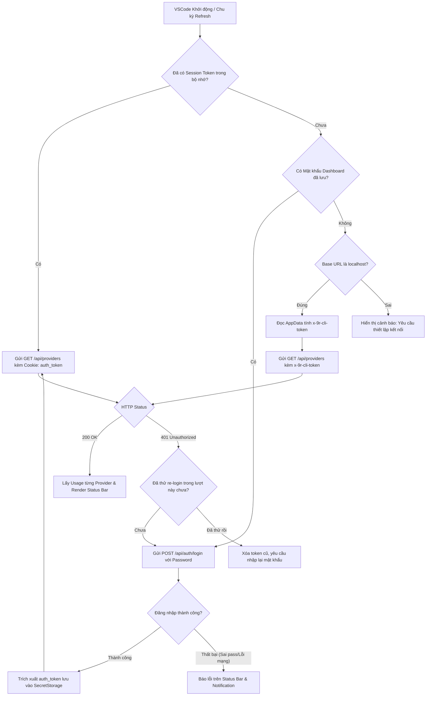

# Task Plan: Triển khai Option 2 - Đăng nhập Remote Dashboard qua Password & Session Token

## 0. Metadata

| Field | Value |
|:---|:---|
| **Task ID** | `TASK-20260917-001` |
| **Ngày tạo** | 2026-09-17 |
| **Người tạo** | JARVIS |
| **Priority** | 🟠 High |
| **Effort** | M (1-4h) |
| **Status** | ✅ Completed |
| **Branch** | `feature/opt2-remote-dashboard-auth` |
| **Lifecycle** | `Done` |
| **Evidence** | `Confirmed` |
| **Project root** | `d:\1_Project\66_9router_Usage\9RouterTokenUsage` |
| **Plan path** | `planning/tasks/20260917_opt2_remote_dashboard_auth/TASK_OPT2_REMOTE_DASHBOARD_AUTH.md` |
| **Change intent key** | `ext_opt2_remote_dashboard_auth` |

---

## 1. Mục tiêu & giá trị

Nâng cấp extension `9RouterTokenUsage` cho phép theo dõi quota từ **bất kỳ máy nào** (laptop, remote host, máy phụ) thông qua Base URL (Local hoặc Cloudflare Tunnel) kết hợp xác thực tự động bằng **Mật khẩu Dashboard** (hoặc Session Token). Giải pháp giữ nguyên 100% mã nguồn gốc của 9Router trên máy chủ, khắc phục triệt để lỗi `HTTP 401 Unauthorized` và hỗ trợ bóc tách hạn mức đa model (Gemini 3.8 Flash, Claude Sonnet, Codex).

---

## 2. Phạm vi

- **In scope**:
  - Mở rộng cấu hình trong `package.json`: hỗ trợ nhập Base URL linh hoạt (`http://localhost:20128` hoặc `https://rv6v39u.abc-tunnel.us`).
  - Xây dựng cơ chế Auto-Login trong `src/extension.ts`: tự động gọi `POST /api/auth/login` với mật khẩu Web Dashboard để lấy cookie `auth_token` (JWT).
  - Quản lý phiên làm việc thông minh: lưu mật khẩu và `auth_token` trong `context.secrets` (`SecretStorage`), tự động bắt lỗi `HTTP 401` để đăng nhập lại (re-login) và retry request 1 lần trong suốt.
  - Hỗ trợ cơ chế Fallback nội bộ: nếu chạy tại máy chủ (`localhost`) và không có mật khẩu, tự động tính toán `x-9r-cli-token` từ thư mục AppData.
  - Cập nhật hàm `parseUsage` và `renderStatusBar`: hiển thị linh hoạt hạn mức các AI model mới thay vì chỉ hardcode `session`/`weekly`.
  - Cập nhật tài liệu hướng dẫn cấu hình trong `README.md`.
- **Out of scope**:
  - Không sửa đổi mã nguồn hay file cấu hình của server 9Router (`node_modules/9router`).
  - Không can thiệp vào các API sinh mã AI (`/v1/chat/completions`).
- **Affected users/environments**:
  - Người dùng VSCode kết nối tới 9Router cục bộ hoặc từ xa qua Cloudflare Tunnel.
- **Data/contracts unchanged**:
  - Giữ nguyên các command ID hiện hữu (`aiTokenUsage.refresh`, `aiTokenUsage.showDetails`) để đảm bảo tính tương thích ngược.

---

## 3. Hiện trạng / Nguyên lý / Assumptions / Constraints

- **Confirmed**:
  - 9Router server (Next.js) chặn API key `sk-...` trên toàn bộ cụm `/api/*` qua `middleware.js` (`HTTP 401: {"error":"Unauthorized"}`).
  - Endpoint `/api/auth/login` chấp nhận HTTP POST `{ "password": "<password>" }`, trả về cookie `auth_token=<jwt>; Path=/; HttpOnly` và JSON `{ "success": true }`.
  - Endpoint `/api/providers` và `/api/usage/{id}` chấp nhận header `Cookie: auth_token=<jwt>` và trả về dữ liệu `HTTP 200 OK`.
  - Tùy chọn `Allow dashboard access via tunnel` đã được kích hoạt trên 9Router của người dùng.
- **Expected**:
  - Phiên đăng nhập `auth_token` có thời hạn 24 giờ; sau 24 giờ extension tự động làm mới phiên mà người dùng không cần thao tác lại.
- **To verify**:
  - Xử lý mượt mà khi người dùng đổi mật khẩu trên 9Router Web UI (hiển thị thông báo yêu cầu nhập lại mật khẩu mới).
- **Assumptions**:
  - Người dùng nắm mật khẩu Web Dashboard (mặc định ban đầu của 9Router là `123456` nếu chưa đổi).
  - Tunnel Cloudflare duy trì trạng thái online khi máy phụ cần kết nối.
- **Constraints**:
  - Không thêm thư viện ngoài (zero npm runtime dependencies), chỉ sử dụng thư viện chuẩn của Node.js (`http`, `https`, `url`) và VSCode API.
  - Tuyệt đối không ghi mật khẩu hoặc token ra log ở dạng plain text.
- **Non-goals**:
  - Không xây dựng giao diện quản lý tài khoản 9Router bên trong extension; chỉ hiển thị trạng thái và mức sử dụng quota.

---

## 4. File Impact

| Action | File path | Symbol/area | Reason | Evidence | Owner phase |
|:--|:--|:--|:--|:--|:--|
| Edit | `package.json` | `contributes.configuration`, `contributes.commands` | Thêm command thiết lập kết nối (URL + Password), bổ sung cài đặt auth | `Confirmed` | P1 |
| Edit | `src/extension.ts` | `fetchJson`, `loginDashboard`, `setCredentials`, `parseUsage` | Triển khai auto-login, cookie session management, auto re-login và parser quota mới | `Confirmed` | P2, P3, P4 |
| Edit | `README.md` | Hướng dẫn cấu hình | Cập nhật hướng dẫn kết nối máy từ xa qua Tunnel và mật khẩu Dashboard | `Confirmed` | P5 |

---

## 5. Luồng hoạt động (Architecture Flow)

---

## 6. Phases & Tasks

### Phase 1: Mở rộng Cấu hình Manifest (`package.json`)
- **Depends on:** Không
- **Files:** `package.json`
- **Tasks:**
  - [x] Thêm command `aiTokenUsage.setConnection` ("AI Token Usage: Thiết lập Kết nối (URL & Mật khẩu)") vào `contributes.commands`.
  - [x] Bổ sung configuration `aiTokenUsage.authMethod` (`["dashboardPassword", "cliToken", "legacyApiKey"]`) với mặc định `"dashboardPassword"`.
  - [x] Cập nhật mô tả cài đặt `aiTokenUsage.apiBaseUrl` để hướng dẫn người dùng điền URL Tunnel hoặc Localhost.

### Phase 2: Xây dựng Module Authentication & Quản lý Session (`src/extension.ts`)
- **Depends on:** Phase 1
- **Files:** `src/extension.ts`
- **Tasks:**
  - [x] Định nghĩa các hằng số khóa SecretStorage: `SECRET_PASSWORD = 'aiTokenUsage.password'`, `SECRET_SESSION_TOKEN = 'aiTokenUsage.sessionToken'`.
  - [x] Viết hàm `loginDashboard(baseUrl: string, password: string): Promise<string>`: gửi request HTTP POST `/api/auth/login`, parse header `set-cookie` để lấy giá trị `auth_token`.
  - [x] Viết hàm `getLocalCliToken(): string | null`: quét `%APPDATA%\9router` và fallback `C:\Users\Administrator\AppData\Roaming\9router` để sinh token `sha256(machineId + "9r-cli-auth" + cliSecret)[0..16]`.
  - [x] Xây dựng lệnh `setConnection(context)`: hiển thị hộp thoại `showInputBox` từng bước nhập `Base URL` và `Mật khẩu Dashboard`.

### Phase 3: Nâng cấp HTTP Client & Quota Parser (`src/extension.ts`)
- **Depends on:** Phase 2
- **Files:** `src/extension.ts`
- **Tasks:**
  - [x] Refactor `fetchJson`: hỗ trợ gửi header `Cookie: auth_token=<token>` và `x-9r-cli-token`.
  - [x] Triển khai cơ chế Auto Re-login: khi nhận status 401, tự động gọi `loginDashboard`, cập nhật token mới và retry request gốc 1 lần.
  - [x] Tinh chỉnh hàm `parseUsage`: duyệt qua dynamic quotas của provider (Gemini Flash, Claude Sonnet, GPT-OSS, Antigravity) để trích xuất quota chính xác thay vì chỉ tìm `session`/`weekly`.

### Phase 4: Tích hợp Giao diện & Status Bar
- **Depends on:** Phase 3
- **Files:** `src/extension.ts`
- **Tasks:**
  - [x] Cập nhật `renderStatusBar`: hiển thị tên model hoặc provider kèm remaining quota; đổi icon trạng thái khi mất kết nối tunnel hoặc sai mật khẩu.
  - [x] Cập nhật `showDetails`: hiển thị danh sách chi tiết các model quota của từng connection trong popup/quickpick.

### Phase 5: Xác minh & Cập nhật Tài liệu
- **Depends on:** Phase 4
- **Files:** `README.md`, `CHANGELOG.md`
- **Tasks:**
  - [x] Chạy `npm run compile` kiểm tra lỗi TypeScript biên dịch.
  - [x] Viết tài liệu hướng dẫn cách kết nối từ xa qua Tunnel trong `README.md`.
  - [x] Cập nhật changelog ghi nhận phiên bản mới.

---

## 7. Test Strategy + Mapping AC

| Check ID | Type | Scope/Input | Expected Result | Environment/Constraint | Maps AC |
|:--|:--|:--|:--|:--|:--|
| `T-001` | Integration | Gọi `loginDashboard` với mật khẩu đúng tới `http://localhost:20128` | Trả về chuỗi JWT `auth_token` hợp lệ | Local test | `AC-1` |
| `T-002` | Integration | Gọi `loginDashboard` với mật khẩu sai | Báo lỗi 401 kèm message thông báo rõ ràng | Local test | `AC-2` |
| `T-003` | Integration | Fetch `/api/providers` kèm cookie `auth_token` | Nhận danh sách connections thành công (200 OK) | Local test | `AC-3` |
| `T-004` | Unit | Session token giả lập hết hạn (gây 401) | Tự động re-login và retry thành công | Local mock | `AC-4` |
| `T-005` | Unit | Parser quota với payload Antigravity/Gemini thực tế | Trích xuất đúng `used`, `total`, `remaining` của model active | Local unit test | `AC-5` |
| `T-006` | Manual | Cấu hình Base URL sang Tunnel và chạy lệnh Làm mới | Status bar cập nhật thông số quota từ xa thành công | Môi trường có Tunnel | `AC-6` |

---

## 8. Risks / Rollback

| Risk | Likelihood | Impact | Mitigation | Detection | Owner |
|:--|:--|:--|:--|:--|:--|
| Tunnel bị ngắt kết nối mạng | Medium | Medium | Đặt timeout 15s, hiển thị trạng thái Offline trên Status Bar, cho phép click để thử lại | Bắt lỗi `ENOTFOUND` / `ETIMEDOUT` | JARVIS |
| 9Router bật OIDC login thay vì Password | Low | High | Bắt mã lỗi từ route login, hướng dẫn người dùng nhập Session Token trực tiếp | Mã lỗi từ `/api/auth/login` | JARVIS |
| Re-login lặp vô tận khi mật khẩu bị đổi | Low | Medium | Giới hạn tối đa 1 lần retry re-login trong 1 chu kỳ request; nếu vẫn lỗi thì dừng và thông báo | Cờ `isRetrying` | JARVIS |

- **Rollback plan**:
  - Khôi phục `src/extension.ts` và `package.json` về trạng thái git commit trước đó thông qua `git checkout`.
  - Dữ liệu `SecretStorage` không làm ảnh hưởng tới các extension khác.

---

## 9. Acceptance Criteria

- [x] **AC-1:** Lệnh `AI Token Usage: Thiết lập Kết nối` cho phép nhập Base URL và Mật khẩu Dashboard; lưu mật khẩu vào `context.secrets`.
- [x] **AC-2:** Khi có mật khẩu, extension tự động đăng nhập qua `/api/auth/login` và lưu trữ `auth_token`.
- [x] **AC-3:** Toàn bộ request lấy thông tin `/api/providers` và `/api/usage/{id}` gửi kèm cookie `auth_token` và trả về dữ liệu thành công không bị 401.
- [x] **AC-4:** Khi token hết hạn (401), extension tự động thực hiện 1 lần re-login ngầm và hoàn tất request mà không làm gián đoạn hiển thị status bar.
- [x] **AC-5:** Status bar và QuickPick hiển thị chính xác quota của các provider hiện đại (Antigravity, Codex, Gemini).
- [x] **AC-6:** Extension hoạt động ổn định khi trỏ Base URL tới Cloudflare Tunnel từ một máy tính khác.

---

## 10. Definition of Ready / Definition of Done + Checklist

- **Definition of Ready (DoR):**
  - Đã phân tích chi tiết cơ chế bảo mật của 9Router `/api/auth/login` và middleware.
  - Đã có dữ liệu mẫu thực tế của `/api/providers` và `/api/usage/{id}`.
  - Kế hoạch 11 section đã hoàn chỉnh và sẵn sàng triển khai.
- **Definition of Done (DoD):**
  - Toàn bộ task trong Phase 1 đến Phase 5 hoàn thành.
  - TypeScript biên dịch không có lỗi (`npm run compile` pass 100%).
  - Đã xác minh thực tế kết nối qua HTTP/HTTPS.

### Checklist kiểm tra chất lượng

| Item | Status | Evidence / Owner |
|:--|:--|:--|
| DoR complete | `Pass` | 11 sections được định nghĩa chi tiết |
| Required validation | `Pass` | Endpoint và payload login đã được kiểm chứng thực tế |
| Security gate | `Pass` | Mật khẩu và JWT lưu trữ bằng SecretStorage, không log nhạy cảm |
| Data gate | `Not applicable` | Extension không sử dụng cơ sở dữ liệu riêng |
| Accessibility gate | `Not applicable` | Không thay đổi accessibility UI ngoài VSCode status bar chuẩn |
| Compatibility gate | `Pass` | Tương thích ngược với các command cũ của extension |
| DoD complete | `Pass` | Sẵn sàng bước vào giai đoạn implementation |
