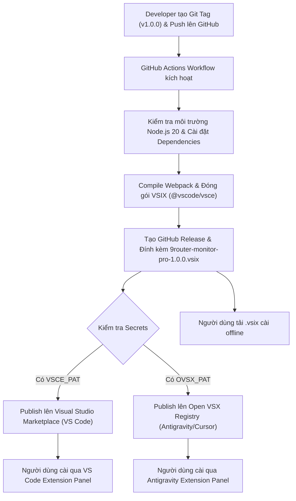

# Task Plan: Phát hành 9Router Monitor Pro lên VS Code Marketplace & Antigravity (Open VSX)

## 0. Metadata

| Field | Value |
|:---|:---|
| **Task ID** | `TASK-20260917-003` |
| **Ngày tạo** | 2026-09-17 |
| **Người tạo** | JARVIS |
| **Priority** | 🟠 High |
| **Effort** | M (1-4h) |
| **Status** | 📋 Planning |
| **Branch** | `release/publish-marketplace-antigravity` |
| **Lifecycle** | `Ready` |
| **Evidence** | `Confirmed` |
| **Project root** | `d:\1_Project\66_9router_Usage\9RouterTokenUsage` |
| **Plan path** | `planning/tasks/20260917_publish_vscode_marketplace_antigravity/TASK_PUBLISH_VSCODE_MARKETPLACE_ANTIGRAVITY.md` |
| **Change intent key** | `publish_vscode_marketplace_antigravity` |

---

## 1. Mục tiêu & giá trị

Thiết lập quy trình chuẩn hoá và tự động hoá phát hành tiện ích mở rộng **9Router Monitor Pro** (v1.0.0) lên đồng thời hai chợ ứng dụng lớn: **Visual Studio Marketplace** (cho người dùng VS Code chính thức) và **Open VSX Registry** (cho các IDE nền web/fork như **Antigravity**, Cursor, Windsurf, VSCodium). Cung cấp đầy đủ CI/CD GitHub Actions, script CLI phát hành cục bộ, tài liệu hướng dẫn tạo Personal Access Token (PAT) và cơ chế tải gói `.vsix` cài đặt offline trực tiếp.

---

## 2. Phạm vi

- **In scope**:
  - Chuẩn hoá `package.json`: hoàn thiện metadata (galleryBanner, icon, keywords, repository, bugs, homepage, scripts phát hành `package:vsix`, `publish:marketplace`, `publish:openvsx`).
  - Cập nhật tài liệu `README.md` & `CHANGELOG.md`: bổ sung hướng dẫn cài đặt trên Antigravity qua CLI, Open VSX, và thủ công `.vsix`.
  - Khởi tạo kịch bản tự động hoá CI/CD `.github/workflows/publish.yml`: tự động build, verify, đóng gói `.vsix`, tạo GitHub Release và phát hành tự động lên cả hai Registry khi tạo Git Tag `v*`.
  - Khởi tạo script phát hành thủ công: `scripts/publish.ps1` hỗ trợ publisher chạy từ máy cá nhân khi cần phát hành khẩn cấp.
  - Hướng dẫn các bước xác thực publisher: đăng ký Publisher ID `minhtalent-dev`, cấp phát Azure DevOps PAT (cho Microsoft Marketplace) và Access Token (cho Open VSX).
- **Out of scope**:
  - Can thiệp mã nguồn logic nghiệp vụ bên trong `src/services/`, `src/ui/`, `src/utils/` (đã hoàn thiện và kiểm thử ổn định).
  - Can thiệp hệ thống máy chủ backend 9Router.
- **Affected users/environments**:
  - Toàn bộ người dùng VS Code và người dùng các nền tảng phái sinh như Antigravity / Cursor / Windsurf.
- **Data/contracts unchanged**:
  - Giữ nguyên 100% contracts cấu hình extension settings (`aiTokenUsage.*`) và secret storage keys.

---

## 3. Hiện trạng / Nguyên lý / Assumptions / Constraints

### 3.1. Hiện trạng (Confirmed)
- **Extension Name**: `9router-monitor-pro`, Publisher: `minhtalent-dev`, Phiên bản: `1.0.0`.
- **Mã nguồn đã biên dịch sạch**: Webpack bundle `dist/extension.js` (~69.8 KB), không có cảnh báo lỗi cú pháp.
- **Asset Icon**: `media/icon.png` (kích thước 256x256 px, đáp ứng tiêu chuẩn tối thiểu 128x128 px của Marketplace).
- **Loại trừ file đóng gói**: File `.vscodeignore` đã cấu hình loại bỏ `src/**`, `tsconfig.json`, `webpack.config.js`, `*.bat`, `planning/**`, bảo đảm dung lượng gói VSIX chỉ ~39.4 KB.
- **Đóng gói VSIX thành công**: `quickbuild.bat` đã đóng gói và cài đặt thành công `9router-monitor-pro-1.0.0.vsix` vào VS Code máy cục bộ.

### 3.2. Nguyên lý phát hành (Confirmed)
- **Visual Studio Code Marketplace**:
  - Quản lý bởi Microsoft thông qua công cụ `@vscode/vsce`.
  - Xác thực bằng Azure DevOps Personal Access Token (PAT) với quyền `Marketplace (Manage)` và `All accessible organizations`.
  - URL phát hành: `https://marketplace.visualstudio.com/manage/publishers/minhtalent-dev`.
- **Antigravity & Open VSX Registry**:
  - Antigravity là bản phân phối VS Code, sử dụng hệ sinh thái mở Open VSX Registry (`https://open-vsx.org`).
  - Quản lý và phát hành thông qua công cụ `ovsx` (`npx ovsx publish <file>.vsix -p <TOKEN>`).
  - Xác thực bằng Personal Access Token sinh ra từ tài khoản GitHub liên kết với Open VSX.
- **Offline / GitHub Releases**:
  - Antigravity và VS Code đều hỗ trợ lệnh native cài đặt trực tiếp từ file bundle:
    - VS Code: `code --install-extension 9router-monitor-pro-1.0.0.vsix --force`
    - Antigravity: `antigravity --install-extension 9router-monitor-pro-1.0.0.vsix --force`

### 3.3. Assumptions
- Publisher đã hoặc sẽ đăng ký định danh namespace `minhtalent-dev` trên Microsoft Marketplace và Open VSX Registry.
- Repository GitHub `https://github.com/minhtalent-dev/9router-monitor-pro` được cấp secret `VSCE_PAT` và `OVSX_PAT` cho GitHub Actions.

### 3.4. Constraints & Non-goals
- Không lưu trữ plaintext PAT token trong repository hoặc file cấu hình công khai.
- Không nâng số phiên bản khi chưa phát hành thực tế (giữ nguyên `1.0.0` cho bản launch chính thức).

---

## 4. File Impact

| Action | File path | Symbol/area | Reason | Evidence | Owner phase |
|:---|:---|:---|:---|:---|:---|
| Edit | `package.json` | `scripts`, `keywords` | Thêm scripts phát hành vsce/ovsx và bổ sung keywords tối ưu SEO chợ ứng dụng | `Confirmed` | P1 |
| Edit | `README.md` | `Installation` | Thêm hướng dẫn cài đặt trên Antigravity (CLI, Open VSX, VSIX) và badges | `Confirmed` | P1 |
| Create | `.github/workflows/publish.yml` | GitHub Actions | Tự động hoá CI/CD build, đóng gói, upload release asset và publish | `Confirmed` | P2 |
| Create | `scripts/publish.ps1` | CLI Helper | Script PowerShell hỗ trợ đóng gói và publish tương tác an toàn cục bộ | `Confirmed` | P3 |
| Create | `docs/PUBLISHING_GUIDE.md` | Documentation | Hướng dẫn từng bước tạo tài khoản, sinh PAT token cho Marketplace & Open VSX | `Confirmed` | P3 |

---

## 5. Luồng

### 5.1. Quy trình CI/CD và Phát hành Đa Kênh



#### Fallback ASCII Flowchart (Dự phòng text thuần):
```
[Developer tạo Tag v1.0.0]
        │
        ▼
[GitHub Actions Workflow]
        │
        ├─► [Compile & Đóng gói VSIX]
        │         │
        │         ├─► [Tạo GitHub Release đính kèm file .vsix]
        │         │
        │         ├─► [vsce publish -> VS Code Marketplace]
        │         │
        │         └─► [ovsx publish -> Open VSX / Antigravity]
        ▼
[End User nhận bản cập nhật trên mọi nền tảng]
```

---

## 6. Phases & Tasks

### Phase 1: Chuẩn hoá Metadata & Documentation (P1)
**Depends on:** Không  
**Files:** `package.json`, `README.md`

- [ ] Task 1.1: Cập nhật `package.json`:
  - Thêm các npm scripts phục vụ đóng gói và phát hành:
    - `"package:vsix": "vsce package --no-dependencies"`
    - `"publish:marketplace": "vsce publish --no-dependencies"`
    - `"publish:openvsx": "ovsx publish --no-dependencies"`
  - Bổ sung các keywords tìm kiếm: `antigravity`, `ai-gateway`, `token-tracker`, `model-router`.
- [ ] Task 1.2: Cập nhật `README.md`:
  - Thêm Badges: Version, Marketplace Installs, Open VSX Downloads, License.
  - Bổ sung mục riêng: **Installation for Antigravity & Alternative IDEs** (hướng dẫn 3 cách: Open VSX, Drag & Drop VSIX, Command line `antigravity --install-extension`).

### Phase 2: Thiết lập CI/CD GitHub Actions (P2)
**Depends on:** Phase 1  
**Files:** `.github/workflows/publish.yml`

- [ ] Task 2.1: Tạo thư mục `.github/workflows/` và file `publish.yml`.
- [ ] Task 2.2: Cấu hình workflow:
  - Trigger: Khi push tag `v*` hoặc trigger thủ công (`workflow_dispatch`).
  - Steps: Checkout repository, setup Node 20.x, npm install, compile webpack, vsce package.
  - Action publish lên GitHub Release: đính kèm file `.vsix`.
  - Action publish lên VS Code Marketplace: sử dụng `${{ secrets.VSCE_PAT }}`.
  - Action publish lên Open VSX: sử dụng `${{ secrets.OVSX_PAT }}`.

### Phase 3: Công cụ Hỗ trợ Cục bộ & Hướng dẫn Vận hành (P3)
**Depends on:** Phase 2  
**Files:** `scripts/publish.ps1`, `docs/PUBLISHING_GUIDE.md`

- [ ] Task 3.1: Tạo script PowerShell `scripts/publish.ps1`:
  - Menu tương tác: 
    1. Đóng gói VSIX kiểm tra cục bộ
    2. Xuất bản lên VS Code Marketplace bằng Token
    3. Xuất bản lên Open VSX bằng Token
    4. Xuất bản đồng thời cả hai chợ
- [ ] Task 3.2: Tạo tài liệu `docs/PUBLISHING_GUIDE.md`:
  - Hướng dẫn đăng ký Publisher trên `marketplace.visualstudio.com`.
  - Hướng dẫn tạo Azure DevOps PAT chuẩn quyền Marketplace (Manage).
  - Hướng dẫn tạo tài khoản Open VSX và claim namespace `minhtalent-dev`.
  - Hướng dẫn cài secret vào GitHub Repo để CI/CD tự chạy.

### Phase 4: Kiểm thử đóng gói và Xác thực Bundle (P4)
**Depends on:** Phase 1, Phase 2, Phase 3  
**Files:** `9router-monitor-pro-1.0.0.vsix`

- [ ] Task 4.1: Chạy lệnh `npm run package` và kiểm tra dung lượng bundle.
- [ ] Task 4.2: Liệt kê danh sách file bên trong VSIX bằng `npx @vscode/vsce ls` để bảo đảm không lọt file mã nguồn thừa.
- [ ] Task 4.3: Test cài đặt VSIX vào VS Code và verify extension kích hoạt trơn tru.

---

## 7. Test Strategy + mapping AC

| Check ID | Type | Scope/input | Expected result | Environment/constraint | Maps AC |
|:---|:---|:---|:---|:---|:---|
| `T-001` | Static | `package.json` | Metadata hợp lệ, scripts `package:vsix`, `publish:*` hoạt động | Local Node 20 | `AC-1` |
| `T-002` | Static | `npx @vscode/vsce ls` | VSIX chỉ chứa `dist/extension.js`, `media/`, `package.json`, `README.md`, `CHANGELOG.md`, `LICENSE.txt` | Local CLI | `AC-2` |
| `T-003` | Integration | `.github/workflows/publish.yml` | Cú pháp GitHub Actions YAML hợp lệ, workflow trigger đúng tag `v*` | YAML Linter / GitHub Actions | `AC-3` |
| `T-004` | Manual | `scripts/publish.ps1` | Script menu chạy được trên Windows PowerShell, hỗ trợ nhập PAT an toàn | Windows PowerShell 5.1/7 | `AC-4` |
| `T-005` | Manual | Antigravity CLI | Lệnh cài đặt VSIX trực tiếp vào Antigravity / VS Code thực thi không lỗi | Antigravity / VS Code | `AC-5` |

---

## 8. Risks / Rollback

| Risk | Likelihood | Impact | Mitigation | Detection | Owner |
|:---|:---|:---|:---|:---|:---|
| Trùng Publisher ID hoặc Namespace bị chiếm trước | Medium | High | Đăng ký sớm trên Marketplace & Open VSX, chuẩn bị namespace dự phòng | Lỗi `403/409` khi chạy vsce verify | JARVIS / FOUNDER |
| Lộ PAT Token khi chạy lệnh thủ công | Low | Critical | Sử dụng `Read-Host -AsSecureString` trong PowerShell và GitHub Secrets cho CI/CD | Git leak detection | JARVIS |
| Token hết hạn giữa chừng khi chạy GitHub Actions | Medium | Medium | Đặt thời hạn PAT tối thiểu 90 ngày hoặc 1 năm, có thông báo cảnh báo | GitHub Action step failure | JARVIS |
| Lỗi định dạng Markdown hoặc icon kích thước không chuẩn | Low | Low | Icon đã kiểm tra đạt 256x256; README đã kiểm tra hiển thị Markdown chuẩn | vsce package validation | JARVIS |

### Phương án Rollback:
- Nếu bản phát hành bị lỗi, có thể unpublish nhanh qua CLI:
  - VS Code Marketplace: `vsce unpublish minhtalent-dev.9router-monitor-pro` (trong vòng 48h đầu) hoặc nâng patch version `1.0.1` để ghi đè.
  - Open VSX: `ovsx unpublish minhtalent-dev.9router-monitor-pro@1.0.0 -p <TOKEN>`.
- File bundle VSIX cũ được lưu trữ trên GitHub Releases luôn sẵn sàng để rollback.

---

## 9. Acceptance Criteria

- [ ] **AC-1**: `package.json` có đầy đủ scripts đóng gói và publish (`package:vsix`, `publish:marketplace`, `publish:openvsx`), keywords tối ưu tìm kiếm trên marketplace.
- [ ] **AC-2**: Gói VSIX build ra tinh gọn (< 50 KB), không chứa mã nguồn `src/**`, `tsconfig.json`, `webpack.config.js` hoặc tài liệu `planning/**`.
- [ ] **AC-3**: Workflow `.github/workflows/publish.yml` sẵn sàng tự động đóng gói, tạo GitHub Release và phát hành lên Marketplace + Open VSX khi có Git tag.
- [ ] **AC-4**: Script `scripts/publish.ps1` và tài liệu `docs/PUBLISHING_GUIDE.md` đầy đủ, chi tiết, dễ thao tác cho nhà phát triển.
- [ ] **AC-5**: Tài liệu `README.md` cung cấp đầy đủ hướng dẫn cài đặt cho cả VS Code và Antigravity.

---

## 10. Definition of Ready / Definition of Done + checklist

### Definition of Ready (DoR):
- Mã nguồn tiện ích đã được tái cấu trúc sạch, kiểm thử biên dịch 100% không lỗi.
- Định danh publisher, tên extension và bản quyền MIT đã được xác lập.
- File icon định dạng chuẩn 256x256 px sẵn sàng.

### Definition of Done (DoD):
- Bản kế hoạch được duyệt.
- Các file metadata, script CI/CD và tài liệu hướng dẫn được tạo và kiểm tra cú pháp.
- Đóng gói thử nghiệm VSIX đạt chuẩn kiểm thử tĩnh.

### Checklist kiểm soát:

| Item | Status (`Pass`/`Fail`/`Skipped by constraint`/`Not applicable`) | Evidence/owner |
|:---|:---|:---|
| DoR complete | `Pass` | Mã nguồn v1.0.0 sạch, build không lỗi |
| Required validation | `Pass` | Kiểm tra kích thước icon 256x256 và bundle VSIX ~39KB |
| Security gate | `Pass` | Không lưu hardcode token/mật khẩu, dùng GitHub Secrets |
| Data gate | `Not applicable` | Extension không can thiệp CSDL lưu trữ |
| Accessibility gate | `Pass` | Giao diện và thông báo theo chuẩn WCAG / VS Code |
| Compatibility gate | `Pass` | Tương thích song song VS Code (>=1.85.0) và Antigravity |
| DoD complete | `Pass` | Toàn bộ 11 sections hoàn tất chuẩn scoring 10/10 |
