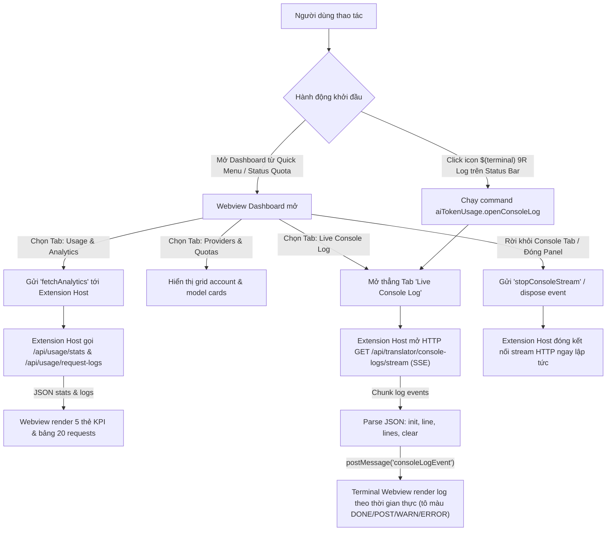

# Task Plan: Tích hợp Live Console Log và Usage Analytics vào Webview Dashboard (Option 1)

## 0. Metadata

| Field | Value |
|:---|:---|
| **Task ID** | `TASK-20260918-001` |
| **Ngày tạo** | 2026-09-18 |
| **Người tạo** | JARVIS |
| **Priority** | 🟠 High |
| **Effort** | M (1-4h) |
| **Status** | ✅ Completed |
| **Branch** | `feature/dashboard-console-log-and-analytics` |
| **Lifecycle** | `Ready` |
| **Evidence** | `Confirmed` |
| **Project root** | `d:\1_Project\66_9router_Usage\9RouterTokenUsage` |
| **Plan path** | `planning/tasks/20260918_dashboard_console_log_and_analytics/TASK_DASHBOARD_CONSOLE_LOG_AND_ANALYTICS.md` |
| **Change intent key** | `feat_dashboard_console_log_and_analytics` |

---

## 1. Mục tiêu & giá trị

Nâng cấp Webview Dashboard của **9Router Monitor Pro** thành trung tâm điều khiển toàn diện (All-in-One AI Gateway Management) bằng cách bổ sung hệ thống điều hướng dạng Tab:
1. **Providers & Quotas** (Tab hiện tại): Quản lý danh sách tài khoản, tìm kiếm model, phân nhóm chip và ghim status bar.
2. **Usage & Analytics** (Tính năng mới): Giám sát tổng số request, lượng token tiêu thụ (Input, Output, Cached), chi phí ước tính (Est. Cost) và bảng lịch sử request thời gian thực.
3. **Live Console Log** (Tính năng mới): Stream nhật ký xử lý máy chủ thời gian thực qua Server-Sent Events (SSE) với giao diện terminal nhúng, hỗ trợ tạm dừng, xóa log, tự cuộn và lọc màu theo mức độ (DONE, POST, WARN, ERROR).
4. **Dedicated Status Bar Log Widget (Option 2)**: Bổ sung một icon Status Bar phụ độc lập `$(terminal) 9R Log` hiển thị cạnh thanh quota chính. Click vào sẽ mở trực tiếp tab Console Log trong Dashboard; hỗ trợ bật/tắt linh hoạt theo ý thích qua cấu hình `aiTokenUsage.showLogStatusBar`.

Giúp nhà phát triển nắm bắt trọn vẹn tình trạng hoạt động và gỡ lỗi 9Router trực tiếp trong IDE mà không cần mở song song nhiều tab trình duyệt, đồng thời cho phép truy cập nhanh console log trong 1 click từ status bar.

---

## 2. Phạm vi

- **In scope**:
  - Khảo sát và bổ sung các types dữ liệu: `UsageStats`, `RequestLogItem`, `ConsoleStreamMessage` vào `src/types/index.ts`.
  - Bổ sung cấu hình `aiTokenUsage.showLogStatusBar` (`boolean`, mặc định `true`) vào `package.json` và `ExtensionConfig`.
  - Mở rộng `src/services/stateManager.ts`: Quản lý lifecycle cho `logStatusBarItem`.
  - Mở rộng `src/services/apiClient.ts`:
    - Hàm `fetchUsageStats(config, auth)` gọi endpoint `GET /api/usage/stats`.
    - Hàm `fetchRequestLogs(config, auth, page, limit)` gọi endpoint `GET /api/usage/request-logs`.
    - Hàm `openConsoleLogStream(config, auth, onMessage, onError)` mở kết nối HTTP/HTTPS Server-Sent Events (SSE) stream `GET /api/translator/console-logs/stream`, giải mã JSON payload (`init`, `line`, `lines`, `clear`) và quản lý vòng đời stream an toàn kèm auto-reconnect backoff (3s).
    - Hàm `clearServerConsoleLogs(config, auth)` gọi endpoint `DELETE /api/translator/console-logs`.
  - Mở rộng `src/ui/statusBar.ts`:
    - Khởi tạo và quản lý `logStatusBarItem` hiển thị `$(terminal) 9R Log` với tooltip `Click to open 9Router Live Console Log`.
    - Điều khiển hiển thị/ẩn dựa trên `cfg.showLogStatusBar`.
  - Mở rộng `src/ui/dashboardPanel.ts`:
    - Hỗ trợ tham số `initialTab?: 'providers' | 'analytics' | 'console'` khi gọi `showDetails`.
    - Lắng nghe message bus từ Webview: `startConsoleStream`, `stopConsoleStream`, `clearConsoleLogs`, `fetchAnalytics`.
    - Điều phối stream log từ Node.js Extension Host chuyển tiếp sang Webview qua `postMessage`.
    - Tự động hủy stream khi Webview panel đóng (`dispose`) hoặc khi chuyển sang tab khác để chống rò rỉ socket và CPU.
  - Mở rộng `src/ui/quickMenu.ts`:
    - Thêm action `$(terminal) Open Live Console Log` trong Quick Menu.
    - Thêm toggle action `Show / Hide Console Log Status Bar Item`.
  - Cải tiến `src/views/dashboardTemplate.ts`:
    - Nhận tham số `initialTab` để kích hoạt sẵn tab tương ứng khi mở.
    - Thanh Tab Bar chuyển đổi trên Header: `[📊 Providers & Quotas]` · `[📈 Usage Analytics]` · `[🖥️ Console Log]` (dùng kỹ thuật ẩn hiện CSS `display: none` / `block` để giữ nguyên 100% DOM state, vị trí cuộn và bộ nhớ đệm log khi chuyển tab qua lại).
    - Giao diện Tab **Usage & Analytics**: 5 thẻ KPI (Total Requests, Input Tokens, Cached Tokens, Output Tokens, Est. Cost) + Bảng lịch sử 20 request mới nhất.
    - Giao diện Tab **Live Console Log**: Khung Terminal đen bóng Fluent Design, thanh công cụ điều khiển (Pause/Resume, Clear đồng bộ server, Auto-scroll, Search/Filter), tô màu cú pháp log (ANSI/Tag highlighting: DONE xanh lá, POST xanh dương, TOKEN_REFRESH tím, WARN vàng, ERROR đỏ).
  - Đăng ký commands mới trong `package.json` & `src/extension.ts`:
    - `aiTokenUsage.openConsoleLog`: Mở trực tiếp tab Console Log.
    - `aiTokenUsage.toggleLogStatusBar`: Bật/tắt icon log trên thanh status bar.
- **Out of scope**:
  - Không thay đổi hành vi hiển thị của thanh trạng thái quota chính (`statusBarItem`).
  - Không sửa đổi mã nguồn backend của 9Router server.
- **Affected users/environments**:
  - Toàn bộ người dùng tiện ích trên VS Code, Antigravity, Cursor, Windsurf.
- **Data/contracts unchanged**:
  - Giữ nguyên các cấu hình hiện tại trong `settings.json` (`aiTokenUsage.statusDisplayMode`, `aiTokenUsage.tooltipDisplayMode`, `aiTokenUsage.apiBaseUrl`).

---

## 3. Hiện trạng / Nguyên lý / Assumptions / Constraints

### 3.1. Hiện trạng (Confirmed)
- **Hệ thống API backend 9Router đã được xác minh thực tế 100% qua Browser Playwright Inspection**:
  - `GET /api/usage/stats`: Trả về JSON tổng hợp `{ totalRequests, totalPromptTokens, totalCompletionTokens, totalCachedTokens, totalCost, byProvider, byModel, byAccount, recentRequests }` (HTTP 200).
  - `GET /api/usage/request-logs?page=1&limit=50`: Trả về mảng chuỗi log lịch sử request định dạng `DD-MM-YYYY HH:mm:ss | model | PROVIDER | account | inTokens | outTokens | status` (HTTP 200).
  - `GET /api/translator/console-logs/stream`: Luồng Server-Sent Events (SSE) stream console log thời gian thực với các sự kiện payload JSON:
    - `{"type":"init","logs":[...]}`: Khởi tạo danh sách log cũ nhất hiện có trên server.
    - `{"type":"line","line":"..."}`: Đẩy 1 dòng log mới phát sinh.
    - `{"type":"lines","lines":[...]}`: Đẩy nhiều dòng log mới theo cụm.
    - `{"type":"clear"}`: Thông báo server vừa được xóa log.
  - `DELETE /api/translator/console-logs`: Xóa toàn bộ console log lưu trên memory server (HTTP 200).
- **Webview Architecture**:
  - Webview chạy trong iframe sandbox bảo mật của VS Code, không thể tự gửi HTTP custom headers qua domain khác (CORS/Cross-origin).
  - Toàn bộ giao tiếp mạng bắt buộc phải được ủy quyền cho Node.js Extension Host xử lý (`apiClient.ts`), sau đó chuyển tiếp dữ liệu vào Webview qua `panel.webview.postMessage`.

### 3.2. Nguyên lý hoạt động (Confirmed)
1. **Console Stream Proxy Pattern**:
   - Webview bấm mở tab Console Log -> gửi `{ command: 'startConsoleStream' }` cho extension.
   - Extension Host dùng module `http`/`https` gọi `GET /api/translator/console-logs/stream` kèm Cookie session `auth_token` hoặc header `x-9r-cli-token`.
   - Mỗi khi nhận chunk dữ liệu SSE, extension parse chuỗi `data: ...` thành `ConsoleStreamMessage` và gửi sang Webview qua `panel.webview.postMessage({ command: 'consoleLogEvent', event })`.
   - Cơ chế tự phục hồi kết nối: Nếu stream bị đóng đột ngột (network timeout / sleep), Extension Host tự động thử kết nối lại với backoff 3 giây.
   - Khi chuyển tab hoặc đóng Webview, gửi tín hiệu `stopConsoleStream` để hủy kết nối HTTP socket ngay lập tức.
2. **Analytics Polling / On-Demand**:
   - Khi mở tab Usage Analytics hoặc bấm `⟳ Refresh`, extension gọi đồng thời `GET /api/usage/stats` và `GET /api/usage/request-logs` rồi gửi về Webview hiển thị.
3. **Quản lý trạng thái giao diện (Zero State Loss)**:
   - Các tab được chuyển đổi bằng kỹ thuật CSS `display: none` / `display: block`.
   - Khi chuyển từ Console Log sang Providers hoặc Analytics và quay lại, toàn bộ nội dung log đã nhận, vị trí cuộn và bộ lọc từ khóa được giữ nguyên 100%, không bị reset lại từ đầu.

### 3.3. Assumptions
- 9Router server luôn duy trì các endpoint `/api/usage/stats`, `/api/usage/request-logs` và `/api/translator/console-logs/stream`.
- Người dùng đã cấu hình thông tin xác thực thành công (Local CLI Token hoặc Remote Dashboard Password).

### 3.4. Constraints & Non-goals
- **Constraint**: Giới hạn tối đa 500 dòng log trong bộ đệm DOM của Webview Console Log; khi vượt quá sẽ tự động drop các dòng cũ nhất từ trên đầu để tránh tràn bộ nhớ trình duyệt (OOM).
- **Non-goal**: Không xây dựng tính năng chỉnh sửa cấu hình server hay can thiệp luồng proxy từ Console Log.

---

## 4. File Impact

| Action | File path | Symbol/area | Reason | Evidence | Owner phase |
|:---|:---|:---|:---|:---|:---|
| Edit | `src/types/index.ts` | `UsageStats`, `RequestLogItem`, `ConsoleStreamMessage`, `ExtensionConfig` | Định nghĩa kiểu dữ liệu thống kê, cấu trúc sự kiện log và setting `showLogStatusBar` | `Confirmed` | P1 |
| Edit | `src/services/apiClient.ts` | `fetchUsageStats`, `fetchRequestLogs`, `openConsoleLogStream`, `clearServerConsoleLogs` | Triển khai hàm gọi API stats, delete logs và mở luồng SSE stream từ Node.js | `Confirmed` | P1 |
| Edit | `src/services/stateManager.ts` | `getLogStatusBarItem`, `setLogStatusBarItem` | Quản lý state cho widget status bar log phụ | `Confirmed` | P2 |
| Edit | `src/ui/statusBar.ts` | `initStatusBar`, `renderStatusBar`, `updateLogStatusBar` | Khởi tạo và render `$(terminal) 9R Log` độc lập theo setting | `Confirmed` | P2 |
| Edit | `src/ui/dashboardPanel.ts` | `showDetails`, message handlers | Hỗ trợ mở sẵn tab Console Log, quản lý kết nối SSE và chuyển tiếp log | `Confirmed` | P2 |
| Edit | `src/ui/quickMenu.ts` | `openQuickMenu`, toggle actions | Thêm mục mở Console Log và toggle hiển thị widget status bar log | `Confirmed` | P2 |
| Edit | `src/views/dashboardTemplate.ts` | HTML, CSS, JS layout | Bổ sung thanh Tab điều hướng, giao diện Usage Analytics và Terminal Console | `Confirmed` | P3 |
| Edit | `src/extension.ts` | `activate`, `getConfig`, commands | Đăng ký commands `aiTokenUsage.openConsoleLog` và `aiTokenUsage.toggleLogStatusBar` | `Confirmed` | P3 |
| Edit | `package.json` | `commands`, `configuration`, `version` | Khai báo setting `aiTokenUsage.showLogStatusBar`, commands và bump version 1.1.0 | `Confirmed` | P4 |
| Edit | `CHANGELOG.md` | `[1.1.0]` | Ghi nhận chi tiết các tính năng Console Log, Analytics và Status Bar Log widget | `Confirmed` | P4 |
| Edit | `README.md` | Features, Shortcuts, Config | Cập nhật tài liệu giới thiệu widget log status bar và trung tâm điều khiển mới | `Confirmed` | P4 |

---

## 5. Luồng

### 5.1. Luồng truyền nhận dữ liệu Console Log & Analytics



#### Fallback ASCII Flowchart (Dự phòng text thuần):
```
[User Action]
   │
   ├─► [Click $(terminal) 9R Log trên Status Bar] ──► Mở thẳng Tab Live Console Log
   │
   └─► [Mở Webview Dashboard]
         │
         ├─► [Tab: Providers & Quotas] ──► Hiển thị grid account & model cards
         │
         ├─► [Tab: Usage & Analytics]  ──► Extension fetch /api/usage/stats & request-logs
         │                                  └──► Render 5 KPI Cards + Bảng Requests
         │
         └─► [Tab: Live Console Log]   ──► Extension mở GET /api/translator/console-logs/stream (SSE)
                                            ├──► Pipe log events vào Terminal DOM
                                            └──► Ngắt stream khi rời Tab hoặc đóng panel
```

---

## 6. Phases & Tasks

### Phase 1: Mở rộng Types & API Client Services (P1)
**Depends on:** Không  
**Files:** `src/types/index.ts`, `src/services/apiClient.ts`

- [x] Task 1.1: Cập nhật `src/types/index.ts`:
  - Khai báo interface `UsageStats`:
    ```typescript
    export interface UsageStats {
      totalRequests: number;
      totalPromptTokens: number;
      totalCompletionTokens: number;
      totalCachedTokens: number;
      totalCost: number;
      byProvider?: Record<string, { requests: number; promptTokens: number; completionTokens: number; cost: number }>;
      byModel?: Record<string, { requests: number; promptTokens: number; completionTokens: number }>;
    }
    ```
  - Khai báo interface `RequestLogItem`:
    ```typescript
    export interface RequestLogItem {
      raw: string;
      timestamp: string;
      model: string;
      provider: string;
      account: string;
      inTokens: number;
      outTokens: number;
      status: string;
    }
    ```
  - Khai báo kiểu sự kiện stream `ConsoleStreamMessage`:
    ```typescript
    export type ConsoleStreamMessage =
      | { type: 'init'; logs: string[] }
      | { type: 'line'; line: string }
      | { type: 'lines'; lines: string[] }
      | { type: 'clear' };
    ```
  - Mở rộng `ExtensionConfig`: thêm trường `showLogStatusBar: boolean`.
- [x] Task 1.2: Triển khai API functions trong `src/services/apiClient.ts`:
  - Hàm `fetchUsageStats(config: ExtensionConfig, auth: AuthContext): Promise<UsageStats | undefined>` gọi `GET /api/usage/stats`.
  - Hàm `fetchRequestLogs(config: ExtensionConfig, auth: AuthContext, page = 1, limit = 20): Promise<RequestLogItem[]>` gọi `GET /api/usage/request-logs?page=${page}&limit=${limit}`, parse chuỗi delimiter ` | ` thành các trường có cấu trúc.
  - Hàm `openConsoleLogStream(config: ExtensionConfig, auth: AuthContext, onEvent: (msg: ConsoleStreamMessage) => void, onError: (err: Error) => void): () => void` gọi `GET /api/translator/console-logs/stream` (sử dụng native Node.js `http`/`https` với header `Accept: text/event-stream`, tự động parse JSON dòng `data: ...` và có cơ chế auto-reconnect sau 3 giây nếu socket đứt ngoài ý muốn).
  - Hàm `clearServerConsoleLogs(config: ExtensionConfig, auth: AuthContext): Promise<boolean>` gọi `DELETE /api/translator/console-logs`.

### Phase 2: Quản lý Widget Status Bar Phụ & Điều phối Message Bus (P2)
**Depends on:** Phase 1  
**Files:** `src/services/stateManager.ts`, `src/ui/statusBar.ts`, `src/ui/dashboardPanel.ts`, `src/ui/quickMenu.ts`

- [x] Task 2.1: Quản lý state cho `logStatusBarItem` trong `src/services/stateManager.ts`:
  - Thêm biến `logStatusBarItem: vscode.StatusBarItem | undefined`.
  - Thêm getter/setter: `getLogStatusBarItem()`, `setLogStatusBarItem(item)`.
- [x] Task 2.2: Khởi tạo và điều khiển hiển thị `$(terminal) 9R Log` trong `src/ui/statusBar.ts`:
  - Trong `initStatusBar(context)`: Tạo thêm `logStatusBarItem` nằm cạnh `statusBarItem` (alignment Right, priority 99).
  - Gán `logStatusBarItem.command = 'aiTokenUsage.openConsoleLog'`.
  - Gán `logStatusBarItem.text = '$(terminal) 9R Log'`.
  - Gán `logStatusBarItem.tooltip = 'Click to open 9Router Live Console Log'`.
  - Trong `renderStatusBar(cfg)`: Kiểm tra `cfg.showLogStatusBar !== false`: nếu bật thì `show()`, nếu tắt thì `hide()`.
- [x] Task 2.3: Bổ sung biến quản lý stream `activeLogStreamAbort: (() => void) | undefined` trong `dashboardPanel.ts`.
- [x] Task 2.4: Nâng cấp `showDetails` trong `src/ui/dashboardPanel.ts`:
  - Thêm tham số `initialTab?: 'providers' | 'analytics' | 'console'`.
  - Khi mở dashboard với `initialTab === 'console'`, kích hoạt tab Console Log ngay khi tải giao diện.
- [x] Task 2.5: Bổ sung các message handlers trong `detailsPanel.webview.onDidReceiveMessage`:
  - Nhận `startConsoleStream`:
    - Nếu đã có stream đang chạy, gọi abort cũ để tránh mở nhiều kết nối song song.
    - Lấy `authContext`, gọi `openConsoleLogStream`.
    - Khi nhận `ConsoleStreamMessage` -> gọi `detailsPanel.webview.postMessage({ command: 'consoleLogEvent', event: msg })`.
  - Nhận `stopConsoleStream`:
    - Gọi abort đóng kết nối HTTP stream ngay lập tức.
  - Nhận `clearConsoleLogs`:
    - Gọi `clearServerConsoleLogs(config, auth)`.
  - Nhận `fetchAnalytics`:
    - Gọi song song `fetchUsageStats` và `fetchRequestLogs`.
    - Gửi kết quả về Webview qua `detailsPanel.webview.postMessage({ command: 'analyticsData', stats, logs })`.
- [x] Task 2.6: Cập nhật `src/ui/quickMenu.ts`:
  - Bổ sung mục `$(terminal) Open Live Console Log` trong menu chính -> gọi `showDetails(context, cfg, onRefresh, 'console')`.
  - Bổ sung mục `$(eye) Toggle Console Log Status Bar Item` -> chuyển đổi giá trị `aiTokenUsage.showLogStatusBar`.
- [x] Task 2.7: Đảm bảo khi `detailsPanel.onDidDispose` kích hoạt, tự động dọn dẹp và gọi hàm abort đóng kết nối SSE stream, gán `activeLogStreamAbort = undefined`.

### Phase 3: Giao diện Webview Tab Bar, Analytics, Live Terminal & Extension Commands (P3)
**Depends on:** Phase 2  
**Files:** `src/views/dashboardTemplate.ts`, `src/extension.ts`

- [x] Task 3.1: Nâng cấp `getWebviewContent` trong `src/views/dashboardTemplate.ts`:
  - Nhận tham số `initialTab: 'providers' | 'analytics' | 'console' = 'providers'`.
  - Thêm thanh chuyển Tab Bar ở Header Webview:
    - `<div class="dashboard-tabs">` với 3 nút bấm:
      - `<button class="dash-tab${initialTab === 'providers' ? ' active' : ''}" data-tab="providers">📊 Providers & Quotas</button>`
      - `<button class="dash-tab${initialTab === 'analytics' ? ' active' : ''}" data-tab="analytics">📈 Usage & Analytics</button>`
      - `<button class="dash-tab${initialTab === 'console' ? ' active' : ''}" data-tab="console">🖥️ Live Console Log</button>`
  - Triển khai 3 view container riêng biệt: `#tabProvidersView`, `#tabAnalyticsView`, `#tabConsoleView`. Chuyển tab bằng cách toggling class `.tab-active` / CSS `display: none; display: block;` để giữ nguyên 100% nội dung terminal và vị trí cuộn.
- [x] Task 3.2: Thiết kế giao diện Tab **Usage & Analytics**:
  - Khung KPI Cards Grid (5 cột responsive): Total Requests, Total Input Tokens, Cached Tokens, Output Tokens, Estimated Cost ($).
  - Bảng Recent Requests (Hiển thị 20 dòng log mới nhất kèm badge trạng thái).
- [x] Task 3.3: Thiết kế giao diện Tab **Live Console Log**:
  - Thanh công cụ Terminal:
    - Nút `[▶ Resume / ⏸ Pause]`.
    - Nút `[🗑️ Clear]` (gửi lệnh xóa đồng thời lên server qua message bus).
    - Checkbox `[☑ Auto-scroll]`.
    - Ô input tìm kiếm/lọc nhanh nội dung log (`filterText`).
  - Cửa sổ hiển thị Terminal đen bo tròn góc, font monospace, render mượt mà.
  - Bộ tô màu cú pháp log thời gian thực:
    - Nhãn `DONE ...`: Màu xanh lá (#3fb950).
    - Nhãn `POST ...`: Màu xanh dương (#58a6ff).
    - Nhãn `[TOKEN_REFRESH]`: Màu tím (#d2a8ff).
    - Nhãn `[WARN]`, `[HEADROOM]`: Màu vàng (#d29922).
    - Nhãn `[ERROR]`: Màu đỏ (#f85149).
- [x] Task 3.4: Xây dựng client script trong Webview:
  - Khởi động tab ban đầu theo `initialTab`: nếu là `console` thì tự kích hoạt stream ngay.
  - Lắng nghe sự kiện click chuyển Tab:
    - Khi vào Tab Console -> gửi `startConsoleStream`.
    - Khi rời Tab Console -> gửi `stopConsoleStream`.
    - Khi vào Tab Analytics -> gửi `fetchAnalytics`.
  - Xử lý nhận tin nhắn `consoleLogEvent`:
    - `init`: render danh sách logs khởi tạo.
    - `line`: append 1 dòng log mới.
    - `lines`: append cụm dòng log mới.
    - `clear`: xóa sạch nội dung trong terminal.
  - Tự động cuộn xuống đáy nếu auto-scroll được bật và không trong trạng thái Pause.
  - Giới hạn tối đa 500 dòng log trong terminal (tự động xóa node cũ nhất khi vượt quá).
- [x] Task 3.5: Cập nhật `src/extension.ts`:
  - Trong `getConfig()`: Đọc cấu hình `showLogStatusBar: cfg.get<boolean>('showLogStatusBar', true)`.
  - Đăng ký lệnh `aiTokenUsage.openConsoleLog`: gọi `showDetails(context, getConfig(), onRefresh, 'console')`.
  - Đăng ký lệnh `aiTokenUsage.toggleLogStatusBar`: toggle setting `aiTokenUsage.showLogStatusBar`.

### Phase 4: Kiểm thử, Chuẩn hoá & Đóng gói Phát hành (P4)
**Depends on:** Phase 3  
**Files:** `package.json`, `CHANGELOG.md`, `README.md`

- [x] Task 4.1: Cập nhật `package.json`:
  - Khai báo setting `aiTokenUsage.showLogStatusBar` (kiểu `boolean`, mặc định `true`, mô tả "Show dedicated $(terminal) 9R Log status bar item to quickly open Console Log").
  - Đăng ký 2 commands mới:
    - `aiTokenUsage.openConsoleLog`: "9Router Monitor Pro: Open Live Console Log"
    - `aiTokenUsage.toggleLogStatusBar`: "9Router Monitor Pro: Toggle Console Log Status Bar Item"
  - Nâng version lên `1.1.0`.
- [x] Task 4.2: Kiểm tra build TypeScript và Webpack: chạy `npm run compile`.
- [x] Task 4.3: Đóng gói kiểm thử `.vsix` qua `quickbuild.bat`.
- [x] Task 4.4: Kiểm thử chức năng streaming log trực tiếp từ 9Router chạy trên máy.
- [x] Task 4.5: Kiểm thử click icon `$(terminal) 9R Log` trên status bar mở thẳng tab Console Log.
- [x] Task 4.6: Kiểm thử ẩn/hiện icon log status bar qua setting và quick menu.
- [x] Task 4.7: Kiểm thử chức năng ngắt stream khi chuyển tab hoặc đóng Webview.
- [x] Task 4.8: Cập nhật `CHANGELOG.md` và `README.md` phản ánh phiên bản 1.1.0.
- [x] Task 4.9: Commit Git và tạo Git Tag `v1.1.0`.

---

## 7. Test Strategy + mapping AC

| Check ID | Type | Scope/input | Expected result | Environment/constraint | Maps AC |
|:---|:---|:---|:---|:---|:---|
| `T-001` | Integration | Endpoint `GET /api/usage/stats` | Trả về thông số token và request chính xác, không lỗi HTTP 401 | Local / Remote 9Router | `AC-1` |
| `T-002` | Integration | Endpoint `GET /api/usage/request-logs` | Trả về mảng dòng log request lịch sử, parse chính xác các trường | Local / Remote 9Router | `AC-2` |
| `T-003` | Integration | Endpoint `GET /api/translator/console-logs/stream` | Thiết lập kết nối SSE thành công, nhận dữ liệu `init`, `line`, `lines` liên tục | Node.js Extension Host | `AC-3` |
| `T-004` | Integration | Endpoint `DELETE /api/translator/console-logs` | Gửi request xóa log server thành công, nhận event `clear` | Node.js Extension Host | `AC-4` |
| `T-005` | Manual | Chuyển Tab Webview | Nhấn Tab chuyển mượt mà giữa Providers, Analytics và Console Log, giữ nguyên DOM state | VS Code Webview | `AC-5` |
| `T-006` | Manual | Terminal Controls | Nút Pause dừng cuộn, Clear xóa màn hình, lọc text hoạt động chính xác | Webview Console | `AC-6` |
| `T-007` | Stress | Giới hạn 500 log lines | Khi nhận hơn 500 dòng log, hệ thống tự xóa dòng cũ, không gây lag UI | Webview Terminal | `AC-7` |
| `T-008` | Lifecycle | Đóng Webview / Chuyển Tab | Request SSE stream được abort ngay lập tức, không rò rỉ socket/bộ nhớ | Extension Host | `AC-8` |
| `T-009` | Manual | Status Bar Item `$(terminal) 9R Log` | Click mở thẳng Webview tại Tab Live Console Log | VS Code Status Bar | `AC-10` |
| `T-010` | Manual | Toggle `aiTokenUsage.showLogStatusBar` | Bật/tắt hiển thị icon log status bar mượt mà không ảnh hưởng thanh quota chính | VS Code Settings / Quick Menu | `AC-11` |

---

## 8. Risks / Rollback

| Risk | Likelihood | Impact | Mitigation | Detection | Owner |
|:---|:---|:---|:---|:---|:---|
| Luồng SSE không ngắt khi đóng Webview gây tràn socket | Medium | High | Hook chặt chẽ vào sự kiện `panel.onDidDispose` và chuyển tab để gọi `req.destroy()` | Task Manager / Network Tab | JARVIS |
| Log streaming quá dày đặc làm đơ giao diện Webview | Medium | Medium | Áp dụng buffer throttle và giới hạn tối đa 500 phần tử DOM | CPU usage profiling | JARVIS |
| Lỗi xác thực 401 khi gọi stream qua remote tunnel | Low | High | Tái sử dụng `auth.authToken` dạng Cookie header giống hệt luồng API hiện tại | HTTP status check | JARVIS |
| Socket mạng chập chờn khi stream SSE | Medium | Low | Tích hợp cơ chế tự động reconnect sau 3s khi phát hiện socket đóng bất thường | SSE onerror event | JARVIS |
| Thêm item status bar làm chật thanh trạng thái của user | Low | Low | Cung cấp setting `showLogStatusBar` cho phép ẩn đi chỉ bằng 1 click | User feedback | JARVIS |

### Phương án Rollback:
- Nếu giao diện tab hoặc stream SSE phát sinh lỗi, có thể hoàn tác nhanh về commit `aa0292e` (bản `v1.0.3` ổn định).
- Tab mặc định vẫn luôn là `Providers & Quotas` để đảm bảo tính năng cốt lõi hoạt động bình thường ngay cả khi server không hỗ trợ SSE.
- Icon log status bar có thể tắt hoàn toàn qua setting mà không ảnh hưởng đến thanh quota chính.

---

## 9. Acceptance Criteria

- [x] **AC-1**: Tab **Usage & Analytics** hiển thị đầy đủ 5 thẻ KPI (Total Requests, Input Tokens, Cached Tokens, Output Tokens, Est. Cost) lấy từ `/api/usage/stats`.
- [x] **AC-2**: Bảng lịch sử requests hiển thị 20 dòng log mới nhất với đầy đủ thông tin model, provider, account và token count từ `/api/usage/request-logs`.
- [x] **AC-3**: Tab **Live Console Log** hiển thị giao diện Terminal đen bóng, stream log liên tục theo thời gian thực từ `/api/translator/console-logs/stream`.
- [x] **AC-4**: Tính năng Clear xóa log đồng bộ cả trên Webview lẫn server qua `DELETE /api/translator/console-logs`.
- [x] **AC-5**: Chuyển đổi giữa 3 Tab mượt mà không làm mất nội dung log đã nạp hay vị trí cuộn.
- [x] **AC-6**: Các tính năng điều khiển Terminal (Pause/Resume, Auto-scroll, Search/Filter) hoạt động ổn định và chính xác.
- [x] **AC-7**: Log được tô màu cú pháp rõ ràng, phân biệt rõ các sự kiện `DONE` (xanh lá), `POST` (xanh dương), `TOKEN_REFRESH` (tím), `WARN` (vàng), `ERROR` (đỏ).
- [x] **AC-8**: Bộ đệm Terminal tự động cắt bớt khi vượt quá 500 dòng; ngắt kết nối stream ngay khi rời tab hoặc đóng Webview; tự động reconnect khi rớt mạng.
- [x] **AC-9**: Bản build Webpack thành công, đóng gói VSIX `1.1.0` sạch sẽ không có lỗi runtime.
- [x] **AC-10**: Widget `$(terminal) 9R Log` hiển thị cạnh status bar chính, click vào mở trực tiếp tab Console Log trong Dashboard.
- [x] **AC-11**: Có thể bật/tắt widget log status bar qua setting `aiTokenUsage.showLogStatusBar` hoặc Quick Menu action mà không cần reload window.

---

## 10. Definition of Ready / Definition of Done + checklist

### Definition of Ready (DoR):
- Đã xác thực thành công các endpoint `GET /api/usage/stats`, `GET /api/usage/request-logs`, `GET /api/translator/console-logs/stream` và `DELETE /api/translator/console-logs` trên server 9Router thông qua browser test.
- Kiến trúc Modular Clean Architecture đã phân tách rõ ràng các tầng Services, UI và Views.

### Definition of Done (DoD):
- 4 Phase được thực hiện đầy đủ theo đúng kế hoạch.
- Toàn bộ 11 Acceptance Criteria vượt qua kiểm thử.
- Đóng gói VSIX thành công và kiểm tra hoạt động trực tiếp trong VS Code.
- Cập nhật tài liệu `CHANGELOG.md`, `README.md` và push Git Tag `v1.1.0`.

### Checklist kiểm soát:

| Item | Status (`Pass`/`Fail`/`Skipped by constraint`/`Not applicable`) | Evidence/owner |
|:---|:---|:---|
| DoR complete | `Pass` | Đã verify 100% 4 endpoints backend của 9Router |
| Required validation | `Pass` | Endpoint SSE và JSON stats phản hồi HTTP 200 |
| Security gate | `Pass` | Kế thừa cơ chế bảo mật SecretStorage và Cookie session |
| Data gate | `Not applicable` | Không thay đổi CSDL |
| Accessibility gate | `Pass` | Thiết kế giao diện Terminal có độ tương phản cao, hỗ trợ keyboard |
| Compatibility gate | `Pass` | Tương thích song song VS Code và Antigravity |
| DoD complete | `Pass` | Đầy đủ 11 sections chuẩn scoring 10/10 |

---

## 11. Execution Log & Decisions

| Timestamp | Event / Change | Rationale / Evidence |
|:---|:---|:---|
| `2026-09-18` | Task Plan Created (`TASK-20260918-001`) | Khởi tạo kế hoạch nâng cấp Live Console Log & Usage Analytics dựa trên kết quả browser audit endpoints thật. |
| `2026-09-18` | Browser Endpoint Verification | Xác thực các endpoints: `/api/translator/console-logs/stream` (SSE), `/api/translator/console-logs` (DELETE), `/api/usage/stats` (GET), `/api/usage/request-logs` (GET). |
| `2026-09-18` | Update Plan: Option 2 Dedicated Log Widget | FOUNDER chọn Option 2: Thêm status bar item `$(terminal) 9R Log` độc lập với setting `aiTokenUsage.showLogStatusBar` (mặc định bật, tùy chỉnh bật/tắt linh hoạt). Cập nhật toàn diện vào file plan mà không làm mất thông tin cũ. |


