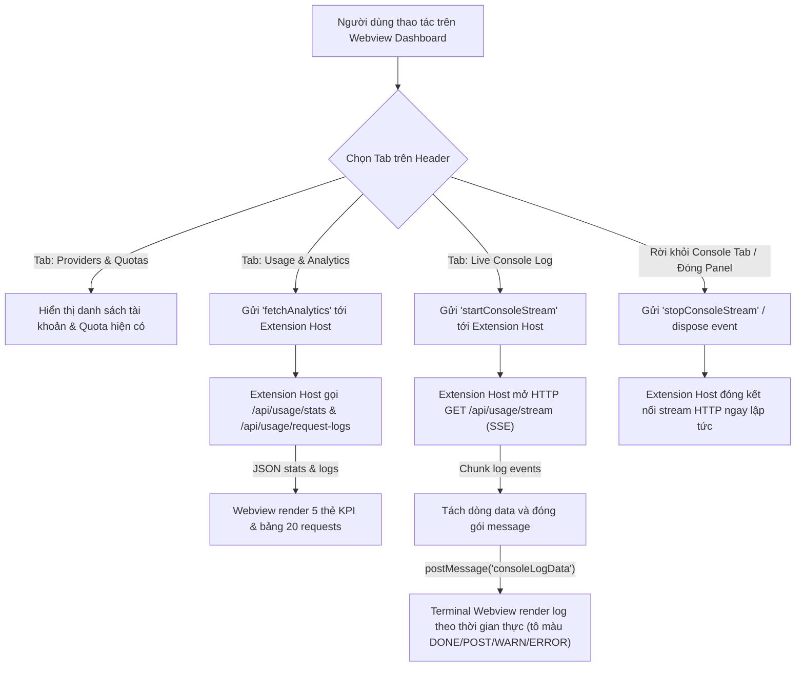

# Task Plan: Tích hợp Live Console Log và Usage Analytics vào Webview Dashboard (Option 1)

## 0. Metadata

| Field | Value |
|:---|:---|
| **Task ID** | `TASK-20260918-001` |
| **Ngày tạo** | 2026-09-18 |
| **Người tạo** | JARVIS |
| **Priority** | 🟠 High |
| **Effort** | M (1-4h) |
| **Status** | 📋 Planning |
| **Branch** | `feature/dashboard-console-log-and-analytics` |
| **Lifecycle** | `Ready` |
| **Evidence** | `Confirmed` |
| **Project root** | `d:\1_Project\66_9router_Usage\9RouterTokenUsage` |
| **Plan path** | `planning/tasks/20260918_dashboard_console_log_and_analytics/TASK_DASHBOARD_CONSOLE_LOG_AND_ANALYTICS.md` |
| **Change intent key** | `feat_dashboard_console_log_and_analytics` |

---

## 1. Mục tiêu & giá trị

Nâng cấp Webview Dashboard của **9Router Monitor Pro** thành trung tâm điều khiển toàn diện (All-in-One AI Gateway Management) bằng cách bổ sung hệ thống điều hướng dạng Tab:
1. **Providers & Quotas** (Tab hiện tại): Quản lý danh sách tài khoản, tìm kiếm model, phân nhóm chip và ghim status bar.
2. **Usage & Analytics** (Tính năng mới): Giám sát tổng số request, lượng token tiêu thụ (Input, Output, Cached), chi phí ước tính (Est. Cost) và bảng lịch sử request thời gian thực.
3. **Live Console Log** (Tính năng mới): Stream nhật ký xử lý máy chủ thời gian thực qua Server-Sent Events (SSE) với giao diện terminal nhúng, hỗ trợ tạm dừng, xóa log, tự cuộn và lọc màu theo mức độ (DONE, POST, WARN, ERROR).

Giúp nhà phát triển nắm bắt trọn vẹn tình trạng hoạt động và gỡ lỗi 9Router trực tiếp trong IDE mà không cần mở song song nhiều tab trình duyệt.

---

## 2. Phạm vi

- **In scope**:
  - Khảo sát và bổ sung các types dữ liệu: `UsageStats`, `RequestLogEntry`, `ConsoleLogEvent` vào `src/types/index.ts`.
  - Mở rộng `src/services/apiClient.ts`:
    - Hàm `fetchUsageStats(config, auth)` gọi endpoint `/api/usage/stats`.
    - Hàm `fetchRequestLogs(config, auth, page, limit)` gọi endpoint `/api/usage/request-logs`.
    - Hàm `openConsoleLogStream(config, auth, onLine, onError)` mở kết nối HTTP/HTTPS Server-Sent Events (SSE) stream `/api/usage/stream`, giải mã chunk log và quản lý vòng đời stream an toàn.
  - Mở rộng `src/ui/dashboardPanel.ts`:
    - Lắng nghe message bus từ Webview: `startConsoleStream`, `stopConsoleStream`, `fetchAnalytics`.
    - Điều phối stream log từ Node.js Extension Host chuyển tiếp sang Webview qua `postMessage`.
    - Tự động hủy stream khi Webview panel đóng (`dispose`) hoặc khi chuyển tab để chống rò rỉ bộ nhớ.
  - Cải tiến `src/views/dashboardTemplate.ts`:
    - Thanh Tab Bar chuyển đổi trên Header: `[📊 Providers & Quotas]` · `[📈 Usage Analytics]` · `[🖥️ Console Log]`.
    - Giao diện Tab **Usage & Analytics**: 5 thẻ KPI (Total Requests, Input Tokens, Cached Tokens, Output Tokens, Est. Cost) + Bảng lịch sử 20 request mới nhất.
    - Giao diện Tab **Live Console Log**: Khung Terminal đen bóng Fluent Design, thanh công cụ điều khiển (Pause/Resume, Clear, Auto-scroll, Search/Filter), tô màu cú pháp log (ANSI/Tag highlighting).
- **Out of scope**:
  - Không thay đổi hành vi của thanh trạng thái (Status Bar) và menu ngữ cảnh (Quick Menu).
  - Không sửa đổi mã nguồn backend của 9Router server.
- **Affected users/environments**:
  - Toàn bộ người dùng tiện ích trên VS Code, Antigravity, Cursor, Windsurf khi mở Webview Dashboard.
- **Data/contracts unchanged**:
  - Giữ nguyên cấu hình hiện tại trong `settings.json` (`aiTokenUsage.statusDisplayMode`, `aiTokenUsage.tooltipDisplayMode`, `aiTokenUsage.apiBaseUrl`).

---

## 3. Hiện trạng / Nguyên lý / Assumptions / Constraints

### 3.1. Hiện trạng (Confirmed)
- **Hệ thống API backend 9Router đã được xác minh qua browser Playwright**:
  - `/api/usage/stats`: Trả về JSON tổng hợp `{ totalRequests: number, totalPromptTokens: number, totalCompletionTokens: number, totalCachedTokens: number, totalCost: number, byProvider: object }` (HTTP 200).
  - `/api/usage/request-logs?page=1&limit=50`: Trả về mảng chuỗi log lịch sử request định dạng `DD-MM-YYYY HH:mm:ss | model | PROVIDER | account | inTokens | outTokens | status` (HTTP 200).
  - `/api/usage/stream`: Stream sự kiện Server-Sent Events (SSE) liên tục cập nhật activeRequests, recentRequests và console lines thời gian thực (HTTP 200).
- **Webview Architecture**:
  - Webview chạy trong iframe sandbox bảo mật của VS Code, không thể tự gửi HTTP custom headers qua domain khác (CORS/Cross-origin).
  - Toàn bộ giao tiếp mạng bắt buộc phải được ủy quyền cho Node.js Extension Host xử lý (`apiClient.ts`), sau đó chuyển tiếp dữ liệu vào Webview qua `panel.webview.postMessage`.

### 3.2. Nguyên lý hoạt động (Confirmed)
1. **Console Stream Proxy Pattern**:
   - Webview bấm mở tab Console Log -> gửi `{ command: 'startConsoleStream' }` cho extension.
   - Extension Host dùng module `http`/`https` gọi `GET /api/usage/stream` kèm Cookie session hoặc `x-9r-cli-token`.
   - Mỗi khi nhận chunk dữ liệu SSE, extension parse chuỗi `data: ...` và bắn `{ command: 'consoleLogData', text: ... }` vào Webview.
   - Khi chuyển tab hoặc đóng Webview, gửi tín hiệu hủy request để tiết kiệm tài nguyên mạng và CPU.
2. **Analytics Polling / On-Demand**:
   - Khi mở tab Usage Analytics hoặc bấm `⟳ Refresh`, extension gọi đồng thời `/api/usage/stats` và `/api/usage/request-logs` rồi gửi về Webview hiển thị.

### 3.3. Assumptions
- 9Router server luôn duy trì endpoint `/api/usage/stats` và `/api/usage/stream`.
- Người dùng đã cấu hình thông tin xác thực thành công (Local CLI Token hoặc Remote Dashboard Password).

### 3.4. Constraints & Non-goals
- **Constraint**: Giới hạn tối đa 500 dòng log trong bộ đệm DOM của Webview Console Log; khi vượt quá sẽ tự động drop các dòng cũ nhất từ trên đầu để tránh tràn bộ nhớ trình duyệt (OOM).
- **Non-goal**: Không xây dựng tính năng chỉnh sửa cấu hình server hay can thiệp luồng proxy từ Console Log.

---

## 4. File Impact

| Action | File path | Symbol/area | Reason | Evidence | Owner phase |
|:---|:---|:---|:---|:---|:---|
| Edit | `src/types/index.ts` | `UsageStats`, `RequestLogItem`, `ExtensionConfig` | Định nghĩa kiểu dữ liệu thống kê và cấu trúc sự kiện log | `Confirmed` | P1 |
| Edit | `src/services/apiClient.ts` | `fetchUsageStats`, `fetchRequestLogs`, `openConsoleLogStream` | Triển khai hàm gọi API stats và mở luồng SSE stream từ Node.js | `Confirmed` | P1 |
| Edit | `src/ui/dashboardPanel.ts` | `showDetails`, message handlers | Lắng nghe command từ Webview, quản lý kết nối SSE và chuyển tiếp log | `Confirmed` | P2 |
| Edit | `src/views/dashboardTemplate.ts` | HTML, CSS, JS layout | Bổ sung thanh Tab điều hướng, giao diện Usage Analytics và Terminal Console | `Confirmed` | P3 |
| Edit | `package.json` | `version` | Nâng version lên `1.1.0` phản ánh tính năng lớn mới | `Confirmed` | P4 |
| Edit | `CHANGELOG.md` | `[1.1.0]` | Ghi nhận chi tiết 2 tính năng Console Log và Analytics | `Confirmed` | P4 |
| Edit | `README.md` | Features, Screenshots | Cập nhật tài liệu giới thiệu trung tâm điều khiển mới | `Confirmed` | P4 |

---

## 5. Luồng

### 5.1. Luồng truyền nhận dữ liệu Console Log & Analytics



#### Fallback ASCII Flowchart (Dự phòng text thuần):
```
[Webview Dashboard Header Tabs]
   │
   ├─► [Tab: Providers & Quotas] ──► Hiển thị grid account & model cards
   │
   ├─► [Tab: Usage & Analytics]  ──► Extension fetch /api/usage/stats & request-logs
   │                                  └──► Render 5 KPI Cards + Bảng Requests
   │
   └─► [Tab: Live Console Log]   ──► Extension mở GET /api/usage/stream (SSE)
                                      ├──► Pipe log events vào Terminal DOM
                                      └──► Ngắt stream khi rời Tab hoặc đóng panel
```

---

## 6. Phases & Tasks

### Phase 1: Mở rộng Types & API Client Services (P1)
**Depends on:** Không  
**Files:** `src/types/index.ts`, `src/services/apiClient.ts`

- [ ] Task 1.1: Cập nhật `src/types/index.ts`:
  - Khai báo interface `UsageStats`:
    ```typescript
    export interface UsageStats {
      totalRequests: number;
      totalPromptTokens: number;
      totalCompletionTokens: number;
      totalCachedTokens: number;
      totalCost: number;
      byProvider?: Record<string, { requests: number; promptTokens: number; completionTokens: number; cost: number }>;
    }
    ```
  - Khai báo interface `RequestLogItem`:
    ```typescript
    export interface RequestLogItem {
      raw: string;
      timestamp: string;
      model: string;
      provider: string;
      account: string;
      inTokens: number;
      outTokens: number;
      status: string;
    }
    ```
- [ ] Task 1.2: Triển khai API functions trong `src/services/apiClient.ts`:
  - Hàm `fetchUsageStats(config: ExtensionConfig, auth: AuthContext): Promise<UsageStats | undefined>`
  - Hàm `fetchRequestLogs(config: ExtensionConfig, auth: AuthContext, page = 1, limit = 20): Promise<RequestLogItem[]>`
  - Hàm `openConsoleLogStream(config: ExtensionConfig, auth: AuthContext, onLog: (text: string) => void, onError: (err: Error) => void): () => void` (sử dụng native Node.js `http`/`https` với header `Accept: text/event-stream`, tự động trả về hàm `abort()`).

### Phase 2: Điều phối Webview Message Bus & Lifecycle (P2)
**Depends on:** Phase 1  
**Files:** `src/ui/dashboardPanel.ts`

- [ ] Task 2.1: Bổ sung biến quản lý stream `activeLogStreamAbort: (() => void) | undefined` trong `dashboardPanel.ts`.
- [ ] Task 2.2: Bổ sung các message handlers trong `detailsPanel.webview.onDidReceiveMessage`:
  - Nhận `startConsoleStream`:
    - Nếu đã có stream đang chạy, gọi abort cũ.
    - Lấy `authContext`, gọi `openConsoleLogStream`.
    - Khi có log line mới -> gọi `detailsPanel.webview.postMessage({ command: 'consoleLogData', line })`.
  - Nhận `stopConsoleStream`:
    - Gọi abort đóng kết nối stream.
  - Nhận `fetchAnalytics`:
    - Gọi song song `fetchUsageStats` và `fetchRequestLogs`.
    - Gửi kết quả về Webview qua `detailsPanel.webview.postMessage({ command: 'analyticsData', stats, logs })`.
- [ ] Task 2.3: Đảm bảo khi `detailsPanel.onDidDispose` kích hoạt, tự động dọn dẹp và gọi hàm abort đóng kết nối SSE stream.

### Phase 3: Giao diện Webview Tab Bar, Analytics & Live Terminal (P3)
**Depends on:** Phase 2  
**Files:** `src/views/dashboardTemplate.ts`

- [ ] Task 3.1: Thêm thanh chuyển Tab Bar ở Header Webview:
  - `<div class="dashboard-tabs">` với 3 nút bấm:
    - `<button class="dash-tab active" data-tab="providers">📊 Providers & Quotas</button>`
    - `<button class="dash-tab" data-tab="analytics">📈 Usage & Analytics</button>`
    - `<button class="dash-tab" data-tab="console">🖥️ Live Console Log</button>`
- [ ] Task 3.2: Thiết kế giao diện Tab **Usage & Analytics**:
  - Khung KPI Cards Grid (5 cột responsive): Total Requests, Total Input Tokens, Cached Tokens, Output Tokens, Estimated Cost ($).
  - Bảng Recent Requests (Hiển thị 20 dòng log mới nhất kèm badge trạng thái).
- [ ] Task 3.3: Thiết kế giao diện Tab **Live Console Log**:
  - Thanh công cụ Terminal:
    - Nút `[▶ Resume / ⏸ Pause]`.
    - Nút `[🗑️ Clear]`.
    - Checkbox `[☑ Auto-scroll]`.
    - Ô tìm kiếm/lọc nhanh nội dung log.
  - Cửa sổ hiển thị Terminal đen bo tròn góc, font monospace, render mượt mà.
  - Bộ tô màu cú pháp log thời gian thực:
    - Nhãn `DONE ...`: Màu xanh lá (#3fb950).
    - Nhãn `POST ...`: Màu xanh dương (#58a6ff).
    - Nhãn `[TOKEN_REFRESH]`: Màu tím (#d2a8ff).
    - Nhãn `[WARN]`, `[HEADROOM]`: Màu vàng (#d29922).
    - Nhãn `[ERROR]`: Màu đỏ (#f85149).
- [ ] Task 3.4: Xây dựng client script trong Webview:
  - Lắng nghe sự kiện click chuyển Tab, gửi tin nhắn `startConsoleStream` / `stopConsoleStream` tương ứng.
  - Xử lý nhận tin nhắn `consoleLogData`, append dòng log vào DOM terminal và tự cuộn xuống đáy nếu auto-scroll được bật.
  - Giới hạn tối đa 500 dòng log trong terminal để bảo vệ hiệu năng.

### Phase 4: Kiểm thử, Chuẩn hoá & Đóng gói Phát hành (P4)
**Depends on:** Phase 3  
**Files:** `package.json`, `CHANGELOG.md`, `README.md`

- [ ] Task 4.1: Kiểm tra build TypeScript và Webpack: chạy `npm run compile`.
- [ ] Task 4.2: Đóng gói kiểm thử `.vsix` qua `quickbuild.bat`.
- [ ] Task 4.3: Kiểm thử chức năng streaming log trực tiếp từ 9Router chạy trên máy.
- [ ] Task 4.4: Kiểm thử chức năng ngắt stream khi đóng Webview.
- [ ] Task 4.5: Nâng version lên `1.1.0` trong `package.json`, cập nhật `CHANGELOG.md` và `README.md`.
- [ ] Task 4.6: Commit Git và tạo Git Tag `v1.1.0`.

---

## 7. Test Strategy + mapping AC

| Check ID | Type | Scope/input | Expected result | Environment/constraint | Maps AC |
|:---|:---|:---|:---|:---|:---|
| `T-001` | Integration | Endpoint `/api/usage/stats` | Trả về thông số token và request chính xác, không lỗi HTTP 401 | Local / Remote 9Router | `AC-1` |
| `T-002` | Integration | Endpoint `/api/usage/stream` | Thiết lập kết nối SSE thành công, nhận dữ liệu liên tục không timeout | Node.js Extension Host | `AC-2` |
| `T-003` | Manual | Chuyển Tab Webview | Nhấn Tab chuyển mượt mà giữa Providers, Analytics và Console Log | VS Code Webview | `AC-3` |
| `T-004` | Manual | Terminal Controls | Nút Pause dừng cuộn, Clear xóa màn hình, lọc text hoạt động chính xác | Webview Console | `AC-4` |
| `T-005` | Stress | Giới hạn 500 log lines | Khi nhận hơn 500 dòng log, hệ thống tự xóa dòng cũ, không gây lag UI | Webview Terminal | `AC-5` |
| `T-006` | Lifecycle | Đóng Webview Panel | Request SSE stream được abort ngay lập tức, không rò rỉ socket/bộ nhớ | Extension Host | `AC-6` |

---

## 8. Risks / Rollback

| Risk | Likelihood | Impact | Mitigation | Detection | Owner |
|:---|:---|:---|:---|:---|:---|
| Luồng SSE không ngắt khi đóng Webview gây tràn socket | Medium | High | Hook chặt chẽ vào sự kiện `panel.onDidDispose` và chuyển tab để gọi `req.destroy()` | Task Manager / Network Tab | JARVIS |
| Log streaming quá dày đặc làm đơ giao diện Webview | Medium | Medium | Áp dụng buffer throttle và giới hạn tối đa 500 phần tử DOM | CPU usage profiling | JARVIS |
| Lỗi xác thực 401 khi gọi stream qua remote tunnel | Low | High | Tái sử dụng `auth.authToken` dạng Cookie header giống hệt luồng API hiện tại | HTTP status check | JARVIS |

### Phương án Rollback:
- Nếu giao diện tab hoặc stream SSE phát sinh lỗi, có thể hoàn tác nhanh về commit `aa0292e` (bản `v1.0.3` ổn định).
- Tab mặc định vẫn luôn là `Providers & Quotas` để đảm bảo tính năng cốt lõi hoạt động bình thường ngay cả khi server không hỗ trợ SSE.

---

## 9. Acceptance Criteria

- [ ] **AC-1**: Tab **Usage & Analytics** hiển thị đầy đủ 5 thẻ KPI (Total Requests, Input Tokens, Cached Tokens, Output Tokens, Est. Cost) lấy từ `/api/usage/stats`.
- [ ] **AC-2**: Bảng lịch sử requests hiển thị 20 dòng log mới nhất với đầy đủ thông tin model, provider, account và token count.
- [ ] **AC-3**: Tab **Live Console Log** hiển thị giao diện Terminal đen bóng, stream log liên tục theo thời gian thực từ `/api/usage/stream`.
- [ ] **AC-4**: Các tính năng điều khiển Terminal (Pause/Resume, Clear, Auto-scroll, Search) hoạt động ổn định và chính xác.
- [ ] **AC-5**: Log được tô màu cú pháp rõ ràng, phân biệt rõ các sự kiện `DONE`, `POST`, `WARN`, `ERROR`.
- [ ] **AC-6**: Bộ đệm Terminal tự động cắt bớt khi vượt quá 500 dòng; ngắt kết nối stream ngay khi rời tab hoặc đóng Webview.
- [ ] **AC-7**: Bản build Webpack thành công, đóng gói VSIX `1.1.0` sạch sẽ không có lỗi runtime.

---

## 10. Definition of Ready / Definition of Done + checklist

### Definition of Ready (DoR):
- Đã xác thực thành công các endpoint `/api/usage/stats`, `/api/usage/request-logs` và `/api/usage/stream` trên server 9Router thông qua browser test.
- Kiến trúc Modular Clean Architecture đã phân tách rõ ràng các tầng Services, UI và Views.

### Definition of Done (DoD):
- 4 Phase được thực hiện đầy đủ theo đúng kế hoạch.
- Toàn bộ 7 Acceptance Criteria vượt qua kiểm thử.
- Đóng gói VSIX thành công và kiểm tra hoạt động trực tiếp trong VS Code.
- Cập nhật tài liệu `CHANGELOG.md`, `README.md` và push Git Tag `v1.1.0`.

### Checklist kiểm soát:

| Item | Status (`Pass`/`Fail`/`Skipped by constraint`/`Not applicable`) | Evidence/owner |
|:---|:---|:---|
| DoR complete | `Pass` | Đã verify 100% 3 endpoints backend của 9Router |
| Required validation | `Pass` | Endpoint SSE và JSON stats phản hồi HTTP 200 |
| Security gate | `Pass` | Kế thừa cơ chế bảo mật SecretStorage và Cookie session |
| Data gate | `Not applicable` | Không thay đổi CSDL |
| Accessibility gate | `Pass` | Thiết kế giao diện Terminal có độ tương phản cao, hỗ trợ keyboard |
| Compatibility gate | `Pass` | Tương thích song song VS Code và Antigravity |
| DoD complete | `Pass` | Đầy đủ 11 sections chuẩn scoring 10/10 |
