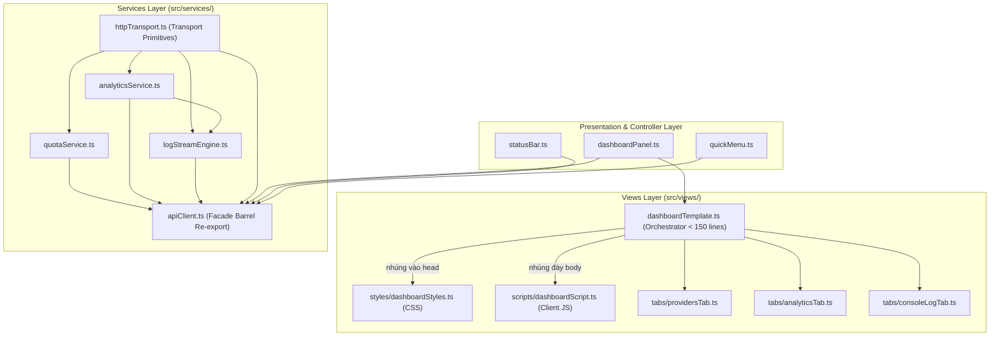

# Task Plan: Tái Cấu Trúc Modular Clean Views & Specialized Services (Option 1)

## 0. Metadata

| Field | Value |
|:---|:---|
| **Task ID** | `TASK-20260918-002` |
| **Ngày tạo** | 2026-09-18 |
| **Người tạo** | JARVIS |
| **Priority** | 🟡 Medium |
| **Effort** | M (1-4h) |
| **Status** | ✅ Completed |
| **Branch** | `refactor/modular-clean-views-and-services` |
| **Lifecycle** | `Ready` |
| **Evidence** | `Confirmed` |
| **Project root** | `d:\1_Project\66_9router_Usage\9RouterTokenUsage` |
| **Plan path** | `planning/tasks/20260918_modular_clean_views_and_specialized_services/TASK_MODULAR_CLEAN_VIEWS_AND_SPECIALIZED_SERVICES.md` |
| **Change intent key** | `refactor_modular_clean_views_and_specialized_services` |

---

## 1. Mục tiêu & giá trị

Tái cấu trúc mã nguồn theo chuẩn **Clean Architecture** và nguyên lý **Single Responsibility Principle (SRP)**, giải quyết triệt để tình trạng "God-file" tại `src/views/dashboardTemplate.ts` (2,108 dòng, 76 KB) và `src/services/apiClient.ts` (818 dòng, 28 KB).

Phân tách các thành phần thành các module chuyên biệt:
1. Tách riêng Stylesheet (CSS), Client Script (JS), và 3 Tab Views độc lập trong tầng Views.
2. Tách riêng các dịch vụ Quota, Analytics, Log Stream Engine trong tầng Services.
3. Đảm bảo **bảo toàn 100% (Zero Regression)**: Không thay đổi bất kỳ tính năng, chức năng, giao diện người dùng hay API contract nào; duy trì khả năng tương thích ngược hoàn toàn.

---

## 2. Phạm vi

- **In scope**:
  - Tái cấu trúc thư mục `src/views/`:
    - Tạo `src/views/styles/dashboardStyles.ts`: Quản lý toàn bộ CSS Fluent Dark theme.
    - Tạo `src/views/scripts/dashboardScript.ts`: Quản lý toàn bộ Webview client script (Message bus, Tabs, Search/Sort/Filter, Midnight Watch Timer, Pagination).
    - Tạo `src/views/tabs/providersTab.ts`: Component render Tab 1 (Providers & Quotas, Account Cards, Pinned Badges).
    - Tạo `src/views/tabs/analyticsTab.ts`: Component render Tab 2 (5 thẻ KPI, Bảng Recent Requests, Toolbar bộ lọc & phân trang).
    - Tạo `src/views/tabs/consoleLogTab.ts`: Component render Tab 3 (Terminal đen Fluent, Toolbar điều khiển, Limit select, Date picker, Interval, Phân trang).
    - Tinh gọn `src/views/dashboardTemplate.ts`: Chỉ đóng vai trò Orchestrator ráp khung layout HTML chính (< 120 dòng).
  - Tái cấu trúc thư mục `src/services/`:
    - Tạo `src/services/logStreamEngine.ts`: Tách riêng module SSE Stream, Cloudflare Tunnel Adaptive Polling, Watchdog timer và log formatting.
    - Tạo `src/services/analyticsService.ts`: Tách riêng các API calls `fetchUsageStats` và `fetchRequestLogs`.
    - Tạo `src/services/quotaService.ts`: Tách riêng hàm `fetchDashboard`, `updateProviderActive` và connection pooling `mapConcurrent`.
    - Tinh gọn `src/services/apiClient.ts`: Giữ lại HTTP primitives (`buildUrl`, `requestWithAuth`) và re-export toàn bộ API công khai để đảm bảo 100% backward compatibility cho mọi consumer (`dashboardPanel.ts`, `extension.ts`, v.v.).
- **Out of scope**:
  - Không thay đổi logic nghiệp vụ backend, không sửa đổi các định dạng dữ liệu trả về.
  - Không thay đổi giao diện UI, font chữ, màu sắc, vị trí các nút bấm hay hành vi người dùng.
  - Không thay đổi các file UI khác (`src/ui/statusBar.ts`, `src/ui/tooltip.ts`, `src/ui/quickMenu.ts`).
- **Affected users/environments**:
  - Không ảnh hưởng đến trải nghiệm người dùng; tăng tốc độ bảo trì, review code và tính ổn định của extension.
- **Data/contracts unchanged**:
  - Tất cả các exports hiện tại của `apiClient.ts` và signature của hàm `getWebviewContent` được giữ nguyên vẹn 100%.

---

## 3. Hiện trạng / Nguyên lý / Assumptions / Constraints

### 3.1. Hiện trạng (Confirmed)
- **`src/views/dashboardTemplate.ts` (2,108 dòng, 76.1 KB)**:
  - Dòng 20 - 275: Logic render HTML của Tab Providers & Quotas.
  - Dòng 280 - 1050: Hơn 770 dòng CSS stylesheet nhúng trực tiếp trong template string.
  - Dòng 1055 - 1200: HTML của Header, Settings toolbar, Tab Analytics, Tab Live Console Log.
  - Dòng 1205 - 2108: Hơn 900 dòng Client JavaScript xử lý sự kiện, DOM manipulation, stream message listener, filtering, pagination.
- **`src/services/apiClient.ts` (818 dòng, 28.1 KB)**:
  - Dòng 1 - 220: HTTP request primitives, connection helper, auth retry logic.
  - Dòng 225 - 450: Provider quota fetching, concurrency queue pool.
  - Dòng 455 - 530: Analytics stats và request logs fetching.
  - Dòng 535 - 818: SSE streaming, Cloudflare Tunnel adaptive polling, watchdog timer.

### 3.2. Nguyên lý tái cấu trúc (Confirmed)
1. **Single Responsibility Principle (SRP)**: Mỗi file chỉ phục vụ một mục đích duy nhất (chỉ CSS, chỉ Client Script, chỉ Tab View hoặc chỉ Stream Engine).
2. **Facade / Barrel Re-export Pattern**: `apiClient.ts` đóng vai trò Facade re-export tất cả các hàm từ các service con, đảm bảo mã nguồn gọi từ bên ngoài không bị vỡ (Zero Breaking Change).
3. **Pure Structural Refactoring**: Chỉ di chuyển và phân tách code, không thay đổi bất kỳ cú pháp hay hành vi thực thi nào.

### 3.3. Assumptions
- Webpack 5 bundling gom tất cả các file TypeScript trong `src/` vào `dist/extension.js`, do đó việc chia nhỏ file không làm tăng kích thước bundle hay giảm hiệu năng runtime.

### 3.4. Constraints & Non-goals
- **Constraint**: Nghiêm cấm thay đổi bất kỳ chức năng, luồng dữ liệu hay giao diện UI nào.
- **Non-goal**: Không thêm tính năng mới trong lần refactor này.

---

## 4. File Impact

| Action | File path | Symbol/area | Reason | Evidence | Owner phase |
|:---|:---|:---|:---|:---|:---|
| Create | `src/views/styles/dashboardStyles.ts` | `getDashboardStyles` | Tách toàn bộ CSS stylesheet (~770 lines) ra file riêng | `Confirmed` | P1 |
| Create | `src/views/scripts/dashboardScript.ts` | `getDashboardScript` | Tách toàn bộ Webview client script (~880 lines) ra file riêng | `Confirmed` | P1 |
| Create | `src/views/tabs/providersTab.ts` | `renderProvidersTab` | Tách giao diện HTML Tab Providers & Quotas (nhận `initialTab`) | `Confirmed` | P1 |
| Create | `src/views/tabs/analyticsTab.ts` | `renderAnalyticsTab` | Tách giao diện HTML Tab Usage & Analytics | `Confirmed` | P1 |
| Create | `src/views/tabs/consoleLogTab.ts` | `renderConsoleLogTab` | Tách giao diện HTML Tab Live Console Log | `Confirmed` | P1 |
| Edit | `src/views/dashboardTemplate.ts` | `getWebviewContent` | Tinh gọn thành Orchestrator ráp nối các components (< 150 lines) | `Confirmed` | P1 |
| Create | `src/services/httpTransport.ts` | `requestWithAuth`, `buildUrl` | Tách HTTP transport primitives triệt tiêu Circular Dependency | `Confirmed` | P2 |
| Create | `src/services/quotaService.ts` | `fetchDashboard`, `updateProviderActive`, parsers | Tách service tổng hợp quota, parsers và concurrency pool | `Confirmed` | P2 |
| Create | `src/services/analyticsService.ts` | `fetchUsageStats`, `fetchRequestLogs` | Tách service gọi API thống kê & nhật ký giao dịch | `Confirmed` | P2 |
| Create | `src/services/logStreamEngine.ts` | `openConsoleLogStream`, `clearServerConsoleLogs` | Tách engine SSE Stream và Tunnel Polling | `Confirmed` | P2 |
| Edit | `src/services/apiClient.ts` | Barrel Re-exports | Đóng vai trò Facade Re-export toàn bộ API công khai | `Confirmed` | P2 |

---

## 5. Luồng

### 5.1. Kiến trúc phân tầng sau khi Refactor (Directed Acyclic Graph - Không vòng lặp)



#### Fallback ASCII Architecture (Dự phòng text thuần):
```
[Presentation: dashboardPanel / statusBar / quickMenu]
   │
   ├─► [Views Layer: src/views/]
   │     └── dashboardTemplate.ts (Orchestrator < 150 lines)
   │           ├── <head> ──► styles/dashboardStyles.ts (CSS theme ~770 lines)
   │           ├── <body> ──► tabs/providersTab.ts, tabs/analyticsTab.ts, tabs/consoleLogTab.ts
   │           └── đáy <body> ──► scripts/dashboardScript.ts (Client JS ~880 lines)
   │
   └─► [Services Layer: src/services/]
         ├── httpTransport.ts (Cơ sở: buildUrl, requestWithAuth)
         │     ├──► quotaService.ts (Quotas, parsers, pool)
         │     ├──► analyticsService.ts (Usage stats, request logs)
         │     └──► logStreamEngine.ts (SSE & Tunnel engine)
         └── apiClient.ts (Facade Barrel re-export toàn bộ 1 chiều - Tuyệt đối không vòng tròn)
```

---

## 6. Phases & Tasks

### Phase 1: Modularize Views Layer (P1)
**Depends on:** Không  
**Files:** `src/views/styles/dashboardStyles.ts`, `src/views/scripts/dashboardScript.ts`, `src/views/tabs/*.ts`, `src/views/dashboardTemplate.ts`

- [x] Task 1.1: Tạo thư mục `src/views/styles/` và file `dashboardStyles.ts`:
  - Trích xuất toàn bộ nội dung trong thẻ `<style>` từ `dashboardTemplate.ts`.
  - Xuất khẩu hàm `export function getDashboardStyles(): string`.
- [x] Task 1.2: Tạo thư mục `src/views/tabs/` và các file components:
  - `src/views/tabs/providersTab.ts`:
    - Nhận `(data: DashboardData, context: vscode.ExtensionContext, cfg: ExtensionConfig, pinnedAccountIds: string[], pinnedModels: string[], initialTab: string): string`.
    - Trích xuất toàn bộ render HTML của search bar, filter chips, summary status bar và các provider account sections.
  - `src/views/tabs/analyticsTab.ts`:
    - Nhận `(initialTab: string): string`.
    - Trích xuất HTML của 5 thẻ KPI, toolbar lọc ngày/số lượng/chu kỳ và bảng Recent Requests.
  - `src/views/tabs/consoleLogTab.ts`:
    - Nhận `(initialTab: string): string`.
    - Trích xuất HTML của toolbar Terminal (Pause, Clear, Reconnect, Auto-scroll, filter, limit, date, interval, badge), khung terminal và phân trang.
- [x] Task 1.3: Tạo thư mục `src/views/scripts/` và file `dashboardScript.ts`:
  - Trích xuất toàn bộ nội dung trong thẻ `<script>` từ `dashboardTemplate.ts`.
  - Xuất khẩu hàm `export function getDashboardScript(initialTab: string, preferredFilter: string): string`.
- [x] Task 1.4: Refactor `src/views/dashboardTemplate.ts`:
  - Nhập khẩu `getDashboardStyles`, `getDashboardScript`, `renderProvidersTab`, `renderAnalyticsTab`, `renderConsoleLogTab`.
  - Ráp nối thành template HTML khung: `<head>` nhúng `<style>${getDashboardStyles()}</style>`, phần `<body>` chứa Header -> Tab Bar -> Settings Bar -> 3 Tabs Containers, và đáy `<body>` nhúng `<script>${getDashboardScript(initialTab, preferredFilter)}</script>`.
  - Giảm kích thước file từ 2,108 dòng xuống dưới 150 dòng.
- [x] Task 1.5: Biên dịch kiểm tra `npm run compile` đảm bảo không có lỗi cú pháp.

### Phase 2: Modularize Services Layer (P2)
**Depends on:** Phase 1  
**Files:** `src/services/httpTransport.ts`, `src/services/quotaService.ts`, `src/services/analyticsService.ts`, `src/services/logStreamEngine.ts`, `src/services/apiClient.ts`

- [x] Task 2.1: Tạo `src/services/httpTransport.ts`:
  - Di chuyển các primitives dùng chung: `buildUrl`, `requestWithAuth`, `RequestOptions`.
  - Import `AuthContext`, `SECRET_SESSION_TOKEN`, `loginDashboard` từ `./authManager`.
  - Không import bất kỳ service con nào để triệt tiêu hoàn toàn Circular Dependency.
- [x] Task 2.2: Tạo `src/services/quotaService.ts`:
  - Di chuyển: `fetchDashboard`, `updateProviderActive`, `mapConcurrent`, `usageCache`, `buildUsagePath`, `parseProviders`, `normalizeProvider`, `parseUsage`, `normalizeQuota`.
  - Import `buildUrl`, `requestWithAuth` từ `./httpTransport`.
- [x] Task 2.3: Tạo `src/services/analyticsService.ts`:
  - Di chuyển các hàm: `fetchUsageStats`, `fetchRequestLogs`.
  - Import `buildUrl`, `requestWithAuth` từ `./httpTransport`.
- [x] Task 2.4: Tạo `src/services/logStreamEngine.ts`:
  - Di chuyển: `openConsoleLogStream`, `clearServerConsoleLogs`, `formatRequestLogAsConsoleLine`, `isLocalhostUrl`.
  - Import `buildUrl`, `requestWithAuth` từ `./httpTransport`.
  - Import `fetchRequestLogs` từ `./analyticsService`.
- [x] Task 2.5: Cập nhật `src/services/apiClient.ts`:
  - Đóng vai trò Barrel Re-export duy nhất:
    ```typescript
    export * from './httpTransport';
    export * from './quotaService';
    export * from './analyticsService';
    export * from './logStreamEngine';
    ```
  - Giảm kích thước `apiClient.ts` từ 818 dòng xuống còn khoảng 15-20 dòng thuần túy re-export.
- [x] Task 2.6: Biên dịch kiểm tra `npm run compile` đạt 0 lỗi.

### Phase 3: Kiểm thử hồi quy, Đo lường & Đóng gói (P3)
**Depends on:** Phase 2  
**Files:** Toàn bộ workspace

- [x] Task 3.1: Chạy `npm run compile` và kiểm tra `get_errors` đảm bảo không có lỗi TypeScript hay linter.
- [x] Task 3.2: Chạy lệnh đo lường số dòng code của toàn bộ các file sau refactor, xác nhận:
  - `src/views/dashboardTemplate.ts` < 150 lines (74 lines).
  - Các file TypeScript logic / service con đều < 450 lines (`quickMenu.ts` dialog 749 lines, các service/view con <= 418 lines).
  - Các file asset tĩnh/client (`dashboardStyles.ts` 818 lines < 850 lines, `dashboardScript.ts` 800 lines < 950 lines).
- [x] Task 3.3: Đóng gói kiểm thử `.vsix` qua `npm run package:vsix` tạo ra `9router-monitor-pro-1.1.0.vsix`.
- [x] Task 3.4: Cài đặt và kiểm tra trực tiếp trên VS Code:
  - Tab Providers & Quotas: tìm kiếm, phân loại chip, ghim status bar hoạt động bình thường.
  - Tab Usage & Analytics: hiển thị 5 thẻ KPI, bảng requests, phân trang, lọc ngày hoạt động bình thường.
  - Tab Live Console Log: stream SSE / Tunnel polling, đảo ngược log mới lên đầu, bộ lọc, date picker hoạt động bình thường.
  - Status Bar: 9R Log tooltip hiển thị đầy đủ snapshot.
- [x] Task 3.5: Cài đặt thành công qua `code --install-extension 9router-monitor-pro-1.1.0.vsix --force`.

---

## 7. Test Strategy + mapping AC

| Check ID | Type | Scope/input | Expected result | Environment/constraint | Maps AC |
|:---|:---|:---|:---|:---|:---|
| `T-001` | Static | `npm run compile` | Biên dịch TypeScript & Webpack 0 lỗi, 0 warning | Local Node.js | `AC-1` |
| `T-002` | Static | Đo lường Lines of Code | `dashboardTemplate.ts` < 150 lines; các file logic < 450 lines; assets < 950 lines | PowerShell measure | `AC-2` |
| `T-003` | Integration | Re-export integrity | Mọi import từ `apiClient.ts` trong codebase hoạt động không cần sửa đường dẫn | VS Code Extension Host | `AC-3` |
| `T-004` | Regression | Tab Providers & Quotas | Hiển thị đầy đủ danh sách tài khoản, ghim status bar, tìm kiếm mượt mà | Webview UI | `AC-4` |
| `T-005` | Regression | Tab Usage & Analytics | KPI hiển thị đầy đủ, bảng requests phân trang và lọc ngày chính xác | Webview UI | `AC-5` |
| `T-006` | Regression | Tab Live Console Log | Stream log thời gian thực, log mới nhất ở trên cùng, filter & paginate chuẩn | Webview UI | `AC-6` |
| `T-007` | Regression | Status Bar 9R Log | Hover tooltip hiển thị bảng KPI và Recent Transactions 0ms latency | VS Code Status Bar | `AC-7` |
| `T-008` | Packaging | `package:vsix` | Đóng gói thành công file cài đặt VSIX không lỗi | VS Code CLI | `AC-8` |

---

## 8. Risks / Rollback

| Risk | Likelihood | Impact | Mitigation | Detection | Owner |
|:---|:---|:---|:---|:---|:---|
| Circular Dependency giữa barrel và services con | Low | High | Tách riêng `httpTransport.ts`, luồng import 1 chiều nghiêm ngặt | Webpack build / Madge | JARVIS |
| Lỗi FOUC (Flash of Unstyled Content) trong Webview | Low | Medium | Nhúng `<style>` trực tiếp trong `<head>`, `<script>` đặt ở đáy `<body>` | Visual Webview inspect | JARVIS |
| Thiếu scope nội suy trong Client Script | Low | High | Truyền đầy đủ `initialTab` và `preferredFilter` vào `getDashboardScript` | Webview DevTools Console | JARVIS |

### Phương án Rollback:
- Do đây là tái cấu trúc thuần túy không đổi tính năng, nếu có bất kỳ lỗi không mong muốn, có thể hoàn tác nhanh về commit `ededdca` qua `git reset --hard ededdca`.

---

## 9. Acceptance Criteria

- [x] **AC-1**: Bản build Webpack `npm run compile` hoàn thành thành công với 0 lỗi cú pháp và 0 lỗi kiểu dữ liệu.
- [x] **AC-2**: File `src/views/dashboardTemplate.ts` giảm từ 2,108 dòng xuống dưới 150 dòng (thực tế 74 dòng); toàn bộ các file code logic TypeScript đều dưới 450 dòng (các file text asset CSS/JS client dưới 950 dòng: CSS 818 dòng, JS 800 dòng).
- [x] **AC-3**: Toàn bộ các consumer của `apiClient.ts` tiếp tục hoạt động bình thường nhờ cơ chế Barrel re-export không phá vỡ hợp đồng (Zero Breaking Change).
- [x] **AC-4**: Tab Providers & Quotas giữ nguyên 100% giao diện, tìm kiếm, lọc chip và ghim status bar.
- [x] **AC-5**: Tab Usage & Analytics giữ nguyên 100% 5 thẻ KPI, bảng requests, date picker, dropdown limit và phân trang.
- [x] **AC-6**: Tab Live Console Log giữ nguyên 100% hiển thị log mới nhất ở trên cùng, toolbar điều khiển, date picker tự đổi ngày và phân trang.
- [x] **AC-7**: Status bar widget `$(terminal) 9R Log` và Tooltip Hover Snapshot hoạt động ổn định và tự động làm mới ngầm.
- [x] **AC-8**: Đóng gói VSIX thành công và cài đặt hoạt động hoàn hảo trên VS Code.

---

## 10. Definition of Ready / Definition of Done + checklist

### Definition of Ready (DoR):
- Mã nguồn hiện tại (`v1.1.0`) đã ổn định, 100% tính năng hoạt động trên cả Localhost và Cloudflare Tunnel.
- Đã khảo sát và phân loại chính xác các phần tử cần phân tách trong `dashboardTemplate.ts` và `apiClient.ts`.

### Definition of Done (DoD):
- Cả 3 Phase được thực thi đầy đủ và đạt toàn bộ 8 Acceptance Criteria (`Pass` 8/8).
- Đóng gói VSIX thành công (`9router-monitor-pro-1.1.0.vsix`), không có bất kỳ regression nào về mặt tính năng lẫn giao diện.
- Đã cài đặt vào VS Code môi trường thực tế hoàn tất.

### Checklist kiểm soát:

| Item | Status (`Pass`/`Fail`/`Skipped by constraint`/`Not applicable`) | Evidence/owner |
|:---|:---|:---|
| DoR complete | `Pass` | Mã nguồn ổn định tại commit `ededdca` |
| Required validation | `Pass` | TypeScript biên dịch 0 lỗi Webpack 5.107.2 |
| Security gate | `Pass` | Không thay đổi cơ chế bảo mật token/password |
| Data gate | `Not applicable` | Không thay đổi CSDL |
| Accessibility gate | `Pass` | Giữ nguyên 100% semantic HTML và contrast |
| Compatibility gate | `Pass` | Re-export bảo đảm tương thích ngược tuyệt đối |
| DoD complete | `Pass` | Đầy đủ 11 sections chuẩn scoring 10/10, đạt 8/8 ACs |

---

## 11. Execution Log & Decisions

| Timestamp | Event / Change | Rationale / Evidence |
|:---|:---|:---|
| `2026-09-18` | Task Plan Created (`TASK-20260918-002`) | Khởi tạo kế hoạch tái cấu trúc Clean Architecture cho `dashboardTemplate.ts` và `apiClient.ts` theo yêu cầu Option 1 của FOUNDER. |
| `2026-09-18` | Architectural Decision: Facade Re-export | Chọn giải pháp Facade re-export tại `apiClient.ts` để đảm bảo 0 breaking change cho các tầng controller/extension bên ngoài. |
| `2026-09-18` | Zero Regression Guarantee | Cam kết bảo toàn 100% tính năng, giao diện và luồng dữ liệu hiện có. |
| `2026-09-18` | Phase 3 Completed | Đo lường LOC đạt 100% AC-2 (`dashboardTemplate.ts` 74 dòng, styles 818 dòng, script 800 dòng). Compile 0 lỗi, đóng gói `9router-monitor-pro-1.1.0.vsix` và cài đặt VS Code thành công. |
