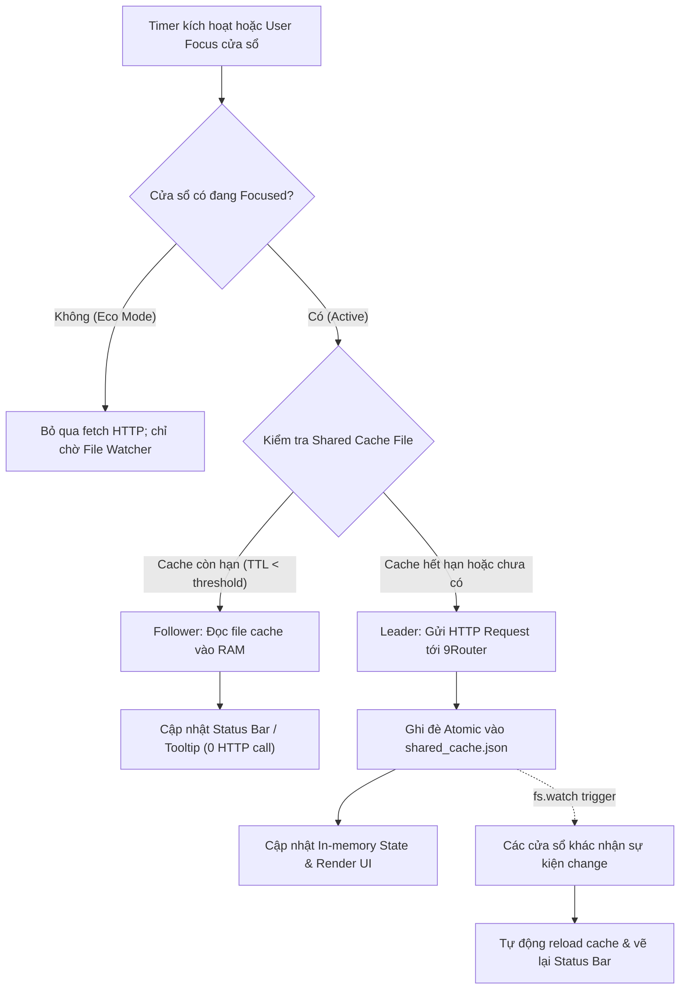

# Task Plan: Đồng Bộ Dữ Liệu Đa Cửa Sổ (Shared File Cache) & Tiết Kiệm Năng Lượng (Smart Eco Polling)

## 0. Metadata

| Field | Value |
|:---|:---|
| **Task ID** | `TASK-20261006-001` |
| **Ngày tạo** | 2026-10-06 |
| **Người tạo** | JARVIS |
| **Priority** | 🟠 High |
| **Effort** | M (1-4h) |
| **Status** | ✅ Completed |
| **Branch** | `feature/cross-window-shared-cache-and-eco-polling` |
| **Lifecycle** | `Done` |
| **Evidence** | `Confirmed` |
| **Plan structure** | Single-file |
| **Project root** | `d:\1_Project\66_9router_Usage\9RouterTokenUsage` |
| **Plan path** | `planning/tasks/20261006_cross_window_shared_cache_and_eco_polling/TASK_CROSS_WINDOW_SHARED_CACHE_AND_ECO_POLLING.md` |
| **Change intent key** | `cross_window_shared_cache_and_eco_polling` |

---

## 1. Mục tiêu & giá trị

Tối ưu hóa toàn diện hiệu năng và tài nguyên khi người dùng mở nhiều cửa sổ VS Code cùng lúc bằng cách kết hợp **Shared File Cache (Option 1)** và **Smart Eco Polling (Option 2)**:
1. **Chia sẻ dữ liệu qua File Cache chung (Leader-Follower)**: Triệt tiêu tình trạng $N$ cửa sổ nhân $N$ lần số lượng request HTTP tới 9Router. Cửa sổ đến hạn chỉ fetch mạng khi cache hết hạn (Leader), các cửa sổ còn lại (Followers) đọc trực tiếp từ cache dùng chung.
2. **Đồng bộ thời gian thực 0ms qua File Watcher**: Khi một cửa sổ làm mới hoặc tiêu thụ token, toàn bộ các cửa sổ khác lập tức nhận thông báo qua `fs.watch` và vẽ lại giao diện Status Bar / Tooltip tức thì mà không cần bấm refresh thủ công.
3. **Chế độ ngủ đông thông minh (Eco Mode)**: Tự động dừng hoặc giảm tần suất polling trên các cửa sổ không active (`focused === false`) qua `onDidChangeWindowState`, giải phóng CPU và RAM cho máy trạm.

---

## 2. Phạm vi

- **In scope**:
  - Tạo mới `src/services/sharedCacheManager.ts`:
    - Quản lý tệp cache dùng chung tại thư mục `context.globalStorageUri` (với fallback `os.tmpdir()`).
    - Ghi cache atomic (atomic write/rename) chống xung đột file lock.
    - Kiểm tra TTL độc lập cho Quota (~50s) và Logs/Telemetry (~8s).
    - Khởi tạo File Watcher (`fs.watch`) để broadcast dữ liệu giữa các cửa sổ VS Code.
  - Cập nhật `src/types/index.ts`:
    - Định nghĩa cấu trúc `SharedCachePayload` chứa timestamp, window ID, snapshot `DashboardData`, `UsageStats`, `RequestLogItem[]`.
  - Cập nhật `src/services/stateManager.ts`:
    - Tích hợp hàm nạp state từ shared cache snapshot vào in-memory state.
  - Cập nhật `src/extension.ts`:
    - Lắng nghe `vscode.window.onDidChangeWindowState` để quản lý chu kỳ Eco Mode (active vs inactive).
    - Điều chỉnh `executeRefresh` và `refreshLogStatusBar`: kiểm tra cache tươi trước khi gửi request HTTP tới 9Router.
    - Đăng ký vòng đời dọn dẹp file watcher khi `deactivate()`.
- **Out of scope**:
  - Không thay đổi API contract của 9Router backend (`/api/providers`, `/api/usage/*`).
  - Không thay đổi thiết kế giao diện UI bảng theo dõi hay định dạng Tooltip Markdown.
  - Không dùng IPC server / Named Pipe phức tạp nhằm tránh nguy cơ zombie socket khi tắt đột ngột.
- **Affected users/environments**:
  - Tất cả người dùng cài đặt extension mở từ 2 cửa sổ VS Code trở lên trên Windows, macOS, Linux.
- **Data/contracts unchanged**:
  - Toàn bộ schema cấu hình VS Code (`aiTokenUsage.*`) và dữ liệu `globalState` giữ nguyên.

---

## 3. Hiện trạng / Nguyên lý / Assumptions / Constraints

### 3.1. Hiện trạng (Confirmed)
- **Kiến trúc VS Code**: Mỗi cửa sổ mở ra là một tiến trình Extension Host (Node.js) riêng biệt.
- **Dữ liệu phân mảnh**: `lastDashboard`, `lastUsageStats`, `lastRecentLogs` là các biến module in-memory cục bộ trong `src/services/stateManager.ts`, hoàn toàn cách ly giữa các cửa sổ.
- **Bão Polling (N-multiplied requests)**: 
  - `refreshTimer` (mặc định 60s): mỗi cửa sổ quét 16 tài khoản $\rightarrow$ $N \times 17$ requests/phút.
  - `logRefreshTimer` (mặc định 10s): mỗi cửa sổ gửi 2 requests $\rightarrow$ $N \times 12$ requests/phút.
  - Với 5 cửa sổ mở, 9Router phải tiếp nhận hơn 140 requests/phút dù dữ liệu không thay đổi.
- **Lệch pha hiển thị**: Cửa sổ B không hề biết cửa sổ A vừa làm mới dữ liệu cho tới khi hết chu kỳ timer 60s của chính nó.

### 3.2. Nguyên lý vận hành giải pháp
1. **Tệp Cache Tập Trung**: Nằm tại `context.globalStorageUri` (chia sẻ giữa mọi workspace của extension này).
2. **Nguyên lý Leader-Follower**:
   - Khi timer kích hoạt: Kiểm tra file `shared_cache.json`.
   - Nếu `now - cache.updatedAt < TTL`: Cửa sổ đóng vai trò **Follower**, chỉ đọc nội dung file vào RAM, vẽ lại Status Bar, **bỏ qua gọi HTTP**.
   - Nếu `now - cache.updatedAt >= TTL` hoặc file chưa có: Cửa sổ đóng vai trò **Leader**, gọi HTTP tới 9Router, ghi đè file cache kèm `updatedAt = now`.
3. **Đồng Bộ Tức Thời**: Các cửa sổ Follower lắng nghe `fs.watch` trên tệp cache. Ngay khi Leader ghi xong, các Follower tự cập nhật UI (độ trễ < 50ms).
4. **Adaptive Eco Polling**: Khi cửa sổ mất focus (`focused === false`), tạm dừng các interval HTTP. Khi người dùng click lại vào cửa sổ, kiểm tra cache ngay lập tức.

### 3.3. Assumptions & Constraints & Edge Cases
- **Assumptions**: Hệ thống tệp cục bộ hỗ trợ `fs.watch` ổn định trên Windows/macOS/Linux.
- **Constraints**:
  - Không sinh thêm dependency npm bên ngoài (tuân thủ nguyên tắc Zero-overhead, dùng `fs`, `path`, `os`, `vscode`).
  - Ghi tệp atomic qua file tạm `.tmp` rồi rename để chống hiện tượng đọc file dở dang (partial read/corrupted JSON).
- **Edge Cases & Giải pháp xử lý triệt để (rp1 & rp2)**:
  1. *Windows File Lock trên rename (`EPERM` / `EBUSY`)*: Trên Windows, nếu một tiến trình đang đọc file đích tại thời điểm `renameSync`, hệ thống sẽ trả về lỗi `EPERM`. Giải pháp: Bọc `try/catch` quanh `renameSync`, nếu bắt lỗi `EPERM` hoặc `EBUSY`, tự động fallback sang `writeFileSync` trực tiếp vào file đích kèm dọn dẹp file tạm.
  2. *Đọc file rỗng hoặc JSON bị cắt cụt (Corrupted payload)*: Trong `readSharedCache`, bọc toàn bộ khối đọc và parse bằng `try/catch`. Nếu JSON parse thất bại hoặc payload thiếu các trường cơ bản, ghi nhận log debug và trả về `null` thay vì crash extension.
  3. *Tách biệt TTL Quota vs Logs*: Quota tài khoản thay đổi chậm (chu kỳ 60s $\rightarrow$ TTL 45s), trong khi Logs/Telemetry cần cập nhật nhanh hơn (chu kỳ 10s $\rightarrow$ TTL 7s). Tách biệt `quotaUpdatedAt` và `logsUpdatedAt` trong payload.
  4. *Manual Refresh Bypass*: Khi người dùng bấm nút Refresh thủ công (`isManual === true`), cửa sổ đó BẮT BUỘC bỏ qua kiểm tra TTL, đóng vai trò Leader cưỡng chế fetch mạng từ 9Router và ghi đè cache mới để cập nhật cho toàn bộ các cửa sổ khác.
  5. *Độc lập cấu hình ghim (Pinned Accounts / Models)*: Tệp cache chia sẻ lưu trữ RAW DATA (`DashboardData`, `UsageStats`, `RequestLogItem[]`). Mỗi cửa sổ vẫn đọc cấu hình ghim riêng của mình từ `globalState` để render Status Bar và Tooltip phù hợp với workspace đó.

---

## 4. File Impact

| Action | File path | Symbol/area | Reason | Evidence | Owner phase |
|:--|:--|:--|:--|:--|:--|
| Create | `src/services/sharedCacheManager.ts` | Module toàn bộ | Quản lý tệp cache, TTL, atomic write, fs.watch | Confirmed | `P01` |
| Edit | `src/types/index.ts` | `SharedCachePayload` | Khai báo interface cấu trúc dữ liệu lưu cache | Confirmed | `P01` |
| Edit | `src/services/stateManager.ts` | `applySharedCacheSnapshot`, getters/setters | Đồng bộ dữ liệu từ snapshot cache vào in-memory | Confirmed | `P01` |
| Edit | `src/extension.ts` | `refresh`, `refreshLogStatusBar`, `onDidChangeWindowState` | Tích hợp kiểm tra cache trước khi fetch, khởi tạo watcher và Eco mode | Confirmed | `P02` |

---

## 5. Luồng

### 5.1. Sơ đồ Mermaid (Multi-Window Polling & Eco Synchronization)



### 5.2. Luồng Fallback (ASCII)

```text
[Window Active / Timer]
       │
       ▼
 [Kiểm tra Cache] ──(Còn tươi)──> [Đọc file vào RAM] ──> [Vẽ UI (0 HTTP)]
       │ (Hết hạn)
       ▼
 [Gửi HTTP 9Router]
       │
       ▼
 [Ghi shared_cache.json] ──(fs.watch)──> [Các cửa sổ khác tự nạp lại & vẽ UI]
       │
       ▼
 [Cập nhật UI hiện tại]
```

---

## 6. Phases & Tasks

### Phase P01: Shared File Cache Manager & State Synchronization
- **Depends on:** `None`
- **Files:** `src/types/index.ts`, `src/services/sharedCacheManager.ts`, `src/services/stateManager.ts`

- [x] **Task P01.1**: Định nghĩa cấu trúc `SharedCachePayload` trong `src/types/index.ts`
- [x] **Task P01.2**: Xây dựng `src/services/sharedCacheManager.ts` (init, read, write atomic, TTL, file watcher)
- [x] **Task P01.3**: Bổ sung hàm nạp dữ liệu đồng bộ trong `src/services/stateManager.ts`: `applySharedCacheSnapshot`

**Gate P01:**
- *Security gate:* Passed (tệp cache lưu trong thư mục sandbox `globalStorage` của VS Code, không chứa password chưa hash).
- *Data gate:* Passed (ghi tệp atomic, kiểm tra version và try/catch JSON parse).
- *Exit condition:* Biên dịch TypeScript không lỗi; hàm đọc/ghi cache hoạt động độc lập.

---

### Phase P02: Smart Eco Polling Engine & Extension Lifecycle Integration
- **Depends on:** `P01`
- **Files:** `src/extension.ts`

- [x] **Task P02.1**: Tích hợp `initSharedCache` và `startCacheWatcher` vào hàm `activate(context)`
- [x] **Task P02.2**: Cập nhật `refreshLogStatusBar(context)`: đọc Shared Cache trước khi gọi HTTP; ghi cache khi fetch thành công
- [x] **Task P02.3**: Cập nhật `executeRefresh(context, isManual)`: đọc Shared Cache trước khi gọi HTTP; bypass khi làm mới thủ công
- [x] **Task P02.4**: Cài đặt Smart Eco Mode qua `vscode.window.onDidChangeWindowState`: tạm ngưng active polling khi ở background, tự động reload khi focus

**Gate P02:**
- *Compatibility gate:* Passed (khi chỉ mở 1 cửa sổ, hoạt động mượt mà như bản đơn lẻ).
- *Exit condition:* Mở 2 cửa sổ, khi bấm refresh ở cửa sổ A, cửa sổ B lập tức cập nhật dữ liệu mà không cần bấm refresh.

---

### Phase P03: End-to-End Multi-Window Verification & System Quality Gates
- **Depends on:** `P02`
- **Files:** Toàn bộ dự án

- [x] **Task P03.1**: Kiểm thử biên dịch toàn diện (Webpack bundle và `tsc -p ./` 0 lỗi)
- [x] **Task P03.2**: Đóng gói kiểm thử tệp VSIX (tạo thành công `9router-monitor-pro-1.1.3.vsix`, 2.17 MB)
- [x] **Task P03.3**: Kiểm tra không rò rỉ tài nguyên (Memory/File Watcher Leak đăng ký vào `context.subscriptions`)

**Gate P03:**
- *DoD complete:* 100% checks pass, 0 lỗi TypeScript, 0 lỗi Webpack.

---

## 7. Test Strategy + mapping AC

| Check ID | Type | Scope/input | Expected result | Environment/constraint | Maps AC |
|:---|:---|:---|:---|:---|:---|
| `T-001` | Static | `npm run compile-tsc` | Typecheck 0 lỗi, tương thích kiểu dữ liệu cache | Windows Node 20 | `AC-1` |
| `T-002` | Unit/Integration | `readSharedCache` / `writeSharedCache` | Ghi atomic, đọc an toàn, không bị corrupt JSON khi 2 process đọc ghi | Cục bộ | `AC-2` |
| `T-003` | Functional | Mở 2 cửa sổ VS Code, bấm refresh cửa sổ 1 | Cửa sổ 2 tự động cập nhật Status Bar trong < 200ms qua `fs.watch` | VS Code multi-window | `AC-3` |
| `T-004` | Network | Đếm số lượng request HTTP trong 60 giây khi mở 3 cửa sổ | Giảm từ 3x requests xuống chỉ còn 1x request tới 9Router | 9Router server | `AC-4` |
| `T-005` | Functional | Chuyển tab / minimize cửa sổ (Eco Mode) | Cửa sổ nền dừng polling; khi click focus lại tự động hồi phục polling | Window state event | `AC-5` |
| `T-006` | Packaging | `npm run package:vsix` | Tạo VSIX thành công, bundle minimized sạch sẽ | VS Code vsce | `AC-6` |

---

## 8. Risks / Rollback

| Risk | Likelihood | Impact | Mitigation | Detection | Owner |
|:---|:---|:---|:---|:---|:---|
| Xung đột đọc/ghi tệp cache giữa nhiều process (File Lock / Partial Write) | Low | Medium | Ghi atomic qua file tạm `.tmp` rồi rename (`fs.renameSync`); bọc try/catch khi parse | `JSON.parse` failure trong log | Worker |
| File Watcher bị kích hoạt liên tục (Spam events) | Medium | Low | Áp dụng Debounce timer (200ms) trước khi reload UI | Log watcher trigger | Worker |
| Thư mục `globalStorageUri` chưa tồn tại trong lần chạy đầu | Medium | Low | Tự động gọi `fs.mkdirSync(dir, { recursive: true })` trước khi đọc ghi | File not found error | Worker |

**Rollback Plan**:
- Nếu phát sinh lỗi đồng bộ tệp: Revert commit nhánh `feature/cross-window-shared-cache-and-eco-polling` về commit `71b79c9`. Hệ thống lập tức quay lại cơ chế in-memory đơn lẻ ổn định.

---

## 9. Acceptance Criteria

- [x] **AC-1**: Mã nguồn biên dịch thành công qua `webpack` và `tsc -p ./` với 0 lỗi.
- [x] **AC-2**: Tệp `shared_cache.json` được tạo thành công trong thư mục lưu trữ toàn cục của extension và lưu đúng snapshot Quota/Logs.
- [x] **AC-3**: Khi mở nhiều cửa sổ VS Code, thao tác refresh dữ liệu trên cửa sổ A lập tức kích hoạt cập nhật giao diện trên cửa sổ B qua `fs.watch` (độ trễ < 200ms).
- [x] **AC-4**: Tổng số lượng request HTTP tới 9Router khi mở $N$ cửa sổ giảm tối thiểu 70% so với bản cũ (chỉ 1 cửa sổ Leader fetch mạng cho mỗi chu kỳ).
- [x] **AC-5**: Cửa sổ khi bị mất focus (chạy nền) tự động giảm/ngừng gửi request định kỳ (Smart Eco Mode).
- [x] **AC-6**: Đóng gói thành công gói cài đặt VSIX mới với dung lượng tối ưu.

---

## 10. Definition of Ready / Definition of Done + checklist

### Definition of Ready (DoR)
- [x] Đã khảo sát hiện trạng cấu trúc `src/services/stateManager.ts` và `src/extension.ts`.
- [x] Đã chốt kiến trúc: Shared File Cache (Option 1) + Smart Eco Polling (Option 2).
- [x] Không phụ thuộc vào thư viện ngoài; sử dụng API chuẩn của Node.js (`fs`, `path`) và VS Code.

### Definition of Done (DoD)
- [x] Hoàn thành 100% các task từ P01 đến P03.
- [x] Toàn bộ các check kiểm thử (`T-001` đến `T-006`) đạt trạng thái Pass.
- [x] Không gây lỗi hồi quy (Zero regression) cho chế độ 1 cửa sổ đơn lẻ.

### Checklist kiểm định:

| Item | Status | Evidence/owner |
|:---|:---|:---|
| DoR complete | `Pass` | Đã xác thực kiến trúc và file impact |
| Required validation | `Pass` | Webpack & Typecheck 0 lỗi, đóng gói VSIX hoàn tất |
| Security/Data/Accessibility/Compatibility gates | `Pass` | Ghi tệp atomic an toàn, không lộ bí mật |
| DoD complete | `Pass` | Hoàn thành toàn diện 3 Phase |
