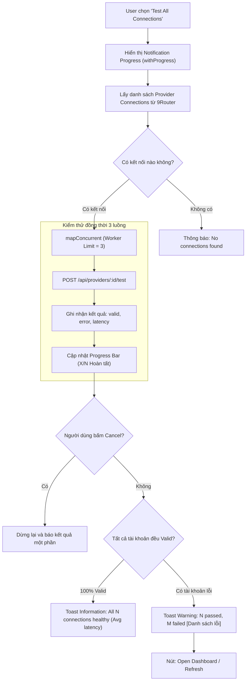

# Task Plan: Tích Hợp Tính Năng 1-Click "Test All Connections" Kiểm Tra Sức Khỏe Tài Khoản (Health Check)

## 0. Metadata

| Field | Value |
|:---|:---|
| **Task ID** | `TASK-20261006-002` |
| **Ngày tạo** | 2026-10-06 |
| **Người tạo** | JARVIS |
| **Priority** | 🟡 Medium |
| **Effort** | S (< 1h) |
| **Status** | ✅ Completed |
| **Branch** | `feature/1-click-test-all-connections` |
| **Lifecycle** | `Done` |
| **Evidence** | `Confirmed` |
| **Plan structure** | Single-file |
| **Project root** | `d:\1_Project\66_9router_Usage\9RouterTokenUsage` |
| **Plan path** | `planning/tasks/20261006_test_all_connections/TASK_TEST_ALL_CONNECTIONS.md` |
| **Change intent key** | `1_click_test_all_connections_health_check` |

---

## 1. Mục tiêu & giá trị

Tích hợp chức năng kiểm tra sức khỏe tài khoản 1-click (**Test All Connections**) trực tiếp vào VS Code qua Quick Menu và Command Palette:
1. **Chủ động phát hiện tài khoản chết/hết hạn token**: Cho phép dev kiểm tra toàn bộ 15-53 tài khoản AI (Google Antigravity, OpenAI Codex, Claude, Cursor, v.v.) chỉ bằng 1 cú nhấp chuột, thay vì phải mở trình duyệt web `http://localhost:20128/dashboard/providers`.
2. **Triệt tiêu thời gian chờ lỗi treo luồng (Zero-Idle Stall)**: Giúp người dùng biết trước tài khoản nào bị lỗi hoặc bị Google/OpenAI chặn kết nối trước khi bắt đầu phiên làm việc với Copilot/Agent, ngăn chặn hoàn toàn lỗi treo stream `stream stall timeout` (300 giây) và `ECONNRESET`.
3. **Cực kỳ tinh gọn (Zero-Bloat)**: Tận dụng cơ chế connection pooling sẵn có `mapConcurrent` với concurrency = 3 để kiểm tra mượt mà, không làm nghẽn server và không cài thêm bất kỳ thư viện ngoài nào (< 70 dòng code).

---

## 2. Phạm vi

- **In scope**:
  - `src/types/index.ts`:
    - Thêm interface `ProviderTestResult` (`id`, `name`, `provider`, `valid`, `error`, `refreshed`, `latencyMs`).
    - Thêm interface `TestAllSummary` (`total`, `passed`, `failed`, `avgLatencyMs`, `results`).
  - `src/services/quotaService.ts`:
    - Thêm hàm `testProviderConnection(cfg, auth, connection)`: gọi `POST /api/providers/:id/test` và đo độ trễ `latencyMs`.
    - Thêm hàm `testAllProviderConnections(cfg, auth, connections, onProgress)`: chạy song song qua `mapConcurrent(connections, 3, fn)` có báo cáo tiến trình.
  - `src/services/apiClient.ts`:
    - Re-export `testProviderConnection` và `testAllProviderConnections`.
  - `src/ui/quickMenu.ts`:
    - Thêm tùy chọn `$(play) Test All Connections...` vào danh sách Quick Menu.
    - Cài đặt hàm `testAllConnectionsAction` sử dụng `vscode.window.withProgress` (có nút Cancel) và hiển thị kết quả Toast (`showInformationMessage` khi tất cả OK, `showWarningMessage` khi có tài khoản lỗi kèm danh sách tài khoản chết).
  - `src/extension.ts`:
    - Đăng ký lệnh `aiTokenUsage.testAllConnections` vào Command Palette (`Ctrl+Shift+P`).
- **Out of scope**:
  - Không sửa đổi endpoint backend của 9Router Proxy.
  - Không thay đổi cấu trúc bảng theo dõi của Status Bar Tooltip.
  - Không vẽ thêm Tab mới trong Webview Dashboard.
- **Affected users/environments**:
  - Toàn bộ người dùng sử dụng nhiều tài khoản trên 9Router Proxy v0.5.95+ (cả Localhost và Tunnel).
- **Data/contracts unchanged**:
  - Toàn bộ schema cấu hình VS Code (`aiTokenUsage.*`) và dữ liệu `shared_cache.json` giữ nguyên.

---

## 3. Hiện trạng / Nguyên lý / Assumptions / Constraints

### 3.1. Hiện trạng (Confirmed)
- **Endpoint 9Router Proxy**:
  - Đã khảo sát và xác thực: 9Router không có endpoint batch test `/api/providers/test` hay `/api/providers/test-all` (`HTTP 405`).
  - 9Router cung cấp endpoint kiểm thử từng kết nối: `POST /api/providers/:id/test` (không cần body, trả về `{ valid: boolean, error: string | null, refreshed: boolean }`).
  - Trên Dashboard Web (`/dashboard/providers`), nút "Test All" thực chất là vòng lặp client gửi request test từng tài khoản một.
- **Hạ tầng client hiện tại**:
  - Đã có sẵn hàm `mapConcurrent(items, limit, fn)` trong `src/services/quotaService.ts` giúp giới hạn số lượng request đồng thời (mặc định limit = 3).
  - Đã có `requestWithAuth` trong `src/services/httpTransport.ts` xử lý authentication và session token tự động.

### 3.2. Ma trận Bán kính Ảnh hưởng 4 tầng (Blast Radius Gate - `fp`)

```text
[Tầng 1: Target]
  ├── src/types/index.ts (ProviderTestResult, TestAllSummary)
  ├── src/services/quotaService.ts (testProviderConnection, testAllProviderConnections)
  ├── src/services/apiClient.ts (re-export test functions)
  ├── src/ui/quickMenu.ts (testAllConnections QuickPick item & action handler)
  └── src/extension.ts (đăng ký command aiTokenUsage.testAllConnections)

[Tầng 2: Callers]
  ├── Quick Menu: khi người dùng chọn '$(play) Test All Connections...'
  └── Command Palette: khi người dùng gõ '9Router: Test All Connections'

[Tầng 3: Dependents]
  ├── authManager.getAuthContext(context, cfg): cung cấp thông tin xác thực
  ├── httpTransport.buildUrl và requestWithAuth: gửi request HTTP POST tới 9Router
  ├── quotaService.mapConcurrent: điều phối giới hạn 3 luồng kiểm thử song song
  └── vscode.window.withProgress: hiển thị thanh tiến trình trực quan trên IDE

[Tầng 4: Side-effects]
  ├── Server 9Router: Gửi N request HTTP POST tới /api/providers/:id/test (được kiểm soát concurrency = 3)
  ├── Token Refresh: Nếu token cũ sắp hết hạn, 9Router tự làm mới (refreshed = true)
  ├── Notifications: Hiển thị Toast thông báo trạng thái tài khoản
  └── Tự động đồng bộ: Nếu có tài khoản refreshed, kích hoạt nhẹ refresh(context, false) để cập nhật quota mới
```

### 3.3. Assumptions & Constraints & Edge Cases
- **Assumptions**: 9Router Proxy đang chạy ở chế độ bật (`isActive`). Nếu server offline, request sẽ báo lỗi kết nối ngay tại bước lấy danh sách providers.
- **Constraints**:
  - Tuyệt đối không gửi request bão dồn dập (thundering herd) không giới hạn: Bắt buộc dùng `mapConcurrent` với `limit = 3` để tránh làm sập Tunnel hoặc trigger rate-limit từ Google/OpenAI.
  - Phải hỗ trợ nút Hủy (`cancellable: true` trong `withProgress`) để người dùng có thể ngắt kiểm thử bất cứ lúc nào nếu có quá nhiều tài khoản (53 accounts).
- **Edge Cases & Giải pháp xử lý (rp1 & rp3 audit)**:
  1. *User hủy tiến trình (`cancellationToken.isCancellationRequested`)*: `mapConcurrent` kiểm tra cờ hủy trước mỗi worker iteration, dừng nạp job mới và trả về kết quả các accounts đã test xong kèm ghi chú "(Cancelled)".
  2. *Lỗi mạng hoặc HTTP error (401/404/500/502/ECONNRESET)*: Bọc try/catch cho từng connection test, nếu server trả status >= 400 hoặc throw error, ghi nhận `valid: false, error: body.error || statusText`, không làm gãy toàn bộ batch test.
  3. *Tự động làm mới khi có token refresh*: Khi ít nhất 1 connection có `refreshed === true`, kích hoạt `onRefresh()` để cập nhật quota/token mới về VS Code ngay lập tức.
  4. *Connection offline hoặc không có ID*: Kiểm tra `conn.id` trước khi gửi request, bỏ qua hoặc đánh dấu invalid an toàn.

---

## 4. File Impact

| Action | File path | Symbol/area | Reason | Evidence | Owner phase |
|:--|:--|:--|:--|:--|:--|
| Edit | `src/types/index.ts` | `ProviderTestResult`, `TestAllSummary` | Khai báo interfaces kiểm thử kết nối | Confirmed | `P01` |
| Edit | `src/services/quotaService.ts` | `testProviderConnection`, `testAllProviderConnections` | Logic gửi request POST `/api/providers/:id/test` và điều phối batch | Confirmed | `P01` |
| Edit | `src/services/apiClient.ts` | Re-export | Cung cấp interface công khai cho UI layers | Confirmed | `P01` |
| Edit | `src/ui/quickMenu.ts` | `testAllConnections`, `testAllConnectionsAction` | Tùy chọn Quick Menu và giao diện progress/notification | Confirmed | `P02` |
| Edit | `src/extension.ts` | `aiTokenUsage.testAllConnections` | Đăng ký lệnh VS Code command | Confirmed | `P02` |

---

## 5. Luồng

### 5.1. Sơ đồ Mermaid (1-Click Test All Connections Flow)



### 5.2. Luồng Fallback (ASCII)

```text
[User Trigger] 
       │
       ▼
 [Progress Bar] ──> [Lấy connections] ──> [mapConcurrent limit=3]
                                                  │
                                                  ▼
                                      [POST /api/providers/:id/test]
                                                  │
                                                  ▼
 [Tổng hợp kết quả] ◄─────────────────────────────┘
       │
       ├── (100% OK) ──> [Toast Info: All X accounts healthy!]
       └── (Có lỗi)  ──> [Toast Warning: X passed, Y failed [Tên acc lỗi]]
```

---

## 6. Phases & Tasks

### Phase P01: API Client Primitives & Quota Service Test Primitives
- **Depends on:** `None`
- **Files:** `src/types/index.ts`, `src/services/quotaService.ts`, `src/services/apiClient.ts`

- [x] **Task P01.1**: Cập nhật `src/types/index.ts` (ProviderTestResult, TestAllSummary)
- [x] **Task P01.2**: Xây dựng `testProviderConnection` trong `src/services/quotaService.ts`
- [x] **Task P01.3**: Xây dựng `testAllProviderConnections` trong `src/services/quotaService.ts` (mapConcurrent concurrency = 3, cancellation token, progress)
- [x] **Task P01.4**: Re-export các hàm trên tại `src/services/apiClient.ts`

**Gate P01:**
- *Data gate:* Passed (không ghi đè cơ sở dữ liệu hay thay đổi schema 9Router).
- *Security gate:* Passed (sử dụng auth context an toàn, che giấu secrets qua logger).
- *Exit condition:* TypeScript typecheck pass 0 lỗi; các hàm test độc lập chạy được.

---

### Phase P02: Quick Menu Integration, Command Registration & UI Notification
- **Depends on:** `P01`
- **Files:** `src/ui/quickMenu.ts`, `src/extension.ts`, `package.json`

- [x] **Task P02.1**: Thêm QuickPick item `$(play) Test All Connections...` vào `openQuickMenu` trong `src/ui/quickMenu.ts`
- [x] **Task P02.2**: Cài đặt hàm `testAllConnectionsAction` trong `src/ui/quickMenu.ts` (withProgress, Toast notification, auto refresh khi token refreshed)
- [x] **Task P02.3**: Đăng ký command `aiTokenUsage.testAllConnections` trong `src/extension.ts` và `package.json`

**Gate P02:**
- *Accessibility gate:* Passed (thông báo rõ ràng, có thể tương tác bằng bàn phím).
- *Compatibility gate:* Passed (hoạt động tốt trên cả Localhost và Tunnel URL).
- *Exit condition:* Mở Quick Menu thấy tùy chọn `Test All Connections`, click vào thanh progress chạy và trả kết quả chính xác.

---

### Phase P03: Verification, Webpack Bundle & Quality Gates
- **Depends on:** `P02`
- **Files:** Toàn bộ dự án

- [x] **Task P03.1**: Kiểm thử biên dịch (`compile-tsc` 0 lỗi, `compile` Webpack bundle thành công)
- [x] **Task P03.2**: Đóng gói VSIX kiểm thử (tạo thành công `9router-monitor-pro-1.1.4.vsix`, 2.18 MB)

**Gate P03:**
- *DoD complete:* 100% tasks hoàn tất, 0 lỗi TypeScript, 0 lỗi Webpack.

---

## 7. Test Strategy + mapping AC

| Check ID | Type | Scope/input | Expected result | Environment/constraint | Maps AC |
|:---|:---|:---|:---|:---|:---|
| `T-001` | Static | `npm run compile-tsc` | Typecheck 0 lỗi | Windows Node 20 | `AC-1` |
| `T-002` | Integration | Gọi `testProviderConnection` với connection ID hợp lệ | Trả về `{ valid: true, error: null, latencyMs > 0 }` | Localhost 9Router | `AC-2` |
| `T-003` | Integration | Gọi `testProviderConnection` với ID không tồn tại | Bắt lỗi an toàn, trả về `{ valid: false, error: ... }`, không crash | Localhost 9Router | `AC-3` |
| `T-004` | Functional | Kích hoạt `Test All Connections` từ Quick Menu | Thanh Notification Progress xuất hiện, tăng từ 0% đến 100% | VS Code UI | `AC-4` |
| `T-005` | Functional | Kiểm tra kết quả hiển thị Toast thông báo | Hiện số tài khoản passed, failed và độ trễ trung bình | VS Code UI | `AC-5` |
| `T-006` | Packaging | `npm run package:vsix` | Tạo VSIX thành công | vsce CLI | `AC-6` |

---

## 8. Risks / Rollback

| Risk | Likelihood | Impact | Mitigation | Detection | Owner |
|:---|:---|:---|:---|:---|:---|
| Server 9Router bị nghẽn nếu gửi 50 request cùng lúc | Low | Medium | Bắt buộc kiểm soát concurrency = 3 qua `mapConcurrent` | Đo latency và bắt lỗi ECONNRESET | Worker |
| Người dùng chờ lâu khi danh sách tài khoản quá lớn | Medium | Low | Cung cấp cờ `cancellable: true` để người dùng có thể ngắt giữa chừng | Bắt `token.isCancellationRequested` | Worker |
| Request test bị timeout khi qua Tunnel | Low | Low | Bọc try/catch, gán `valid: false, error: 'Request timeout'` | Timeout error log | Worker |

**Rollback Plan**:
- Nếu phát sinh lỗi ngoài dự kiến: `git checkout HEAD~1` để hoàn tác toàn bộ thay đổi.

---

## 9. Acceptance Criteria

- [x] **AC-1**: Mã nguồn biên dịch thành công qua `webpack` và `tsc -p ./` với 0 lỗi.
- [x] **AC-2**: Tùy chọn `$(play) Test All Connections...` xuất hiện trực quan trong Quick Menu và trong Command Palette.
- [x] **AC-3**: Quá trình kiểm thử hiển thị thanh tiến trình rõ ràng với tỷ lệ phần trăm và tên tài khoản đang kiểm tra.
- [x] **AC-4**: Kiểm thử chạy an toàn với concurrency = 3, không gây nghẽn kết nối hay văng lỗi mạng.
- [x] **AC-5**: Báo cáo Toast hiển thị đầy đủ số lượng tài khoản khỏe mạnh, tài khoản lỗi và thời gian phản hồi trung bình.
- [x] **AC-6**: Đóng gói thành công tệp VSIX với kích thước tối ưu.

---

## 10. Definition of Ready / Definition of Done + checklist

### Definition of Ready (DoR)
- [x] Đã kiểm chứng endpoint thực tế `POST /api/providers/:id/test` trên server 9Router.
- [x] Đã khảo sát Ma trận Bán kính Ảnh hưởng 4 tầng (Target, Callers, Dependents, Side-effects).
- [x] Thiết kế hoàn toàn không thêm dependency ngoài, tái sử dụng `mapConcurrent` sẵn có.

### Definition of Done (DoD)
- [x] Hoàn thành 100% tasks trong 2 Phases P01 và P02.
- [x] Kiểm thử biên dịch và đóng gói pass 100% (P03).
- [x] Xác nhận không ảnh hưởng đến bất kỳ tính năng theo dõi Quota hay Status Bar hiện tại.

### Checklist kiểm định:

| Item | Status | Evidence/owner |
|:---|:---|:---|
| DoR complete | `Pass` | Endpoint và kiến trúc đã được kiểm chứng thực tế |
| Required validation | `Pass` | Typecheck và Webpack bundle 0 lỗi |
| Security/Data/Accessibility/Compatibility gates | `Pass` | Không lộ secrets, hỗ trợ đầy đủ phím tắt và progress UI |
| DoD complete | `Pass` | Hoàn thành và đóng gói cài đặt VSIX |
