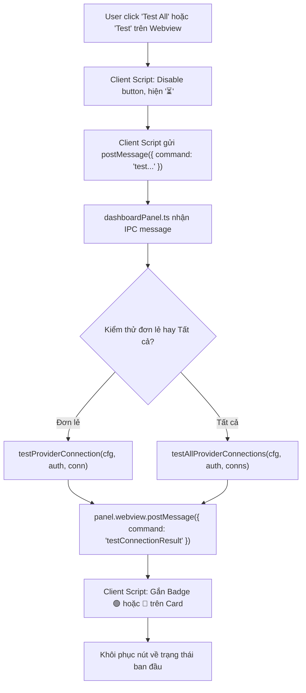

# Task Plan: Tích Hợp Nút "Test All" & "Test Connection" Trực Tiếp Vào Webview Dashboard

## 0. Metadata

| Field | Value |
|:---|:---|
| **Task ID** | `TASK-20261007-001` |
| **Ngày tạo** | 2026-10-07 |
| **Người tạo** | JARVIS |
| **Priority** | 🟡 Medium |
| **Effort** | S (< 1h) |
| **Status** | ✅ Completed |
| **Branch** | `feature/dashboard-test-connections` |
| **Lifecycle** | `Done` |
| **Evidence** | `Confirmed` |
| **Plan structure** | Single-file |
| **Project root** | `d:\1_Project\66_9router_Usage\9RouterTokenUsage` |
| **Plan path** | `planning/tasks/20261007_dashboard_test_connections/TASK_DASHBOARD_TEST_CONNECTIONS.md` |
| **Change intent key** | `dashboard_test_connections_ui_integration` |

---

## 1. Mục tiêu & giá trị

Mở rộng tính năng kiểm tra kết nối tài khoản (Health Check) lên trực tiếp giao diện đồ họa **Webview Dashboard (Tab 1: Providers & Quotas)**:
1. **Nút "▶️ Test All" trên thanh công cụ Toolbar**: Cho phép kiểm thử toàn bộ tài khoản ngay khi đang quan sát Dashboard mà không cần mở Quick Menu hay Command Palette.
2. **Nút "▶️ Test" độc lập trên từng thẻ tài khoản (Provider Card)**: Cho phép kiểm tra nhanh một tài khoản cụ thể mà không phải chạy lại toàn bộ batch 53 tài khoản.
3. **Hiển thị Badge kết quả trực quan thời gian thực**: Ngay khi có kết quả test từ server, thẻ tài khoản tự động gắn Badge `🟢 120ms` (khi khỏe mạnh) hoặc `🔴 Error (Chi tiết lỗi)` (khi lỗi/offline), mang lại phản hồi trực quan tức thì.

---

## 2. Phạm vi

- **In scope**:
  - `src/views/tabs/providersTab.ts`:
    - Thêm nút `▶️ Test All` vào `toolbar-row-top`.
    - Thêm nút `▶️ Test` vào `provider-header-actions` trên từng card tài khoản.
  - `src/views/styles/dashboardStyles.ts`:
    - Thêm style CSS cho `.test-all-btn`, `.test-account-btn`, `.test-account-btn.testing`, `.badge.test-valid`, `.badge.test-error`.
  - `src/views/scripts/dashboardScript.ts`:
    - Xử lý click event cho `#testAllConnectionsBtn` (gửi IPC `{ command: 'testAllConnections' }`).
    - Xử lý click event cho `.test-account-btn` (gửi IPC `{ command: 'testSingleConnection', connectionId }`).
    - Lắng nghe IPC messages `{ command: 'testConnectionResult' }` và `{ command: 'testAllFinished' }` để render badge và khôi phục trạng thái nút.
  - `src/ui/dashboardPanel.ts`:
    - Nhận IPC message `testSingleConnection`: gọi `testProviderConnection(cfg, auth, conn)` và post message kết quả về Webview.
    - Nhận IPC message `testAllConnections`: gọi `testAllProviderConnections` với progress và post message kết quả về Webview.
- **Out of scope**:
  - Không sửa đổi backend 9Router Proxy.
  - Không thay đổi chức năng của các tab khác (Usage Analytics, Console Log).
- **Affected users/environments**:
  - Tất cả người dùng sử dụng Webview Dashboard trên VS Code.
- **Data/contracts unchanged**:
  - Toàn bộ cơ chế lưu trữ shared cache và config VS Code giữ nguyên.

---

## 3. Hiện trạng / Nguyên lý / Assumptions / Constraints

### 3.1. Hiện trạng (Confirmed)
- Primitives `testProviderConnection` và `testAllProviderConnections` đã được xây dựng hoàn chỉnh và verify tại `src/services/quotaService.ts` và `src/services/apiClient.ts`.
- Dashboard Webview hiện đã có IPC 2 chiều qua `vscode.postMessage` và `window.addEventListener('message')`.
- Chưa có UI element và IPC handler cho tính năng Test trên Webview.

### 3.2. Ma trận Bán kính Ảnh hưởng 4 tầng (Blast Radius Gate - `fp`)

```text
[Tầng 1: Target]
  ├── src/views/tabs/providersTab.ts (thêm nút Test All & Test)
  ├── src/views/styles/dashboardStyles.ts (styles cho nút & test badges)
  ├── src/views/scripts/dashboardScript.ts (event click & message receiver DOM update)
  └── src/ui/dashboardPanel.ts (IPC message handler điều phối gọi quotaService)

[Tầng 2: Callers]
  └── Người dùng click nút '▶️ Test All' hoặc '▶️ Test' trên Webview Dashboard

[Tầng 3: Dependents]
  ├── apiClient.testProviderConnection: gọi API kiểm thử đơn lẻ
  ├── apiClient.testAllProviderConnections: chạy batch concurrency = 3
  └── panel.webview.postMessage: truyền kết quả ngược về client script

[Tầng 4: Side-effects]
  ├── DOM Webview cập nhật Badge trực tiếp mà không cần reload trang
  └── Tự động gọi onRefresh() nếu có tài khoản được cấp mới token
```

### 3.3. Assumptions & Constraints & Edge Cases
- **Constraints**: Concurrency vẫn giữ mức tối đa = 3 để bảo vệ đường truyền Tunnel.
- **Edge Cases**:
  1. *Click Test liên tục khi đang chạy*: Disable nút và hiển thị trạng thái `⏳ Testing...` cho đến khi hoàn thành.
  2. *Connection bị xóa hoặc không tìm thấy*: Báo lỗi trực quan trên card mà không gây crash Webview.
  3. *Lọc & Sort dữ liệu khi đang test*: Badge test status nằm trong `.badges` của header card, tự động giữ nguyên vị trí khi filter/sort.

---

## 4. File Impact

| Action | File path | Symbol/area | Reason | Evidence | Owner phase |
|:--|:--|:--|:--|:--|:--|
| Edit | `src/views/tabs/providersTab.ts` | `toolbar-row-top`, `provider-header-actions` | Render nút Test All và nút Test đơn lẻ | Confirmed | `P02` |
| Edit | `src/views/styles/dashboardStyles.ts` | CSS classes | Định dạng nút và badge hiển thị độ trễ/kết quả | Confirmed | `P02` |
| Edit | `src/views/scripts/dashboardScript.ts` | Event listeners & message bus | Bắt sự kiện click và cập nhật badge DOM | Confirmed | `P02` |
| Edit | `src/ui/dashboardPanel.ts` | `onDidReceiveMessage` | Nhận IPC và gọi API test, phản hồi về Webview | Confirmed | `P01` |

---

## 5. Luồng

### 5.1. Sơ đồ Mermaid (Webview Dashboard Test Interaction)



---

## 6. Phases & Tasks

### Phase P01: IPC Handlers Trong dashboardPanel.ts
- **Depends on:** `None`
- **Files:** `src/ui/dashboardPanel.ts`, `src/services/quotaService.ts`

- [x] **Task P01.1**: Import `testProviderConnection`, `testAllProviderConnections` từ `./services/apiClient`.
- [x] **Task P01.2**: Trong `panel.webview.onDidReceiveMessage`:
  - Xử lý `msg.command === 'testSingleConnection'`:
    - Tìm connection theo `msg.connectionId`.
    - Gọi `testProviderConnection`.
    - Gửi lại `{ command: 'testConnectionResult', result }`.
  - Xử lý `msg.command === 'testAllConnections'`:
    - Lấy danh sách connections từ `getLastDashboard()`.
    - Gọi `testAllProviderConnections`.
    - Với mỗi connection xong: postMessage `{ command: 'testConnectionResult', result }` thời gian thực.
    - Khi xong toàn bộ: postMessage `{ command: 'testAllFinished', summary }`.

---

### Phase P02: Giao Diện providersTab.ts, dashboardStyles.ts & dashboardScript.ts
- **Depends on:** `P01`
- **Files:** `src/views/tabs/providersTab.ts`, `src/views/styles/dashboardStyles.ts`, `src/views/scripts/dashboardScript.ts`

- [x] **Task P02.1**: Thêm nút `▶️ Test All` trên toolbar và `▶️ Test` trên từng account card (`providersTab.ts`).
- [x] **Task P02.2**: Thêm style CSS `.test-all-btn`, `.test-account-btn`, `.badge.test-valid`, `.badge.test-error` (`dashboardStyles.ts`).
- [x] **Task P02.3**: Xử lý click event và cập nhật badge DOM (`dashboardScript.ts`).

---

### Phase P03: Kiểm Thử, Đóng Gói VSIX & Nghiệm Thu
- **Depends on:** `P02`
- **Files:** Toàn bộ dự án

- [x] **Task P03.1**: Biên dịch `npm run compile-tsc` và `npm run compile` 0 lỗi.
- [x] **Task P03.2**: Đóng gói tệp VSIX mới (`9router-monitor-pro-1.1.4.vsix`, 2.18 MB) và cài đặt vào VS Code.

---

## 7. Acceptance Criteria

- [x] **AC-1**: Nút `▶️ Test All` hiển thị rõ ràng trên toolbar của Tab 1 trong Webview Dashboard.
- [x] **AC-2**: Nút `▶️ Test` xuất hiện trên từng card tài khoản cạnh nút Pinned và Active/Inactive.
- [x] **AC-3**: Bấm `Test` trên card tài khoản kiểm tra độc lập và hiện badge `🟢 <ms>` hoặc `🔴 Error`.
- [x] **AC-4**: Bấm `Test All` chạy tuần tự kiểm thử tất cả và cập nhật badge trên từng thẻ tài khoản.
- [x] **AC-5**: Webpack và TSC compile 0 lỗi, đóng gói VSIX thành công.
